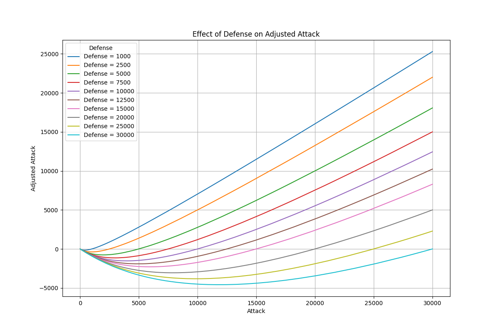
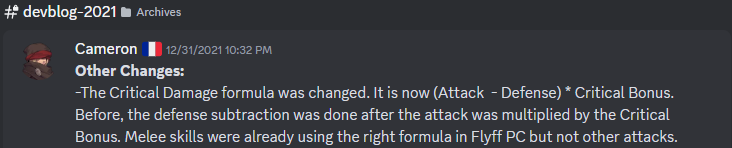
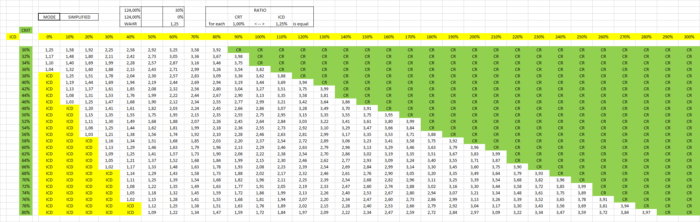
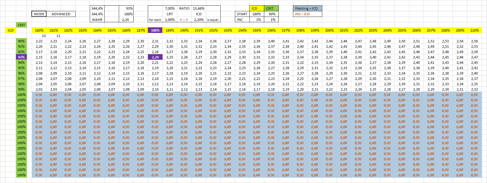
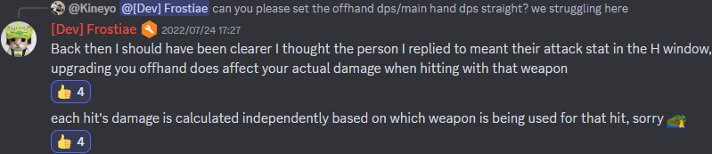
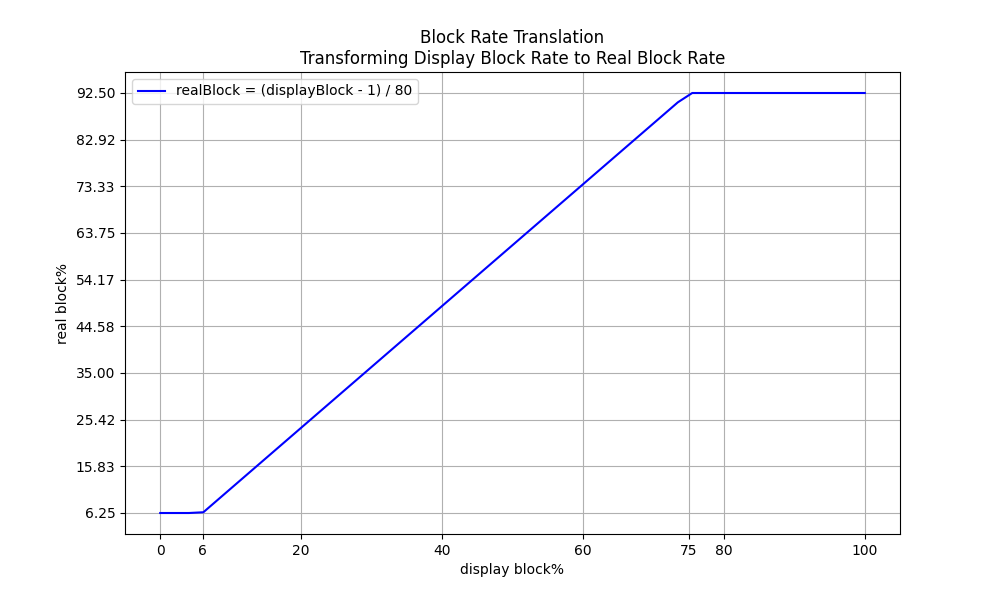
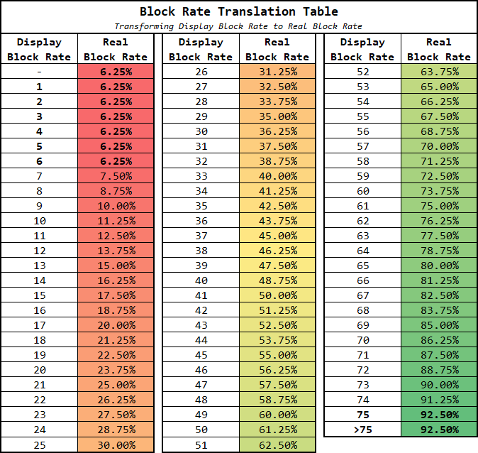

# Formulas

> [!IMPORTANT]
> **Document about the game Flyff Universe. <ins>NOT affiliated with GalaLab / Wemade Connect / PlayPark.</ins>**

> [!IMPORTANT]
> **The information used in the document is from the FlyFF Universe API and belong to Gala Lab Corp.**

> [!CAUTION]
> **This document is for reference only and may not fully represent the game. If any inconvenience is caused, please contact me as soon as possible. Thank you.** 🙏

<!-- Copyright 2024 © Gala Lab Corp. All Rights Reserved. -->

<table><tr><td><details><summary>📁 Table of Contents</summary>

- [Formulas](#formulas)
  - [⚔️ damage](#️-damage)
    - [dps](#dps)
    - [auto attack](#auto-attack)
    - [melee skill](#melee-skill)
    - [magic skill](#magic-skill)
  - [⚔️ critical chance vs critical damage](#️-critical-chance-vs-critical-damage)
  - [⚔️ blade damage](#️-blade-damage)
  - [🗡️ empower weapon](#️-empower-weapon)
  - [🔪 sword vs axe 🪓](#-sword-vs-axe-)
  - [❤️ health](#️-health)
    - [max hp](#max-hp)
  - [🩹 heal](#-heal)
  - [⛔ block](#-block)
    - [calculate](#calculate)
      - [Monster VS Player , Player VS Player](#monster-vs-player--player-vs-player)
      - [Player VS Monster](#player-vs-monster)
    - [block cap](#block-cap)
  - [🌟 exp](#-exp)

</details></td></tr></table>

## ⚔️ damage

[🔝 Back to top](#formulas)

<details>
  <summary>📁 damage details</summary>

### dps

```
DamagePerSecond = computeDamage * hitsPerSecond
```

* hitsPerSecond
   ```js
   hitsPerSecond = classHitsPerSecond * attackSpeed * hitProbAdjusted
   ```

* checkHitRate

    <details><summary>details</summary>

   ```js
   // 0 ~ 99
   randValue = Math.floor(Math.random() * 100)
   if (randValue < hitProbAdjusted) {
     // hit
   }
   if (
     100 - hitProbAdjusted != 0 &&
     hitProb < (randValue - hitProbAdjusted) / (100 - hitProbAdjusted)
   ) {
     // PARRY
   }
     // MISS
   ```

   </details>

* hitProb, hitProbAdjusted

   <details><summary>details</summary>

   * hit rate in character window : It generally displays the incorrect value, with the value increasing by `1` for every `4` DEX, which isn't how DEX affects `hit rate` in reality. Additionally, it caps at `100`, whereas the actual limit should be `96`.

   ```js
   // MoverAttack.cpp
   // BOOL CMover::GetAttackResult( CMover* pDefender, DWORD dwOption )

   // ------------------------------------------------------------------------------------
   // Attacker is NPC, Defender is Player
   factor = 1.5 * 2.0 * ((attackerLevel * 0.5) / (attackerLevel + defenderLevel * 0.3))
   // -----------------------------------------------------------------------------------

   // ------------------------------------------------------------------------------------
   // Attacker is Player, Defender is NPC
   factor = 1.6 * 1.5 * ((attackerLevel * 1.2) / (attackerLevel + defenderLevel))
   // ------------------------------------------------------------------------------------

   // ------------------------------------------------------------------------------------
   // Attacker is Player, Defender is Player
   // No level difference factor in PvP
   factor = 1.6 * 1.2 * (attackerLevel * 1.2) / (attackerLevel * 2))
   // ------------------------------------------------------------------------------------
   ```
   ```js
   // ------------------------------------------------------------------------------------
   // If not AUTO_ATTACK, this is always 100.
   // ------------------------------------------------------------------------------------
   hitRate = (attackerDex / (attackerDex + defenderParryRate))
   hitProb = Math.floor(hitRate * factor * 100);
   hitProbAdjusted = Math.max(20, Math.min(96, hitProb + ExtraHitRate))
   // Limited to 20 ~ 96
   // ------------------------------------------------------------------------------------
   ```

   * defenderParryRate : From Defender's unscaled `parry` `DST_PARRY`.

      * parry in character window : Displayed as a percentage, but the unit is incorrect (the number is correct).

   * ExtraHitRate : From Attacker's Gear, Buff scaled `hitrate` `DST_ADJ_HITRATE`.

   * Player VS Monster
      ```js
      // simplify formula
      // Attacker is Player, Defender is NPC
      hitProb = Math.floor(
         (2.88 * attackerDex * attackerLevel) /
           ((attackerDex + defenderParryRate) * (attackerLevel + defenderLevel))
           * 100
         )
      hitProbAdjusted = Math.max(20, Math.min(96, hitProb + ExtraHitRate))
      // Limited to 2 ~ 96

      // ------------------------------------------------------------------------------------
      // example (Lv160 Blade's dex 60 vs Beast King Khan https://api.flyff.com/monster/16244) :
      // hitProb = Math.floor((2.88 * 60 * 160) / ((60 + 178) * (160 + 150)) * 100) = 37
      // Equipment Set +10 Hit Rate +45%, Accuracy +30%
      // hitProbAdjusted = Math.max(20, Math.min(96, 37 + 45 + 30)) = 96
      // ------------------------------------------------------------------------------------
      ```
      ```js
      function getHitRate(
        attackerLevel,
        attackerDex,
        defenderLevel,
        defenderParry,
        extraHitRate = 0
      ) {
        let hitProb = Math.floor(
          ((2.88 * attackerDex * attackerLevel) /
            ((attackerDex + defenderParry) * (attackerLevel + defenderLevel))) *
            100
        )
        return Math.max(20, Math.min(96, hitProb + extraHitRate))
      }
      ```

   * Monster VS Player
      ```js
      // simplify formula
      // Attacker is NPC, Defender is Player
      hitProb = Math.floor(
         (1.5 * attackerDex * attackerLevel) /
           ((attackerDex + defenderParryRate) * (attackerLevel + defenderLevel * 0.3))
           * 100
         )
      hitProbAdjusted = Math.max(20, Math.min(96, hitProb + ExtraHitRate))
      // Limited to 2 ~ 96
      ```

      * Player Parry Rate

         * ExtraParry : From Player's Gear, Buff unscaled `parry` `DST_PARRY`.

         * parry% : From Player's Gear, Buff scaled `parry` `DST_PARRY`.

         ```js
         playerParryRate = (playerDex * 0.5) + ExtraParry) * (1 + parry%)
         ```

   </details>

### auto attack

<table><tr><td><details><summary>details</summary>

* ATK_TYPE : `ATK_GENERIC`

* computeAttack
   ```js
   // AttackArbiter.cpp
   // int CAttackArbiter::CalcATK( ATTACK_INFO* pInfo )
   computeAttack = (HitPower * AttackMultiplier) + FlatAttack + PvEFlatAttack
                 = (HitMinMax * DamagePropertyFactor * ChargeMultiplier * (1 + attack% + achievementBonus%) * (1 + Upcut%)) + FlatAttack + PvEFlatAttack
   ```

   * Attack in character window

      * WeaponPlusDamage : From Attacker’s Weapon unscaled Additional Attack. (Not sure if it's still in use.)

      ```js
      // WndField.cpp
      // void CWndCharInfo::RenderATK( C2DRender* p2DRender, int x, int y )
      Attack = ((HitMin + HitMax) / 2) * (1 + attack%) * (1 + Upcut%) + FlatAttack + WeaponPlusDamage

      // ------------------------------------------------------------------------------------
      // example :
      // Math.Floor((7898 + 7904) / 2) * 1.73 * 1.2 + 0 + 0 = 16402
      // ------------------------------------------------------------------------------------
      ```

   * HitPower
      ```js
      // MoverAttack.cpp
      // int CMover::GetHitPower( ATTACK_INFO* pInfo  )
      HitPower = Math.floor(HitMinMax * DamagePropertyFactor * ChargeMultiplier)
      // HitPower = xRandom( nMin, nMax ) * DamagePropertyFactor * ChargeMultiplier
      ```
      ```js
      // ------------------------------------------------------------------------------------
      // Average Dps
      HitPower = Math.floor(Math.floor((HitMin + HitMax) / 2) * DamagePropertyFactor)
      // ------------------------------------------------------------------------------------
      ```

   * HitMinMax

      <details><summary>details</summary>

      ```js
      // MoverAttack.cpp
      // void CMover::GetHitMinMax( int* pnMin, int* pnMax, ATTACK_INFO *pInfo )
      HitMinMax = Math.Floor(((WeaponBaseAttackMinMax * 2) + WeaponAttack + AttackerPlusDamage) * WeaponMultiplier) + WeaponUpgradeLevelAdditionalAttack
      // ------------------------------------------------------------------------------------
      // WeaponBaseAttackMinMax = minAttack DST_ABILITY_MIN, maxAttack DST_ABILITY_MAX
      // ------------------------------------------------------------------------------------

      // ------------------------------------------------------------------------------------
      // example (Blade use Lusaka's Crystal Axe U+5, Demol Earring U+5 * 2, Spirit Fortune) :
      // Math.Floor(((544 ~ 546 * 2) + 3123 + (540 * 2) + 350) * 1.39) + 58 = 7898 ~ 7904
      // ------------------------------------------------------------------------------------
      ```

      * WeaponAttack

         * AttackerStats : DEX for bow, INT for Wand, STR for Other Weapon.

         ```js
         // MoverAttack.cpp
         // int CMover::GetWeaponATK( DWORD dwWeaponType )
         WeaponAttack = Math.floor(statAttack + levelAttack + plusWeaponAttack + addValue)
         ```
         ```js
         // ------------------------------------------------------------------------------------
         statAttack = (AttackerStats - WeaponTypeStatModifer) * ClassWeaponTypeAutoAttackFactors
         // ------------------------------------------------------------------------------------
         // ClassWeaponTypeAutoAttackFactors = autoAttackFactors = GetJobPropFactor( JOB_PROP_TYPE )
         // ------------------------------------------------------------------------------------
         // WeaponTypeStatModifer:
         // sword WT_MELEE_SWD 12
         // axe WT_MELEE_AXE 12
         // staff WT_MELEE_STAFF 10
         // stick WT_MELEE_STICK 10
         // knuckle WT_MELEE_KNUCKLE 10
         // wand WT_MAGIC_WAND 10
         // yoyo WT_MELEE_YOYO 12
         // bow WT_RANGE_BOW 14
         // ------------------------------------------------------------------------------------
         // example (Blade's str 500 and use Axe) :
         // (500 - 12) * 5.7 = 2781.6
         // example (Blade's str 500 and use Sword) :
         // (500 - 12) * 4.7 = 2293.6
         // ------------------------------------------------------------------------------------

         // ------------------------------------------------------------------------------------
         levelAttack = AttackerLevel * WeaponTypeLevelFactor
         // ------------------------------------------------------------------------------------
         // WeaponTypeLevelFactor :
         // sword WT_MELEE_SWD 1.1
         // axe WT_MELEE_AXE 1.2
         // staff WT_MELEE_STAFF 1.1
         // stick WT_MELEE_STICK 1.3
         // knuckle WT_MELEE_KNUCKLE 1.2
         // wand WT_MAGIC_WAND 1.2
         // yoyo WT_MELEE_YOYO 1.1
         // bow WT_RANGE_BOW 0.91
         // ------------------------------------------------------------------------------------
         // example (lv160 Blade use Axe) :
         // 160 * 1.2 = 192
         // ------------------------------------------------------------------------------------

         // ------------------------------------------------------------------------------------
         // int CMover::GetPlusWeaponATK( DWORD dwWeaponType )
         // ------------------------------------------------------------------------------------
         plusWeaponAttack : From Attacker’s Gear, Buff Weapon Type unscaled Additional Attack. (Weapon Mastery Buff)
         // ------------------------------------------------------------------------------------
         // swordattack DST_SWD_DMG
         // axeattack DST_AXE_DMG
         // staffattack, stickattck
         // knuckleattack DST_KNUCKLE_DMG
         // wandattack, yoyoattack DST_YOY_DMG
         // bowattack DST_BOW_DMG
         // ------------------------------------------------------------------------------------
         // master skill :
         // DST_KNUCKLEMASTER_DMG
         // DST_YOYOMASTER_DMG
         // DST_BOWMASTER_DMG
         // DST_TWOHANDMASTER_DMG
         // ------------------------------------------------------------------------------------
         // example (Blade's Skill Axe) :
         // Smite Axe MAX axeattack + 50 and Axe Mastery MAX axeattack + 100, total = 150
         // ------------------------------------------------------------------------------------

         // ------------------------------------------------------------------------------------
         // Only for bow
         addValue = AttackerStr  * 0.14
         // ------------------------------------------------------------------------------------
         // example (Ranger's str 68 and use Bow) :
         // 68 * 0.14 = 9.52
         // ------------------------------------------------------------------------------------

         // ------------------------------------------------------------------------------------
         // example total = Math.Floor(2781.6 + 192 + 150) = 3123
         // ------------------------------------------------------------------------------------
         ```

      * AttackerPlusDamage : From Attacker's Gear, Buff unscaled `damage` `DST_CHR_DMG`.

         * Example : *Demol Earring* `damage`, *Spirit Fortune* `damage` etc.

      * WeaponMultiplier : Weapon Attack Upgrade Level Bonus.
         ```js
         // WeaponUpgradeLevel = 1, 2, 3, 4, 5, 6, 7, 8, 9, 10, U1, U2, U3, U4, U5
         WeaponAttackUpgradeLevelBonus% = 2%, 4%, 6%, 8%, 10%, 13%, 16%, 19%, 21%, 24%,27%, 30%, 33%, 36%, 39%
         WeaponMultiplier = (1 + WeaponAttackUpgradeLevelBonus%)
         ```

      * WeaponUpgradeLevelAdditionalAttack : Weapon Attack Upgrade Level Additional Attack.
         ```js
         WeaponUpgradeLevelAdditionalAttack = WeaponUpgradeLevel^1.5
                                            = Math.floor(Math.pow(WeaponUpgradeLevel, 1.5))
         ```

      </details>

   * DamagePropertyFactor : `1.0`(attacker is none or same element), `1.0 ~ 1.0895`(attacker element vs none or others), `1.0 ~ 1.2139`(strong), `0.9554 ~ 1.0895`(weak).

      * Element Type : Includes the weapon's inherent element.

      * Element Level : Sum of unscaled `elementattack` `DST_CHR_WEAEATKCHANGE` from Attacker's Gear, Buff.

      * ElementAttackStone%： Only boost attack when using auto attack against monsters that have a weakness to that element. If the monsters aren't weak to that element, the stones won't increase attack.

      ```js
      // MoverAttack.cpp
      // void CMover::GetDamagePropertyFactor( CMover* pDefender, int* pnATKFactor, int* pnDEFFactor, int nParts )
      // Player VS Monster
      DamagePropertyFactor = ElementAttackFactor + ElementAttackStone%
      ```
      ```js
      // Monster VS Player, Player VS Player
      // example Attacker is fire vs Defender is water
      DamagePropertyFactor = (1 - (2% * (DefenderElementLevel - AttackerElementLevel)))
      ```

      <details><summary>details</summary>

      | Attack Element Level (Any Element Type vs None) | DamagePropertyFactor |
      |:-----------------------------------------------:|:--------------------:|
      | 0                                               | 1                    |
      | 1                                               | 1.02                 |
      | 2                                               | 1.0221               |
      | 3                                               | 1.0256               |
      | 4                                               | 1.0305               |
      | 5                                               | 1.0368000000000002   |
      | 6                                               | 1.0446               |
      | 7                                               | 1.0537               |
      | 8                                               | 1.0642               |
      | 9                                               | 1.0761               |
      | 10                                              | 1.0895000000000001   |
      | ...                                             | 1.0895000000000001   |

      | Attack Element Level (Same or Others) | DamagePropertyFactor |
      |:---------------------------:|:--------------------:|
      | 0                           | 1                    |
      | 1                           | 1                    |
      | 2                           | 1.02                 |
      | 3                           | 1.0221               |
      | 4                           | 1.0256               |
      | 5                           | 1.0305               |
      | 6                           | 1.0368000000000002   |
      | 7                           | 1.0446               |
      | 8                           | 1.0537               |
      | 9                           | 1.0642               |
      | 10                          | 1.0761               |
      | 11                          | 1.0895000000000001   |
      | ...                         | 1.0895000000000001   |

      | Attack Element Level (Strong) | DamagePropertyFactor |
      |:-----------------------------:|:--------------------:|
      | 0                             | 1                    |
      | 1                             | 1.07                 |
      | 2                             | 1.0743               |
      | 3                             | 1.0816               |
      | 4                             | 1.0917000000000001   |
      | 5                             | 1.1048               |
      | 6                             | 1.1209               |
      | 7                             | 1.13969999999999     |
      | 8                             | 1.1615               |
      | 9                             | 1.1862000000000001   |
      | 10                            | 1.2139               |
      | ...                           | 1.2139               |

      | Attack Element Level (Weak) | DamagePropertyFactor |
      |:---------------------------:|:--------------------:|
      | 0                           | 0.9554               |
      | 1                           | 0.9632               |
      | 2                           | 0.9695               |
      | 3                           | 0.9743999999999999   |
      | 4                           | 0.9779000000000001   |
      | 5                           | 0.98                 |
      | 6                           | 1                    |
      | 7                           | 1.02                 |
      | 8                           | 1.0221               |
      | 9                           | 1.0256               |
      | 10                          | 1.0305               |
      | 11                          | 1.0368000000000002   |
      | 12                          | 1.0446               |
      | 13                          | 1.0537               |
      | 14                          | 1.0642               |
      | 15                          | 1.0761               |
      | 16                          | 1.0895000000000001   |
      | ...                         | 1.0895000000000001   |

      </details>

   * ChargeMultiplier : Ranger Attack boost based on charge level.

   * AttackMultiplier
      ```js
      // MoverAttack.cpp
      // float CMover::GetATKMultiplier( CMover* pDefender, DWORD dwAtkFlags )
      // ------------------------------------------------------------------------------------
      // AttackMultiplier = (1 + DST_ATKPOWER_RATE%) * (1 + SM_ATTACK_UP1% || SM_ATTACK_UP%)
      AttackMultiplier = (1 + attack% + achievementBonus%) * (1 + Upcut%)
      ```

   * FlatAttack : From Attacker's Gear, Buff unscaled `attack` `DST_ATKPOWER`.

      * Example : *Balloons* `attack`, *Power Scroll* `attack` etc.

   * PvEFlatAttack : From Attacker's Gear, Buff unscaled `pveattack`.

      * Example : *Blessing of the Goddess* or *Blessing of the Demon* awake `pveattack` etc.

         > source:[@frostiae @[Dev] Frostiae (discord flyff universe)](https://discord.com/channels/778915844070834186/1000058902576119878/1311822709201567826 "@frostiae @[Dev] Frostiae (discord flyff universe)")

* computeDamage

   * **The term `critical` here refers to a factor derived from a series of calculations. For detailed calculations, please refer to the section below.**

   ```js
   // AttackArbiter.cpp
   // int CAttackArbiter::CalcDamage( ATTACK_INFO* pInfo )
   computeDamage = applyDefense(computeAttack)
                 = applyGenericDefense(computeAttack) * ElementResistFactor * Link/Global * DamageMultiplier * afterDamageFactor
                 = (damageAfterCritical * blockFactor + WeaponPlusDamage) * ElementResistFactor * Link/Global * DamageMultiplier * afterDamageFactor
                 = (applyAttackDefense(computeAttack, defense) * critical * blockFactor + WeaponPlusDamage) * ElementResistFactor * Link/Global * DamageMultiplier * afterDamageFactor * (1 + (pvpdamage% || pvedamage%)) * Math.max((1 + incomingdamage%), -50) * (1 + bossmonsterdamage%) * (1 - Math.min(20, pvpdamagereduction% || pvedamagereduction%))
   ```

   * applyGenericDefense
      ```js
      applyGenericDefense = damageAfterCritical * blockFactor + WeaponPlusDamage
      ```

   *  blockFactor : `0.2` (block PvE), `1.0` (block failure), `0.3`(block PvP)

      > source:[v1.2.0 Reborn is coming on March 13!](https://universe.flyff.com/news/reborn120 "v1.2.0 Reborn is coming on March 13!")

      * Blocked hits no longer deal 1 damage at the minimum, but 20% of the initial damage instead.

   * 💥 damageAfterCritical

      * **The term `critical` here refers to a factor derived from a series of calculations. For detailed calculations, please refer to the section below.**

      ```js
      damageAfterCritical = applyAttackDefense(computeAttack, defense) * critical
                          = damageAfterApplyDefense * critical
      ```

   * WeaponPlusDamage : From Attacker’s Weapon unscaled Additional Attack. (Not sure if it's still in use.)

   * applyAttackDefense

      <details><summary>details</summary>

      

      ```js
      value = Math.sqrt(defense / (defense + (2.0 * attack)))
      applyAttackDefense = attack - Math.floor(linearInterpolation(defense, attack, value))
                         = attack - Math.floor((1 - value) * defense + value * attack)
      ```
      ```js
      function applyAttackDefense(attack, defense){
        const value = Math.sqrt(defense / (defense + 2.0 * attack))
        const damage = attack - Math.floor((1 - value) * defense + value * attack)
        return damage
      }

      // ------------------------------------------------------------------------------------
      // example (Beast King Khan https://api.flyff.com/monster/16244)
      // applyAttackDefense(15000, 223) = 13508
      // ------------------------------------------------------------------------------------
      ```

      </details>

   * defense

      <details><summary>details</summary>

      * FlatDefense : From Defender's Gear, Buff unscaled `DST_ADJDEF`.

      * ArmorPenetrate% : From Attacker's Gear, Buff scaled `armorpenetrate` (Currently only `SI_BLD_DOUBLE_ARMORPENETRATE`).

      * Defense% : From Defender's Gear, Buff scaled `defense` `DST_ADJDEF_RATE`.

      ```js
      // MoverAttack.cpp
      // int CMover::CalcDefense( ATTACK_INFO* pInfo, BOOL bRandom )
      defense = computeDefense
              = Math.MAX((computeGenericDefense) * (1 - ArmorPenetrate%) * (1 + Defense%), 0)
      ```

      * defense in character window
         ```js
         defense = Math.floor((Math.floor((level * 2 + sta / 2) / 2.8 - 4 + (sta - 14) * classDefenseFactor) + DefenseFromArmor) * (1 + Defense%))
         // true defense = ((defenseCharacterWindow / (1 + Defense%)) - (DefenseFromArmor * 0.75)) * (1 + Defense%)
         ```

      * Player VS Monster

         * jobFactor :  Monsters always `1.0`.

         ```js
         function computeGenericDefense(level, defense, sta, jobFactor = 1.0, flatDefense = 0.0) {
           const staFactor = 0.75
           const levelScale = 2.0 / 2.8 // 0.7142857142857143 ~= 71.43%
           const statScale = 0.5 / 2.8 // 0.1785714285714286 ~= 17.86%

           const baseDefense = Math.floor(
             level * levelScale +
               (sta * statScale + (sta - 14) * jobFactor) * staFactor -
               4
           )
           // Monster's defense means that natural armor represents a monster's "armor set".
           const equipmentDefense = defense / 4

           return baseDefense + equipmentDefense + flatDefense
         }

         // ------------------------------------------------------------------------------------
         // example (Beast King Khan https://api.flyff.com/monster/16244)
         // computeGenericDefense(150, 416, 30) = 223
         // ------------------------------------------------------------------------------------
         ```

      * Monster VS Player (Not sure if it's still in use.)
         ```js
         // MoverAttack.cpp
         // int CMover::CalcDefensePlayer( CMover* pAttacker, DWORD dwAtkFlags )
         computeGenericDefense =
           Math.Max(
             Math.Floor(
               DefenseFromArmor / 4 +
                 FlatDefense +
                 (DefenderLevel + DefenderSta / 2 + DefenderDex) / 2.8 -
                 4 +
                 DefenderLevel * 2
             ),
             0
           )
         ```

      </details>

   * critical

      <details><summary>details</summary>

      * 💥 criticalChance%

         * ClassCriticalFactor : `critical`, `class.critical`, `job.critical`, `JOB_PROP_CRITICAL`.

         * AttackerCriticalChance : From Attacker's Gear, Buff scaled `criticalchance` `DST_CHR_CHANCECRITICAL`.

         * Precision： Increases the Critical Chance on the next attack of all party members around the leader by `0.5%` x Amount of party members.

         * CriticalResist% : From Defender's Gear, Buff scaled `criticalresist`.

         ```js
         // MoverAttack.cpp
         // int CMover::GetCriticalProb( void )
         criticalChance% = ((((AttackerDex / 10) * ClassCriticalFactor) + AttackerCriticalChance + Precision) / 100.0) * ( 1 - CriticalResist%)

         // ------------------------------------------------------------------------------------
         // MoverAttack.cpp
         // BOOL CMover::IsCriticalAttack( CMover* pDefender, DWORD dwAtkFlags )
         // ------------------------------------------------------------------------------------
         // example (Blade's str 500, dex 60, cc 45) :
         // criticalChance% = ((((60 / 10) * 1) + 45) / 100.0) * (1 - CriticalResist%) = 51% * (1 - CriticalResist%)
         // ------------------------------------------------------------------------------------
         ```

         * critical chance in character window
            ```js
            // WndField.cpp
            // int CWndCharInfo::GetVirtualCritical()
            criticalChance% = (((AttackerDex / 10) * ClassCriticalFactor) + AttackerCriticalChance + Precision) / 100.0
            ```

      * 💥 criticalFactor
         ```js
         // ------------------------------------------------------------------------------------
         // Player's level <= Monster's level
         criticalFactorMin = 1.1
         criticalFactorMax = 1.4
         // ------------------------------------------------------------------------------------
         // Average Dps
         criticalFactor = (criticalFactorMin + criticalFactorMax) / 2.0 = 1.25
         // ------------------------------------------------------------------------------------

         // ------------------------------------------------------------------------------------
         // Monster's level < Player's level
         criticalFactorMin = 1.2
         criticalFactorMax = 2.0
         // ------------------------------------------------------------------------------------
         // Average Dps
         criticalFactor = (criticalFactorMin + criticalFactorMax) / 2.0 = 1.6
         // ------------------------------------------------------------------------------------


         // ------------------------------------------------------------------------------------
         // Attacker is NPC Mob and Player's level < NPC's level
         criticalFactorMin = 1.4
         criticalFactorMax = 1.8
         // ------------------------------------------------------------------------------------
         // Average Dps
         criticalFactor = (criticalFactorMin + criticalFactorMax) / 2.0 = 1.6
         // ------------------------------------------------------------------------------------
         ```

      * 💥 criticalDamage, criticalBonus

         

         * CriticalDamage% : From Attacker's Gear, Buff scaled `criticaldamage` `DST_CRITICAL_BONUS`.

         ```js
         // if xRandom(100) < criticalChance%, then calculate criticalDamage
         criticalDamageMinMax = applyAttackDefense(computeAttack, defense) * criticalFactorMinMax * (1 + CriticalDamage%)
                              = damageAfterApplyDefense * criticalFactorMinMax * (1 + CriticalDamage%)
         // fCriticalBonus = 1 + CriticalDamage%
         // if fCriticalBonus < 0.1, then 0.1
         ```
         ```js
         actualDamageAfterCritical = xRandom(criticalDamageMin, criticalDamageMax)
         ```

      * 💥 **damageAfterCritical**
         ```js
         // linearInterpolation
         damageAfterCritical = Math.floor(linearInterpolation(damageAfterApplyDefense, criticalDamage, criticalChance%))
                             = Math.floor(damageAfterApplyDefense * ((1 - criticalChance%) + criticalChance% * criticalFactor * (1 + criticalDamage%)))
         ```
         ```js
         // Player level <= Monster's level, average dps
         damageAfterCritical = Math.floor(damageAfterApplyDefense * ((1 - criticalChance%) + criticalChance% * 1.25 * (1 + criticalDamage%)))
         ```
         ```js
         // Monster's level < Player's level, average dps
         damageAfterCritical = Math.floor(damageAfterApplyDefense * ((1 - criticalChance%) + criticalChance% * 1.6 * (1 + criticalDamage%)))
         ```

      </details>

   * ElementResistFactor : `0.7`(weak against), `1.0`(none), `1.3`(strong against)

   * DamageMultiplier
      ```js
      DamageMultiplier = berserkAttackPowerMultiplier * OffhandWeaponAttackFactor * HolycrossSwordcross2x * LevelDifferenceReductionFactor

      // ------------------------------------------------------------------------------------
      // berserkAttackPower = m_fBerserkDmgMul%
      // If the monster's HP is lower than berserkThresholdHP%, this will apply, and it is only applicable to monster attacks.
      // ------------------------------------------------------------------------------------
      // OffhandWeaponAttackFactor : PARTS_LWEAPON 0.75
      // ------------------------------------------------------------------------------------
      // HolycrossSwordcross2x : CHS_DOUBLE
      // ------------------------------------------------------------------------------------
      ```

   * LevelDifferenceReductionFactor
      ```js
      reductionFactor = [
        1.0, 1.0, 0.98, 0.95, 0.91, 0.87, 0.81, 0.75, 0.67, 0.59, 0.51, 0.42, 0.32, 0.22, 0.12, 0.01,
      ]
      delta = Math.min(defenderLevel - attackerLevel, 15)
      LevelDifferenceReductionFactor = reductionFactor[delta]
      ```

</details></td></tr></table>

### melee skill

<table><tr><td><details><summary>details</summary>

* ATK_TYPE : `AF_MELEESKILL`, `ATK_MELEESKILL`, `skill.magic == false`

* computeAttack
   ```js
   computeAttack = (MeleeSkillPower * AttackMultiplier) + FlatAttack + PvEFlatAttack
                 = (MeleeSkillPower * (1 + attack% + achievementBonus% + skillDamage%) * (1 + Upcut%)) + FlatAttack + PvEFlatAttack
   ```

   * MeleeSkillPower
      ```js
      // MoverAttack.cpp
      // int	CMover::GetMeleeSkillPower( ATTACK_INFO* pInfo )
      MeleeSkillPower = Math.max(Math.floor(((WeaponAttackPowerMinMax + (SkillMinMaxAttack + WeaponAdditionalSkillDamage) * 5 + ReferStat - 20) * (16 + SkillLevel)) / 13 + PlusWeaponAttack + AttackerPlusDamage), 1)
      /*
      float fMinMax = (fPowerMax - fPowerMin) + 1;
      if( fMinMax <= 0 )
        fMinMax = 1;
      MeleeSkillPower = (float)( fPowerMin + xRandom( (DWORD)( fMinMax ) ) );
      */
      ```
      ```js
      // ------------------------------------------------------------------------------------
      // Average Dps
      MeleeSkillPower = Math.max(Math.floor((MeleeSkillPowerMin + MeleeSkillPowerMax) / 2), 1)
      // ------------------------------------------------------------------------------------
      // example (Bldae use Lusaka's Crystal Axe U+5, Demol Earring U+5, Armor Penetrate Lv10 PvE, Smite Axe MAX , Axe Mastery MAX) :
      // Math.floor(((814.16 ~ 816.94 + (79 ~ 80 + 0) * 5 + 1590 - 20) * (16 + 10)) / 13) = 5558 ~ 5573
      // 5558 ~ 5573 + 150 + (540 * 2) = 6788 ~ 6803
      // ------------------------------------------------------------------------------------
      // Average Dps
      // Math.max(Math.floor((6788 + 6803) / 2), 1) = 6795
      // ------------------------------------------------------------------------------------
      ```

   * WeaponAttackPowerMinMax
      ```js
      // MoverAttack.cpp
      // void CMover::GetItemATKPower( int *pnMin, int *pnMax, ItemProp* pItemProp, CItemElem *pWeapon )
      WeaponAttackPowerMinMax = (WeaponBaseAttackMinMax * WeaponMultiplier) + WeaponUpgradeLevelAdditionalAttack

      // ------------------------------------------------------------------------------------
      // example (Lusaka's Crystal Axe U+5) :
      // (544 ~ 546 * 1.39) + 58 = 814.16 ~ 816.94
      // ------------------------------------------------------------------------------------
      ```

      * WeaponMultiplier : Weapon Attack Upgrade Level Bonus.
         ```js
         // WeaponUpgradeLevel = 1, 2, 3, 4, 5, 6, 7, 8, 9, 10, U1, U2, U3, U4, U5
         WeaponAttackUpgradeLevelBonus% = 2%, 4%, 6%, 8%, 10%, 13%, 16%, 19%, 21%, 24%,27%, 30%, 33%, 36%, 39%
         WeaponMultiplier = (1 + WeaponAttackUpgradeLevelBonus%)
         ```

      * WeaponUpgradeLevelAdditionalAttack : Weapon Attack Upgrade Level Additional Attack.
         ```js
         WeaponUpgradeLevelAdditionalAttack = WeaponUpgradeLevel^1.5
                                            = Math.floor(Math.pow(WeaponUpgradeLevel, 1.5))
         ```

   * ReferStat
      ```js
      // If there are two Stats, add them after calculation.
      ReferStat = Math.floor(AttackerStat * ((((PvEPvPSkillStatScale * 50.0) - (SkillLevel + 1)) / 5.0) / 10.0) + ((AttackerStat * SkillLevel) / 50.0))
                = Math.floor(AttackerStat * (((PvEPvPSkillStatScale × 50.0) - 1) / 50.0))
      ```
      <details><summary>details</summary>

      ```js
      // Armor Penetrate https://api.flyff.com/skill/9740
      {
         "id": 9740,
         "name": {
            "en": "Armor Penetrate",
            //
            /* For brevity, not all details are shown */
            //
         }
         //
         /* For brevity, not all details are shown */
         //
         "magic": false,
         //
         /* For brevity, not all details are shown */
         //
         "levels": [
            //
            /* For brevity, not all details are shown */
            //
            {
               "damageMultiplier": 0.6,
               "minAttack": 79,
               "maxAttack": 80,
               "probabilityPVP": 90,
               "consumedFP": 58,
               "cooldown": 0.2,
               "casting": 1.25,
               "duration": 20,
               "durationPVP": 20,
               "abilities": [
                  {
                     "parameter": "block",
                     "add": -40,
                     "rate": true
                  }
               ],
               "scalingParameters": [
                  {
                     "parameter": "attack",
                     "stat": "str",
                     "scale": 3,
                     "pvp": true,
                     "pve": true
                  },
                  {
                     "parameter": "attack",
                     "stat": "dex",
                     "scale": 1.7,
                     "pvp": true,
                     "pve": true
                  }
               ]
            }
         ]
      }
      // ------------------------------------------------------------------------------------
      // example (Bldae use Armor Penetrate Lv10 PvE str scale 3, dex scale 1.7) :
      // character's str 500, dex 60 :
      // Math.floor((500 * (((3 * 50.0) - 1) / 50.0)) + (60 * (((1.7 * 50.0) - 1) /50.0))) = 1590
      // ------------------------------------------------------------------------------------
      ```

      </details>

   * SkillMinMaxAttack : `skill.levels[skillLevel].minAttack` and `skill.levels[skillLevel].maxAttack`.

   * WeaponAdditionalSkillDamage : `weapon.additionalSkillDamage`.

   * PlusWeaponAttack : From Attacker’s Gear, Buff Weapon Type unscaled Additional Attack.
      ```js
      // ------------------------------------------------------------------------------------
      // example (Blade's Skill Axe) :
      // Smite Axe MAX axeattack + 50 and Axe Mastery MAX axeattack + 100, total = 150
      // ------------------------------------------------------------------------------------
      ```

   * AttackerPlusDamage : From Attacker's Gear, Buff unscaled `damage` `DST_CHR_DMG`.

      * Example : *Demol Earring* `damage`, *Spirit Fortune* `damage` etc.

   * AttackMultiplier
      ```js
      // MoverAttack.cpp
      // float CMover::GetATKMultiplier( CMover* pDefender, DWORD dwAtkFlags )
      // ------------------------------------------------------------------------------------
      // AttackMultiplier = (1 + DST_ATKPOWER_RATE%) * (1 + SM_ATTACK_UP1% || SM_ATTACK_UP%)
      AttackMultiplier = (1 + attack% + achievementBonus% + skillDamage%) * (1 + Upcut%)
      ```

   * FlatAttack : From Attacker's Gear, Buff unscaled `attack` `DST_ATKPOWER`.

      * Example : *Balloons* `attack`, *Power Scroll* `attack` etc.

   * PvEFlatAttack : From Attacker's Gear, Buff unscaled `pveattack`.

      * Example : *Blessing of the Goddess* or *Blessing of the Demon* awake `pveattack` etc.

         > source:[@frostiae @[Dev] Frostiae (discord flyff universe)](https://discord.com/channels/778915844070834186/1000058902576119878/1311822709201567826 "@frostiae @[Dev] Frostiae (discord flyff universe)")

* computeDamage
   ```js
   // AttackArbiter.cpp
   // int CAttackArbiter::CalcDamage( ATTACK_INFO* pInfo )
   computeDamage = applyDefense(computeAttack)
                 = applyDefenseParryCritical(computeAttack) * ElementResistFactor * Link/Global * DamageMultiplier * afterDamageFactor
                 = applyDefenseParryCritical * ElementResistFactor * Link/Global * DamageMultiplier * afterDamageFactor * (1 + (pvpdamage% || pvedamage%)) * Math.max((1 + incomingdamage%), -50) * (1 + bossmonsterdamage%) * (1 - Math.min(20, pvpdamagereduction% || pvedamagereduction%))
   ```

   * applyDefenseParryCritical
      ```js
      applyDefenseParryCritical = applyAttackDefense(computeAttack, defense)
      ```

   * defense

      * FlatDefense : From Defender's Gear, Buff unscaled `DST_ADJDEF`.

      * ArmorPenetrate% : From Attacker's Gear, Buff scaled `armorpenetrate` (Currently only `SI_BLD_DOUBLE_ARMORPENETRATE`).

      * Defense% : From Defender's Gear, Buff scaled `defense` `DST_ADJDEF_RATE`.

      ```js
      defense = computeDefense
              = Max(Math.floor(FlatDefense / 7.0 + 1) * (1 - ArmorPenetrate%) * (1 + Defense%), 0)
      ```

   * ElementResistFactor : If the skill and weapon match the element, apply `10%` more damage; If the weapon is weak compared to the skill element, apply `-10%` less damage.
      ```js
      // applyElementDefense(damage)
      ElementResistFactor = SkillElementVSDefenderElementFactor * SkillElementVSWeaponElementFactor
                          = (0.7 or 1.0 or 1.3) * (0.9 or 1.0 or 1.1)

      // ------------------------------------------------------------------------------------
      // Skill Element VS Defender Element Factor
      // weak against = 0.7
      // none against = 1.0
      // strong against = 1.3
      // ------------------------------------------------------------------------------------
      // Skill Element VS Weapon Element Factor
      // If the weapon is weak compared to the skill element = 0.9
      // If the skill and weapon match the element = 1.1
      // Others = 1.0
      // ------------------------------------------------------------------------------------
      ```

   * DamageMultiplier
      ```js
      DamageMultiplier = SkillDamageMultiplier * SkillAwakeBonus * berserkAttackPowerMultiplier * OffhandWeaponAttackFactor * HolycrossSwordcross2x * LevelDifferenceReductionFactor

      // ------------------------------------------------------------------------------------
      // berserkAttackPower = m_fBerserkDmgMul%
      // If the monster's HP is lower than berserkThresholdHP%, this will apply, and it is only applicable to monster attacks.
      // ------------------------------------------------------------------------------------
      // OffhandWeaponAttackFactor : PARTS_LWEAPON 0.75
      // ------------------------------------------------------------------------------------
      // HolycrossSwordcross2x : CHS_DOUBLE
      // ------------------------------------------------------------------------------------
      ```

   * LevelDifferenceReductionFactor
      ```js
      reductionFactor = [
        1.0, 1.0, 0.98, 0.95, 0.91, 0.87, 0.81, 0.75, 0.67, 0.59, 0.51, 0.42, 0.32, 0.22, 0.12, 0.01,
      ]
      delta = Math.min(defenderLevel - attackerLevel, 15)
      LevelDifferenceReductionFactor = reductionFactor[delta]
      ```

   * SkillDamageMultiplier : `skill.levels.damageMultiplier * skill.levels.probability(probabilityPVP) * BuffSkillDamageMultiplier`

   * BuffSkillDamageMultiplier : Damage caused by specific skills in different states.

      * Example : *If it's a Silent Shot, the damage is doubled, and if it's Dark Illusion, it's removed.*

</details></td></tr></table>

### magic skill

<table><tr><td><details><summary>details</summary>

* ATK_TYPE : `AF_MAGIC`, `ATK_MAGICSKILL`, `skill.magic == true`

* computeAttack
   ```js
   computeAttack = (MagicSkillPower * AttackMultiplier) + FlatAttack + PvEFlatAttack
                 = (MeleeSkillPower * (1 + magicattack%) * (1 + ElementMastery%) * AttackMultiplier) + FlatAttack + PvEFlatAttack
                 = (MeleeSkillPower * (1 + magicattack%) * (1 + ElementMastery%) * (1 + attack% + achievementBonus% + skillDamage%) * (1 + Upcut%)) + FlatAttack + PvEFlatAttack
   ```

   * MagicSkillPower

      * magicattack% : From Attacker's Gear, Buff scaled `magicattack`.

      ```js
      // MagicSkillPower = MeleeSkillPower * (1 + DST_ADDMAGIC%) * ( 1 + DST_MASTRY_ELEMENT%)
      MagicSkillPower = MeleeSkillPower * (1 + magicattack%) * (1 + ElementMastery%)
      ```

   * ElementMastery% : From Attacker's Gear, Buff scaled `firemastery` `DST_MASTRY_FIRE`, `watermastery` `DST_MASTRY_WATER`, `electricitymastery` `DST_MASTRY_ELECTRICITY`, `windmastery` `DST_MASTRY_WIND`, `earthmastery` `DST_MASTRY_EARTH`.

   * AttackMultiplier
      ```js
      // MoverAttack.cpp
      // float CMover::GetATKMultiplier( CMover* pDefender, DWORD dwAtkFlags )
      // ------------------------------------------------------------------------------------
      // AttackMultiplier = (1 + DST_ATKPOWER_RATE%) * (1 + SM_ATTACK_UP1% || SM_ATTACK_UP%)
      AttackMultiplier = (1 + attack% + achievementBonus% + skillDamage%) * (1 + Upcut%)
      ```

   * FlatAttack : From Attacker's Gear, Buff unscaled `attack` `DST_ATKPOWER`.

      * Example : *Balloons* `attack`, *Power Scroll* `attack` etc.

   * PvEFlatAttack : From Attacker's Gear, Buff unscaled `pveattack`.

      * Example : *Blessing of the Goddess* or *Blessing of the Demon* awake `pveattack` etc.

         > source:[@frostiae @[Dev] Frostiae (discord flyff universe)](https://discord.com/channels/778915844070834186/1000058902576119878/1311822709201567826 "@frostiae @[Dev] Frostiae (discord flyff universe)")

* computeDamage
   ```js
   // AttackArbiter.cpp
   // int CAttackArbiter::CalcDamage( ATTACK_INFO* pInfo )
   computeDamage = applyDefense(computeAttack)
                 = applyMagicSkillDefense(computeAttack) * ElementResistFactor * Link/Global * DamageMultiplier * afterDamageFactor
                 = applyMagicSkillDefense * ElementResistFactor * Link/Global * DamageMultiplier * afterDamageFactor * (1 + (pvpdamage% || pvedamage%)) * Math.max((1 + incomingdamage%), -50) * (1 + bossmonsterdamage%) * (1 - Math.min(20, pvpdamagereduction% || pvedamagereduction%))
   ```

   * applyMagicSkillDefense

      * Magic skills have no any defense in PvE.

      * magicDefensePvP% : From Defender's Gear, Buff scaled `magicDefense` `DST_RESIST_MAGIC_RATE`.

      ```js
      // nATK = nATK - nATK * pDefender->GetParam( DST_RESIST_MAGIC_RATE, 0 ) / 100
      applyMagicSkillDefense = applyAttackDefense((computeAttack * (1 − magicDefensePvP%)), defense)
      ```

   * defense

      * Magic skills have no any defense in PvE.

      * magicDefensePvP : From Defender's Gear, Buff unscaled `magicDefense` `DST_RESIST_MAGIC`.

      * ArmorPenetrate% : From Attacker's Gear, Buff scaled `armorpenetrate` (Currently only `SI_BLD_DOUBLE_ARMORPENETRATE`).

      * Defense% : From Defender's Gear, Buff scaled `defense` `DST_ADJDEF_RATE`.

      ```js
      defense = computeDefense
              = Max(magicDefensePvP * (1 - ArmorPenetrate%) * (1 + Defense%), 0)
      ```

   * ElementResistFactor : If the skill and weapon match the element, apply `10%` more damage; If the weapon is weak compared to the skill element, apply `-10%` less damage.
      ```js
      // applyElementDefense(damage)
      ElementResistFactor = SkillElementVSDefenderElementFactor * SkillElementVSWeaponElementFactor
                          = (0.7 or 1.0 or 1.3) * (0.9 or 1.0 or 1.1)

      // ------------------------------------------------------------------------------------
      // Skill Element VS Defender Element Factor
      // weak against = 0.7
      // none against = 1.0
      // strong against = 1.3
      // ------------------------------------------------------------------------------------
      // Skill Element VS Weapon Element Factor
      // If the weapon is weak compared to the skill element = 0.9
      // If the skill and weapon match the element = 1.1
      // Others = 1.0
      // ------------------------------------------------------------------------------------
      ```

   * DamageMultiplier
      ```js
      DamageMultiplier = SkillDamageMultiplier * SkillAwakeBonus * berserkAttackPowerMultiplier * OffhandWeaponAttackFactor * HolycrossSwordcross2x * LevelDifferenceReductionFactor

      // ------------------------------------------------------------------------------------
      // berserkAttackPower = m_fBerserkDmgMul%
      // If the monster's HP is lower than berserkThresholdHP%, this will apply, and it is only applicable to monster attacks.
      // ------------------------------------------------------------------------------------
      // OffhandWeaponAttackFactor : PARTS_LWEAPON 0.75
      // ------------------------------------------------------------------------------------
      // HolycrossSwordcross2x : CHS_DOUBLE
      // ------------------------------------------------------------------------------------
      ```

   * LevelDifferenceReductionFactor
      ```js
      reductionFactor = [
        1.0, 1.0, 0.98, 0.95, 0.91, 0.87, 0.81, 0.75, 0.67, 0.59, 0.51, 0.42, 0.32, 0.22, 0.12, 0.01,
      ]
      delta = Math.min(defenderLevel - attackerLevel, 15)
      LevelDifferenceReductionFactor = reductionFactor[delta]
      ```

   * SkillDamageMultiplier : `skill.levels.damageMultiplier` * `skill.levels.probability(probabilityPVP)` * `BuffSkillDamageMultiplier`

      * `skill.levels.probability(probabilityPVP)` `dwProbability` : The skill's probability. Will calculate damage factor upon success.

      * BuffSkillDamageMultiplier : Damage factor caused by specific skills in different buffs.

         * Example : *If it's a Silent Shot, the damage is doubled, and if it's Dark Illusion, it's removed.*

</details></td></tr></table>

</details>

## ⚔️ critical chance vs critical damage

[🔝 Back to top](#formulas)

<details>
  <summary>📁 critical chance vs critical damage details</summary>

<div align="center"></div>

<div align="center"></div>

> source:[@shayminhunter @TeachMeHisty (discord flyff universe)](https://discord.com/channels/778915844070834186/1099736335469781063/1126098066823467030 "@shayminhunter @TeachMeHisty (discord flyff universe)")

* example 1:

   * At `32%` critical chance and `50%` critical damage increase, you get the value `2.73`.

   * If you gain `x%` critical chance from one source, then `2.73` times those `x%` in critical damage increase will do the same for you.

      `10% critical chance == 27.3% critical damage increase(rounded up to 28%).`

   * This multiplier stays constant, no matter the heights of the bonuses with one exception.

      * If current critical chance bonus exceed `100%`, then only the part that's missing to `100%` must be multiplied and compare.

* example 2:

   * At `96%` critical chance and `120%` critical damage increase, you get the value `1.64`.

      * `10% critical chance == 16.4% critical damage increase(rounded up to 16%).`

      * then normally you'd opt for critical chance.

</details>

## ⚔️ blade damage

[🔝 Back to top](#formulas)

<details>
  <summary>📁 blade damage details</summary>

* Attack calculation:
   1. main hand
   2. main + offhand (dual)
   3. main hand
   4. main + offhand (dual)
   * repeat

* dual and main distribution is split 50/50, offhand never attacks alone.
   > 主手攻擊和雙手攻擊是各為一半，副手從不單獨攻擊。

* dual hit is 100% main hand + 75% off hand damage.
   > 雙手攻擊是 `100%` 主手傷害 + `75%` 副手傷害。

* upgrading offhand does affect actual damage when hitting with that weapon.
   > 副手基礎傷害和屬性等級加成會影響使用該武器擊中(雙手攻擊)時的實際傷害。

* Each hit's damage is calculated independently based on which weapon is being used for that hit.
   > 每次攻擊的傷害都是根據該攻擊所使用的武器獨立計算的。

> source:[@shayminhunter @TeachMeHisty (discord flyff universe)](https://discord.com/channels/778915844070834186/999269862260084736/1032237394856001556 "@shayminhunter @TeachMeHisty (discord flyff universe)")

* Ensured that Blade's left-hand weapon element damage is now correctly calculated based on its own element, rather than the right-hand weapon's element.

   > 確保 Blade 的左手武器元素傷害現在是根據其自身的元素來正確計算，而不是根據右手武器的元素。

> source:[Minor Fixes after 11/21 Maintenance](https://universe.flyff.com/news/minorfixesnov21 "Minor Fixes after 11/21 Maintenance")

<div align="center"></div>

> source:[@frostiae @[Dev] Frostiae (discord flyff universe)](https://discord.com/channels/778915844070834186/999269862260084736/1000695721990815744 "@frostiae @[Dev] Frostiae (discord flyff universe)")

</details>

## 🗡️ empower weapon

[🔝 Back to top](#formulas)

<details>
  <summary>📁 empower weapon details</summary>

* `Empower Weapon` adds to weapons element upgrade level (literally), it is not a direct damage boost.

* The current max element is `+10`, and since you are forced to have at least `+1` on weapon to activate the skill, `Empower Weapon` can only contribute `+9` max.

* The stat window only shows empower weapon and weapon element + bonus separately.

* Only on actual damage (auto attack) calculation are both merged into one and result in a `+10` element.

> source:[@shayminhunter @TeachMeHisty (discord flyff universe)](https://discord.com/channels/778915844070834186/999269862260084736/1034085511754678303 "@shayminhunter @TeachMeHisty (discord flyff universe)")

</details>

## 🔪 sword vs axe 🪓

[🔝 Back to top](#formulas)

<details>
  <summary>📁 sword vs axe details</summary>

* The crit chance from the axe is stronger than the increase critical damage by default and going from `5.7` to `4.7` is a `17.54%` damage loss from `STR` portion of the damage alone, which makes up around halve of total attack.

* `8.78%` loss from the lower scaling + less damage from `10 crit chance` to `10 critical damage` and you're at around `10%` total dps loss.

> source:[@shayminhunter @TeachMeHisty (discord flyff universe)](https://discord.com/channels/778915844070834186/999269862260084736/1102990787186262136 "@shayminhunter @TeachMeHisty (discord flyff universe)")

</details>

## ❤️ health

[🔝 Back to top](#formulas)

<details>
  <summary>📁 hp details</summary>

* `m_nHitPoint`, `DST_HP`

* baseHp

   * Vagrant : `classHpModifier = 18`

   * Assist, Acrobat, Magician : `classHpModifier = 28`

   * Mercenary, Blade, Jester, Psykeeper, Elementor : `classHpModifier = 30`

   * Ranger, Billposter: `classHpModifier = 32`

   * Ringmaster : `classHpModifier = 34`

   * Knight : `classHpModifier = 40`

   ```js
   // MoverParam.cpp
   // int CMover::GetMaxOriginHitPoint( BOOL bOriginal )
   baseHp = 150 + (level * classHpModifier) + (sta * level * classHpModifier / 100)
          = 150 + level * (classHpModifier + (classHpModifier / 100 * sta))
          = 150 + classHpModifier * level * (1 + (sta / 100))
   ```

### max hp

* hp

   * flatMaxHp : From Character's Gear, Buff unscaled `maxhp` `DST_HP_MAX`.

   * maxHp% : From Character's Gear, Buff scaled `maxhp` `DST_HP_MAX_RATE`.

   ```js
   // MoverParam.cpp
   // int CMover::GetMaxHitPoint()
   hp = (baseHp + flatMaxHp) * (1 + maxHp%)
   ```

</details>

## 🩹 heal

[🔝 Back to top](#formulas)

<details>
  <summary>📁 heal details</summary>

* healing

   * skillHealingBase :

      * Heal,  Heal Rain : `650`

      * Circle Healing : `450`

   * skillScale :

      * Heal, Circle Healing : `5.88`

      * Heal Rain : `8.18`

   * healing% : From Character's Gear, Buff scaled `healing` `DST_HP_MAX_RATE`.

   ```js
   healing = (skillHealingBase + PlayerInt * skillScale) * (1 + healing%)
   ```

</details>

## ⛔ block

[🔝 Back to top](#formulas)

<details>
  <summary>📁 block details</summary>

>

* You will still get hit, but you'll take significantly less damage. Secondary effects such as crowd control, debuffs, or Sword Cross can still be triggered even if the hit is blocked.

> source:[@shayminhunter @TeachMeHisty (discord flyff universe)](https://discord.com/channels/778915844070834186/1000058902576119878/1266532805651726346 "@shayminhunter @TeachMeHisty (discord flyff universe)")

* Blocked hits no longer deal 1 damage at the minimum, but 20% of the initial damage instead.

> source:[v1.2.0 Reborn is coming on March 13!](https://universe.flyff.com/news/reborn120 "v1.2.0 Reborn is coming on March 13!")

* Block Factor return `0.3` for PvP.

> source:[@frostiae @[Dev] Frostiae (discord flyff universe)](https://discord.com/channels/778915844070834186/1000058902576119878/1285045859750383676 "@frostiae @[Dev] Frostiae (discord flyff universe)")

### calculate

#### Monster VS Player , Player VS Player

<table><tr><td><details><summary>details</summary>

* Defender is Player.

* block chance : Generate random numbers from `0 ~ 79` to determine which of the following ranges applies.

   * block failure : `6 / 80 = 7.5%`. The range of random numbers is `0 ~ 5`, with a total of `6` possible values.

   * block success : `5 / 80 = 6.25%`. The range of random numbers is `75 ~ 79`, with a total of `5` possible values.

   * Further calculate the block rate : `69 / 80 = 86.25%`. The range of random numbers is `6 ~ 74`, with a total of `69` possible values.

   * If reaching the maximum block rate, the block chance is **`6.25% + 86.25% = 92.5%`.**

* blockFactor :

   * block failure : return `1.0`.

   * block success : return `0.2` (PvE), `0.3` (PvP).

   * Further calculate the block rate : If the random number is lower than the player's block rate, then return `0.2` (PvE), `0.3` (PvP); otherwise, return `1.0`.

* BlockRate

   <details><summary>details</summary>

   * BlockPenetration% : From Attacker's Gear, Buff scaled `blockpenetration` `Block_Penetration`.

   > source:[@frostiae @[Dev] Frostiae (discord flyff universe)](https://discord.com/channels/778915844070834186/867043266162458654/1272345376720158841 "@frostiae @[Dev] Frostiae (discord flyff universe)")

   ```js
   // MoverAttack.cpp
   // float CMover::GetBlockFactor( CMover* pAttacker, ATTACK_INFO* pInfo )
   BlockRate = Math.max(Math.floor(((PlayerDex / 8.0) * classBlockModifier) + fAdd + ExtraBlock), 0) * (1 - BlockPenetration%)
   // if BlockRate < 0.0 , then 0.0

   // ------------------------------------------------------------------------------------
   // classBlockModifier = GetJobPropFactor( JOB_PROP_BLOCKING )
   // ------------------------------------------------------------------------------------
   ```

   * fAdd
      ```js
      fblockA = PlayerLevel / ((PlayerLevel + AttackerLevel) * 15.0)
      fblockB = Math.min(Math.max(Math.floor((PlayerDex + AttackerDex + 2) * ((PlayerDex - AttackerDex) / 800.0)), 0), 10)
      // fblockB Limited to 0.0 ~ 10.0

      fAdd = Math.max(fblockA + fblockB, 0)
      // if fAdd < 0.0 , then 0.0
      ```

   * ExtraBlock
      ```js
      ExtraBlock = block% + DST_BLOCK_RANGE%DST_BLOCK_MELEE%
      // ------------------------------------------------------------------------------------
      // block% : From Defender's Gear, Buff scaled block
      // if IsRangeAttack = rangedblock%, DST_BLOCK_RANGE%
      // if not IsRangeAttack = meleeblock%, DST_BLOCK_MELEE%
      // ------------------------------------------------------------------------------------
      ```

   </details>

* calculate

   <details><summary>details</summary>

   ```js
   function calculateBlock(
     playerLevel,
     attackerLevel,
     playerDex,
     attackerDex,
     extraRangedBlock = 0,
     extraMeleeBlock = 0,
     classBlockModifier = 1,
     isRangeAttack = false,
   ) {
     let blockA = playerLevel / ((playerLevel + attackerLevel) * 15.0)
     let blockB = Math.min(
       Math.max(
          Math.floor(
          (playerDex + attackerDex + 2) * ((playerDex - attackerDex) / 800.0)
          ),
          0
       ),
       10
     )
     // rangedblock & meleeblock
     let extraBlock = isRangeAttack ? extraRangedBlock : extraMeleeBlock
     let blockRate = Math.max(
       Math.floor(
         (playerDex / 8.0) * classBlockModifier + blockA + blockB + extraBlock
       ),
       0
     )
     return blockRate
   }

   // ------------------------------------------------------------------------------------
   // example (Beast King Khan https://api.flyff.com/monster/16244 vs Lv160 Knight's dex 240, extra Block +45%)
   // calculateBlock(160, 150, 240, 251, 45, 45) = 75
   // ------------------------------------------------------------------------------------
   ```

   </details>

* block in character window

   <details><summary>details</summary>

   ```js
   CharacterWindowBlock = ((PlayerDex / 8.0) * classBlockModifier) + fblockB + ExtraBlock
   ```

   * The block rate displayed in the character window assumes that your enemies's level is the same as yours and that they have 15 dex, which can make your block rate seem higher than it really is.
      ```js
      // simple formula in Excel
      // A1 : Player's Dex
      // A2 : classBlockModifier
      // A3 : Attacker's Dex (same level enemies Dex, in character window is always 15)
      //CharacterWindowBlock =MIN(MAX(MIN(MAX(ROUNDDOWN((A1+A3+2)*((A1-A3)/800), 0), 0), 10)+ROUNDDOWN(((A1/8)*A2), 0), 0), 100)
      ```
      ```js
      // simple formula
      function getBlock(
        playerDex,
        classBlockModifier = 1,
        extraRangedBlock = 0,
        extraMeleeBlock = 0,
        isRangeAttack = false,
        attackerDex = 15,
      ) {
        const blockB = Math.min(
          Math.max(
            Math.floor(
              (playerDex + attackerDex + 2) * ((playerDex - attackerDex) / 800.0)
            ),
            0
          ),
          10
        )
         // rangedblock & meleeblock
        let extraBlock = isRangeAttack ? extraRangedBlock : extraMeleeBlock
        return Math.min(
          Math.max(
            blockB +
              Math.floor((playerDex / 8.0) * classBlockModifier) +
              extraBlock,
            0
          ),
          100
        )
      }

      // ------------------------------------------------------------------------------------
      // example (Lv160 Knight's dex 240, extra Block +45%)
      // getBlock(240, 1 ,45, 45) = 85
      // ------------------------------------------------------------------------------------
      ```

   > source:[Flyffulator/src/calc/mover.js/getBlock](https://github.com/Frostiae/Flyffulator/blob/7e6b38dc458bffd9edb5e5e6e96237bfe6ae3b51/src/calc/mover.js#L103 "Flyffulator/src/calc/mover.js/getBlock")

   </details>

</details></td></tr></table>

#### Player VS Monster

<table><tr><td><details><summary>details</summary>

* Defender is Monster.

* block chance : Generate random numbers from `0 ~ 99` to determine which of the following ranges applies.

   * block failure : `6 / 100 = 6%`. The range of random numbers is `0 ~ 5`, with a total of `6` possible values.

   * block success : `5 / 100 = 5%`. The range of random numbers is `95 ~ 99`, with a total of `5` possible values.

   * Further calculate the block rate : `89 / 100 = 89%`. The range of random numbers is `6 ~ 94`, with a total of `89` possible values.

> `xRandom(100)` should only return numbers between `0` and `99`, the comment in the code is likely incorrect.

* blockFactor :

   * block failure : return `1.0`.

   * block success : return `0.1`.

   * Further calculate the block rate : If the random number is lower than the monster's block rate, then return `0.2`; otherwise, return `1.0`.

* BlockRate

   <details><summary>details</summary>

   ```js
   BlockRate = Math.max(Math.floor((DefenderParry - DefenderLevel) * 0.5)), 0)
   // if BlockRate < 0.0 , then 0.0
   ```

   </details>

* Average Multiplier

   <details><summary>details</summary>

   ```js
   // Average Multiplier
   function calculateAverageBlockFactor(
     defenderParry,
     defenderLevel,
     numSamples = 1_000_000_000
   ) {
     const nBR = Math.max(Math.floor((defenderParry - defenderLevel) * 0.5), 0);

     let sum = 0
     for (let i = 0; i < numSamples; i++) {
       let r = Math.floor(Math.random() * 100)

       if (r <= 5) {
         sum += 1.0
       } else if (r >= 95) {
         sum += 0.1
       } else {
         sum += nBR > r ? 0.2 : 1.0;
       }
     }
     return sum / numSamples
   }

   // ------------------------------------------------------------------------------------
   // example (Beast King Khan https://api.flyff.com/monster/16244)
   // ------------------------------------------------------------------------------------
   const averageValue = calculateAverageBlockFactor(178, 150)
   console.log('Average value:', averageValue)
   // Average value: 0.8910116515800439
   ```

   </details>

</details></td></tr></table>


### block cap

<div align="center"></div>

<div align="center">

**The Display Block Rate shown in the image refers to the Block Rate that has been calculated, rather than the Block Rate displayed in the Character Window.**

</div>


> source:[@bluechromed @[Dev] Blukie (discord flyff universe)](https://discord.com/channels/778915844070834186/1000058902576119878/1085622720575852654 "@bluechromed @[Dev] Blukie (discord flyff universe)")

* 75% is still the block cap. For those reading this and wondering why you may see a higher % in your stat window, it’s because you can technically have more block % but it caps at 75%. Block is rolled out of 80, so 75% block = 75/80 = 93.75% chance to block.

   * **It might be incorrect, as the actual calculation should be `92.5%`.**

> source:[@bluechromed @[Dev] Blukie (discord flyff universe)](https://discord.com/channels/778915844070834186/1076577520301903984/1174839023383085080 "@bluechromed @[Dev] Blukie (discord flyff universe)")

* The cap is 75% and it’s divided by 80 instead of 100. So you end up with 92.5% block (even though it says 75%). Anything above that is only useful again enemies that have block penetration.

</details>

## 🌟 exp

[🔝 Back to top](#formulas)

<details>
  <summary>📁 block details</summary>

* exp:
   ```js
   expValue = monsterExpValue * serverExpRate * (1 + 1v1Bonus%) * experienceReduceFactor
   ```

   * 1v1Bonus% : low, regular and captain monsters level `30+` killed by at least `80%` of damage inflicted from single target attacks and skills will have an increased experience and drop rate. From level `30` to `140`, `20%` to `35%`; from `141` to `160`, `90%` to `102%`.

   * experienceReduceFactor : Reduces the experience of the highest level party member around the kill target.

* character exp:
   ```js
   // MoverParam.cpp
   // float CMover::GetExpFactor( void )
   characterExpValue = expValue * partyBonus * deathBonus * masterHeroFactor * (1 + characterExpRate%) * cheer * eventBonus
   ```

   * partyBonus : Distributed based on contribution and level sharing modes.

   * deathBonus : It gives more experience bonus after death, and continues until you reach the highest experience you've ever earned on that character.

   * masterHeroFactor : If character has an active Optional Master/Hero Quest, the exp rate is divided by `2` (`50%` exp rate penalty).

   * characterExpRate% : From Character's Gear, Buff scaled `exprate`.

</details>
