# universe-document

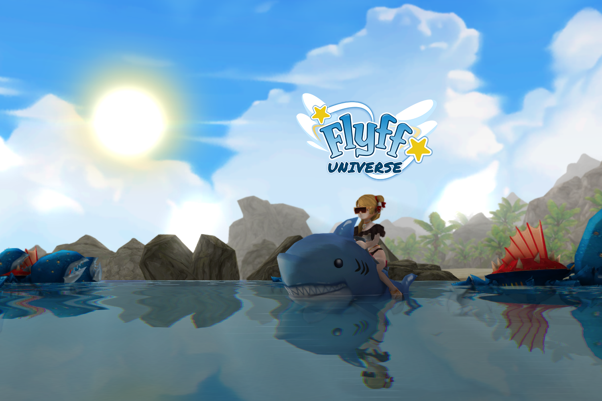

> [!IMPORTANT]
> **Document about the game Flyff Universe. <ins>NOT affiliated with GalaLab / Wemade Connect / PlayPark / Ruiwoo Technology.</ins>**

> [!IMPORTANT]
> **The information used in the document is from the FlyFF Universe API and belong to Gala Lab Corp.**

> [!CAUTION]
> **This repository was created to promote the game. If any inconvenience is caused, please contact me as soon as possible. Thank you.** 🙏

<!-- Copyright 2025 © Gala Lab Corp. All Rights Reserved. -->

<table><tr><td>

📁 Table of Contents

- [universe-document](#universe-document)
  - [🌐 community](#-community)
    - [closed](#closed)
  - [⚙️ system](#️-system)
    - [📢 updates](#-updates)
      - [💸 top up event](#-top-up-event)
    - [📅 all server contents time](#-all-server-contents-time)
    - [🕙 time](#-time)
    - [🗺️ map](#️-map)
      - [madrigal minimum level limit](#madrigal-minimum-level-limit)
      - [wdmadrigal](#wdmadrigal)
      - [coral island monster](#coral-island-monster)
      - [herneos monster](#herneos-monster)
      - [kaillun monster](#kaillun-monster)
    - [🖱️ pixel perfect cursor precision](#️-pixel-perfect-cursor-precision)
    - [❤️ provisional damage hp](#️-provisional-damage-hp)
    - [🎨 theme](#-theme)
    - [💬 chatting filter](#-chatting-filter)
    - [👩🏻‍💻 commands](#-commands)
    - [💫 transmute](#-transmute)
    - [🏰 guild level](#-guild-level)
    - [👩🏻‍❤️‍👨🏻 couple](#️-couple)
      - [couple levels](#couple-levels)
      - [couple skills](#couple-skills)
      - [couple ring](#couple-ring)
      - [couple daily quests](#couple-daily-quests)
      - [couple anniversary rewards](#couple-anniversary-rewards)
    - [🤝 party](#-party)
      - [party window](#party-window)
      - [exp share](#exp-share)
      - [contribution](#contribution)
      - [exp bonus](#exp-bonus)
      - [party exp](#party-exp)
      - [party skill](#party-skill)
    - [🎯 1v1 bonus](#-1v1-bonus)
    - [🥇 level gap](#-level-gap)
    - [🎁 drop rate](#-drop-rate)
      - [Level-based Drop Rate Penalties](#level-based-drop-rate-penalties)
      - [Optional Master/Hero Quests](#optional-masterhero-quests)
      - [Character Buffs That Increase Drop Rate](#character-buffs-that-increase-drop-rate)
      - [Drops Mechanics](#drops-mechanics)
      - [1v1 Disadvantage Towards AoE](#1v1-disadvantage-towards-aoe)
      - [Dungeon](#dungeon)
    - [📦 item rarity](#-item-rarity)
    - [💳 extended battle pass](#-extended-battle-pass)
    - [⚖️ trade](#️-trade)
    - [🛒 search shop](#-search-shop)
    - [👕 fitting room](#-fitting-room)
    - [👗 costume collection](#-costume-collection)
      - [👗 costume collection details](#-costume-collection-details)
    - [⏳ monster focus timer](#-monster-focus-timer)
    - [🐑 herd damage reduction](#-herd-damage-reduction)
    - [🧠 skill point](#-skill-point)
    - [💪 buff scale](#-buff-scale)
    - [💯 level reach rewards](#-level-reach-rewards)
    - [👑 master\&hero quests](#-masterhero-quests)
      - [master cloak](#master-cloak)
      - [hero reward](#hero-reward)
  - [🧪 formula](#-formula)
  - [🚀 upgrade](#-upgrade)
    - [🎲 power dice](#-power-dice)
    - [🧤 catcher](#-catcher)
    - [🥺 pity system](#-pity-system)
    - [🏹 weapon\&armor upgrade](#-weaponarmor-upgrade)
      - [event](#event)
      - [upgrade level bonus](#upgrade-level-bonus)
    - [🆄🅻🆃🅸🅼🅰🆃🅴 ultimate](#-ultimate)
      - [ultimate weapon](#ultimate-weapon)
      - [lv150 weapon](#lv150-weapon)
      - [lv175 weapon](#lv175-weapon)
      - [lv180 weapon \& shield](#lv180-weapon--shield)
      - [reroll weapons](#reroll-weapons)
      - [ultimate jewelry](#ultimate-jewelry)
    - [🦾 new horizon equipment sets](#-new-horizon-equipment-sets)
    - [🦾 muran's awakening equipment sets](#-murans-awakening-equipment-sets)
    - [💎 ultimate jewels](#-ultimate-jewels)
    - [💍 jewelry upgrade](#-jewelry-upgrade)
    - [🔥 element upgrade](#-element-upgrade)
    - [✨ glow\&swinging](#-glowswinging)
      - [weapon glow](#weapon-glow)
      - [armor glow](#armor-glow)
      - [swinging](#swinging)
    - [✂️ piercing](#️-piercing)
      - [event](#event-1)
    - [🛠️ craft](#️-craft)
    - [🙌 blessing](#-blessing)
    - [📜 stat scroll](#-stat-scroll)
    - [📜 awake](#-awake)
  - [🐶 pet](#-pet)
    - [🦮 raised pet](#-raised-pet)
    - [🕊️ grace effect](#️-grace-effect)
    - [🍭 pet candy recipes](#-pet-candy-recipes)
    - [🐾 pet defect recycling](#-pet-defect-recycling)
    - [🐾 pet rerolling](#-pet-rerolling)
    - [🌿 berry map](#-berry-map)
    - [💫 pet transmutation](#-pet-transmutation)
  - [🐉 dungeons](#-dungeons)
    - [📌 dungeons location](#-dungeons-location)
    - [🚩 dungeons difficulties](#-dungeons-difficulties)
    - [📚 story dungeons](#-story-dungeons)
    - [📍 dungeon checkpoints](#-dungeon-checkpoints)
    - [⏳ cooldown](#-cooldown)
    - [🥅 pet cages](#-pet-cages)
    - [💥 dungeons curses](#-dungeons-curses)
      - [the wilds \& ankou's asylum](#the-wilds--ankous-asylum)
    - [💎 dungeons drops](#-dungeons-drops)
    - [❓ office quest](#-office-quest)
    - [🗼 forsaken tower](#-forsaken-tower)
    - [❓ daily quests v1.5](#-daily-quests-v15)
    - [🏆 guild siege](#-guild-siege)
      - [red chip](#red-chip)
      - [maps](#maps)
    - [🏆 kalgas assault](#-kalgas-assault)
  - [🏠 housing](#-housing)
    - [📍 template](#-template)
    - [🗿 npc](#-npc)
      - [Personal House NPC](#personal-house-npc)
      - [Guild House NPC](#guild-house-npc)

</td></tr></table>

## 🌐 community

*  [Flyff Universe](https://universe.flyff.com/ "Flyff Universe")： Official Website.

   * 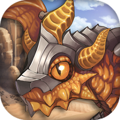 [Galalab Support (helpshift)](https://galalab.helpshift.com/hc/en/12-flyff-universe/contact-us/ "Galalab Support (helpshift)")： Customer Support.

   *  [Flyff Universe Discord](https://discord.com/invite/flyffuniverse "Flyff Universe Discord")： Official Discord.

   *  [Flyff Universe API](https://api.flyff.com/ "Flyff Universe API")： Flyff Universe Public API.

   *  [Flyff Official Fansite Kit](https://drive.google.com/drive/folders/12jQHkPvKXZrDZ9h_SNS7scf2mGUKSuKl "Flyff Official Fansite Kit")： Fansite Kit with high quality Flyff assets.

   *  [Gothante](https://gothante.wiki/ "Gothante")： Meet Gothante, a general search tool for Flyff Universe!

   *  [Frostiae/Flyffulator](https://flyffulator.com/)： Extensive character simulator and damage calculator for Flyff Universe.

   *  [Flyff-Universe-Translations](https://github.com/Gala-Lab/Flyff-Universe-Translations "Flyff-Universe-Translations")： Official Flyff Universe localization repository.

*  [swaight/Flyffipedia](https://flyffipedia.com/ "swaight/Flyffipedia")： A wiki page containing all kinds of static information about the game's data.

*  [tacota0158/Madrigalinside](https://madrigalinside.com/ "tacota0158/Madrigalinside")： A wiki page containing all kinds of static information about the game's data.

*  [nulfrost/Skillulator | FlyFF Universe Skill Calculator](https://skillulator.lol/ "nulfrost/Skillulator | FlyFF Universe Skill Calculator")： Skillulator helps you optimize and share your FlyFF skill builds.

*  [guysuvijak/Flyff - Skill Simulator](https://flyffskillsimulator.vercel.app/ "guysuvijak/Flyff - Skill Simulator")： Flyff Skill Simulator is an open-source project developed using Next.js and React Flow technologies.

*  [ShynoX/SiegeStats](https://siegestats.cc/ "ShynoX/SiegeStats"): SiegeStats is all about the Player vs. Player aspect of Flyff. It aims to organize and visualize Flyff's Battlelog format to allow inspection and analysis of those.

*  [toffeegg/FlyffU-Launcher](https://github.com/toffeegg/FlyffU-Launcher/releases "toffeegg/FlyffU-Launcher")： A multi-profile launcher for Flyff Universe.

*  [Stellar/Flyff Calculators](https://flyff-calculators.com/ "Stellar/Flyff Calculators")： Calculate upgrade costs in flyff universe for gear, jewelry, piercing, ultimate and more!

*  [Housing help by Yuzaro](https://housing-yuzaro.netlify.app/ "Housing help by Yuzaro")： A Simple Website for Housing Furniture Preview. <!-- https://discord.com/channels/778915844070834186/1076577520301903984/1214919984506212362 -->

*   [i9hdkills Flyff Universe resources](https://flyffuniversemodelviewer.com/cs-viewer "i9hdkills Flyff Universe resources")： A collection of different tools and resources for Flyff Universe.

*  [MonkeyZero/Flyff Model Viewer | flyffmodelviewer.com](https://flyffmodelviewer.com/ "MonkeyZero/Welcome to Flyff Model Viewer | flyffmodelviewer.com")： The Ultimate Gateway to the Wonderful Universe of Fly For Fun!

### closed

<table><tr><td>

details

<!-- Your contributions are greatly appreciated! -->

* [FlyingSnow/Flyff Universe quest rewards overview](https://flyffu-quest-rewards-overview.herokuapp.com/ "FlyingSnow/Flyff Universe quest rewards overview")：An overview of the obtainable rewards of the different quests in Flyff Universe.

   * [bram-prins/flyff-universe-quest-rewards-overview](https://github.com/bram-prins/flyff-universe-quest-rewards-overview "flyff-universe-quest-rewards-overview")

* [shovel/Madrigalmaps](https://www.madrigalmaps.com/ "shovel/Madrigalmaps")：An interactive map of the world, Madrigal.

</td></tr></table>

## ⚙️ system

[🔝 Back to top](#universe-document)

  
📁 system details

### 📢 updates

<table><tr><td>

details

 

2020~2021

* `2020-12-15 07:00 UTC ~ 2020-12-30 16:00 UTC`:Closed Beta Test server.

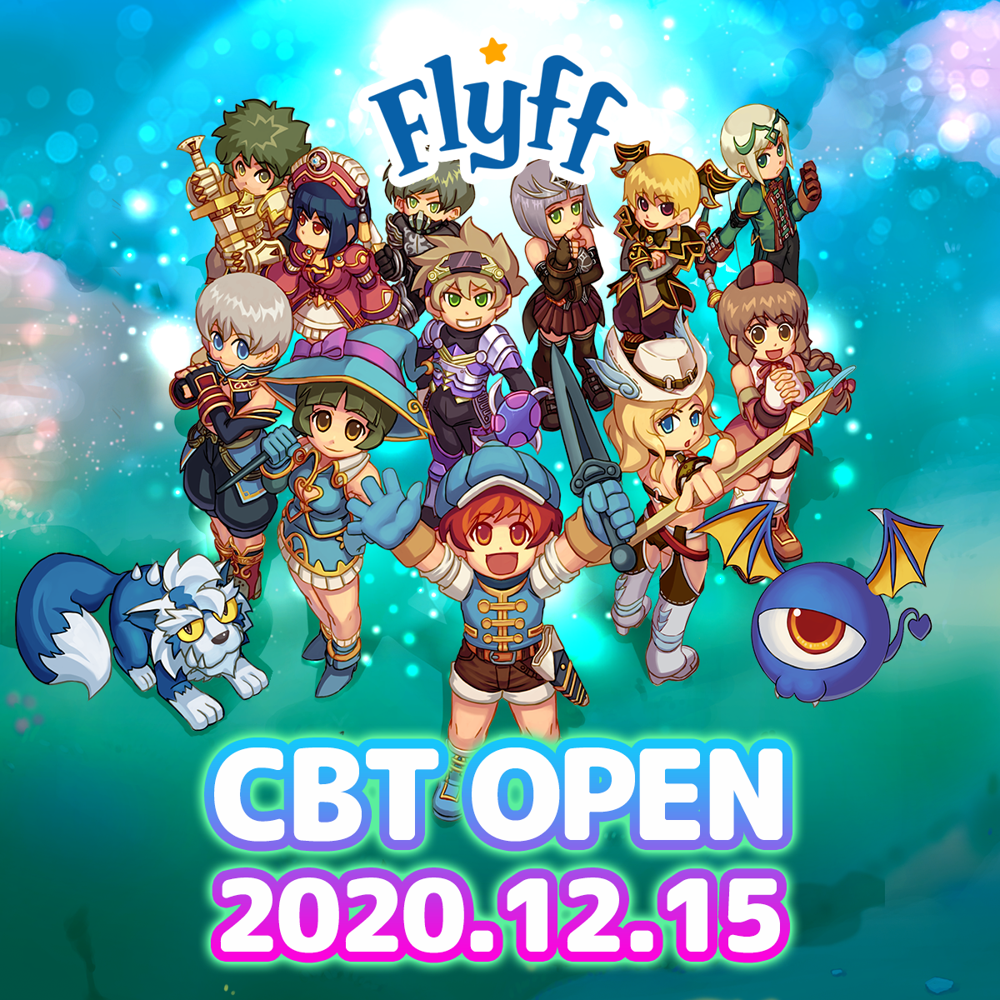

* `2021-01-27 08:00 UTC ~ 2021-01-31 16:00 UTC`:Test server.

2022

* `2022-03-30 09:00 UTC`:Gala Lab is reveal new cross-platform 3D MMORPG `Flyff Universe`.

* `2022-05-18 01:00 UTC`:Early Access to the South-East Asia Server, Pre-registration for Global starts.

   > [Early Access in SEA will open May 18th](https://universe.flyff.com/news/early-access-20220518 "Early Access in SEA will open May 18th")

* `2022-05-20 15:00 UTC`:New server `Glaphan` starts.

   > [@lsaos @[Dev] Aishiro (discord flyff universe)](https://discord.com/channels/778915844070834186/959370780666396703/977209581627400212 "@lsaos @[Dev] Aishiro (discord flyff universe)")

* `2022-06-14 02:00 UTC`:Flyff Universe Global Servers start.

   > [@camac. @[Dev] Cameron (discord flyff universe)](https://discord.com/channels/778915844070834186/778927702874652682/983411667977269289 "@camac. @[Dev] Cameron (discord flyff universe)")

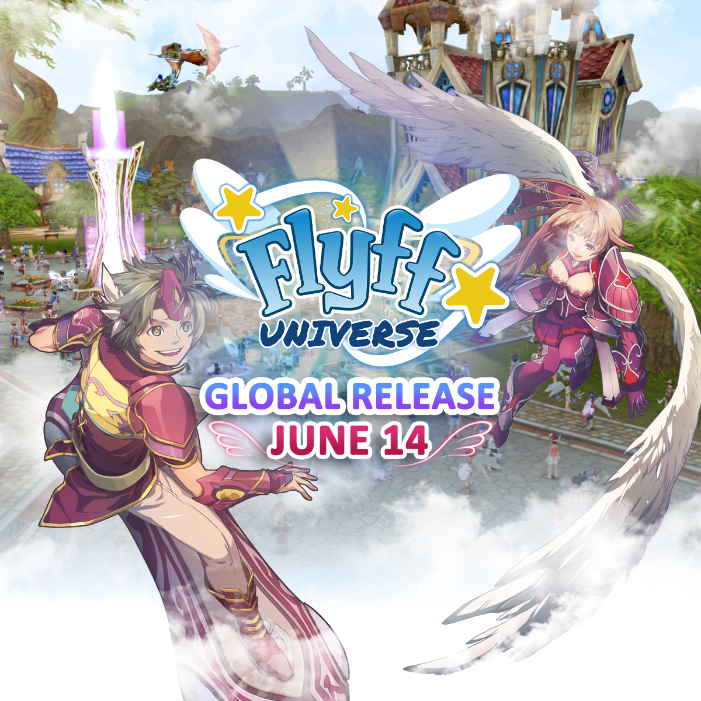

* `2022-11-03 06:00 UTC`:New Taiwanese server `獨眼蝙蝠` starts.

* `2022-08-22 07:00 UTC`:[Summer `2022` expansion (version `1.1.0`)](https://universe.flyff.com/news/summerupdate "Summer 2022 expansion on August 22!")

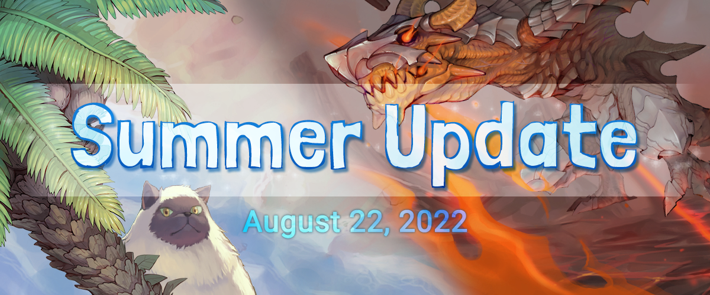

* `2022-11-03 06:00 UTC`:[Battle Pass System](https://universe.flyff.com/news/battlepass "Battle Pass System")

2023

* `2023-03-13 07:00 UTC`:[Reborn `v1.2.0` expansion (version `1.2.0`)](https://universe.flyff.com/news/reborn120 "v1.2.0 Reborn is coming on March 13!")

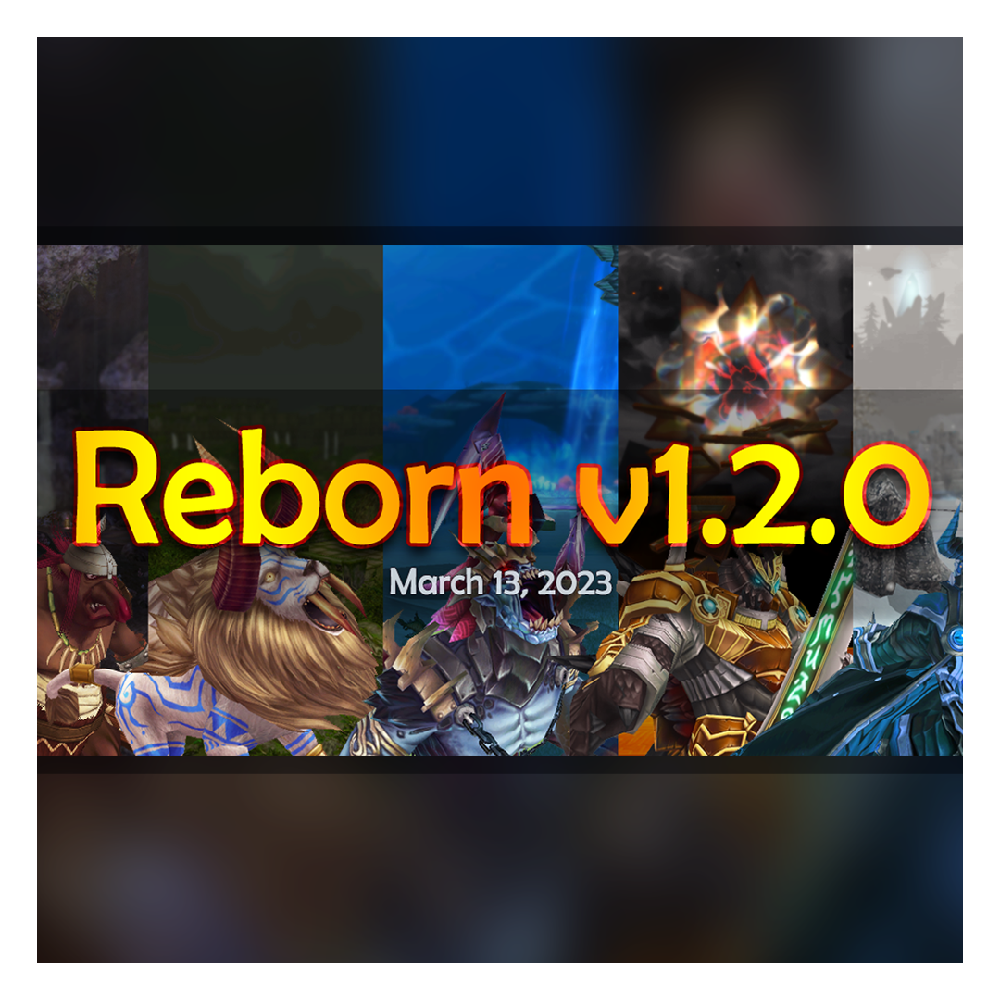

* `2023-05-18 07:00 UTC`:[1st Flyff World Championship (FWC) for Flyff Universe](https://universe.flyff.com/news/fwc1 "1st Flyff World Championship (FWC) for Flyff Universe")

   > [FWC Event Details](https://universe.flyff.com/news/fwc1event "FWC Event Details")

* `2023-07-13 09:00 UTC`:[Áries and Flarine Server Merge](https://universe.flyff.com/news/servermergebrltam "Server Merge Notice: Áries and Flarine Server Merge")

* `2023-10-12 07:00 UTC`:End of `FWC` Server and Transfer.

   > [Maintenance Notice (10/12)](https://universe.flyff.com/news/maintenanceoctober12 "Maintenance Notice (10/12)")

* `2023-11-09 09:00 UTC`:[New Horizon Expansion (Flyff Universe Version 1.3.0)](https://universe.flyff.com/news/newhorizonv1301 "New Horizon Expansion (Flyff Universe Version 1.3.0)")

* `2023-12-21 10:00 UTC`:New Asia server `Rhisis` starts.

2024

* `2024-02-15 09:00 UTC`:[New Horizon Expansion (Flyff Universe Version 1.3.6)](https://universe.flyff.com/news/patchnotes136 "Game Version 1.3.6 Patch Notes")

* `2024-05-16 08:00 UTC`:[Flyff World Championship 2024](https://universe.flyff.com/news/fwc2024 "Flyff World Championship 2024")

   > [FWC 2024 Server Event](https://universe.flyff.com/news/fwc2024serverevent "Flyff World Championship 2024")

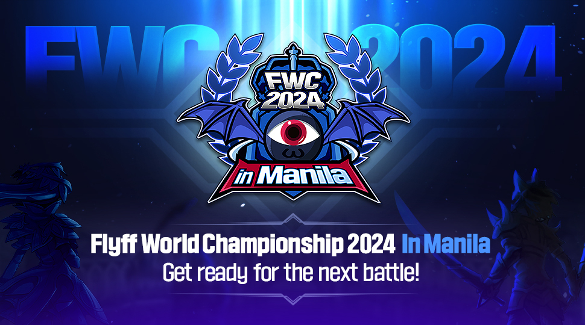

* `2024-08-16`: [Flyff 20 Year Anniversary Article](https://universe.flyff.com/news/flyff20anniversaryarticle "Flyff 20 Year Anniversary Article")

* `2024-10-17 09:00 UTC`:[Battle for Madrigal Expansion (Flyff Universe Version 1.4.0)](https://universe.flyff.com/news/battleformadrigal1400 "Battle for Madrigal Expansion (Flyff Universe Version 1.4.0)")

* `2024-10-24 07:00 UTC`:End of `FWC 2024` Server and Transfer.

   > [Maintenance Notice (10/24)](https://universe.flyff.com/news/maintenanceoctober24 "Maintenance Notice (10/24)")

* `2024-11-28 09:00 UTC`:[Updates to Battle for Madrigal Expansion (Flyff Universe Version 1.4.1)](https://universe.flyff.com/news/ver141 "Updates to Battle for Madrigal Expansion (Flyff Universe Version 1.4.1)")

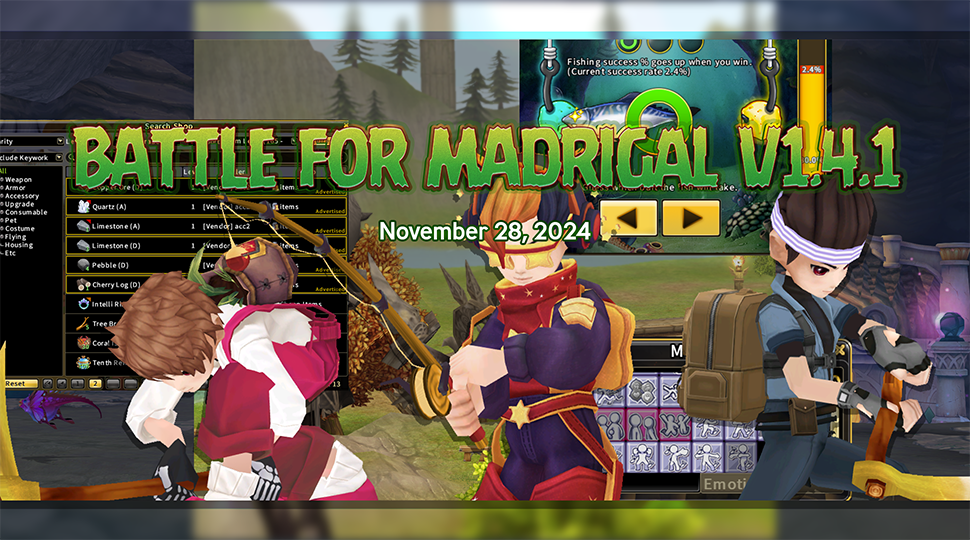

2025

* `2025-02-27 09:00 UTC`:[Server Merge Announcement: Totemia and Genèse servers](https://universe.flyff.com/news/servermergefeb25 "Server Merge Announcement: Totemia and Genèse servers")

* `2025-04-24 08:00 UTC`:[Flyff World Championship 2025](https://universe.flyff.com/news/fwc2025 "Flyff World Championship 2025")

   > [📢 FWC 2025 Server Event Announcement](https://universe.flyff.com/news/fwc2025event "📢 FWC 2025 Server Event Announcement")

* `2025-10-22 08:00 UTC`: [Public Test Server Manifest](https://universe.flyff.com/news/pts2025)

* `2025-11-27 02:00 UTC`: [Muran’s Awakening Expansion (Flyff Universe version 1.5.0)](https://universe.flyff.com/news/muransawakeningexpansion "Muran's Awakening Expansion (Flyff Universe Version 1.5.0)")

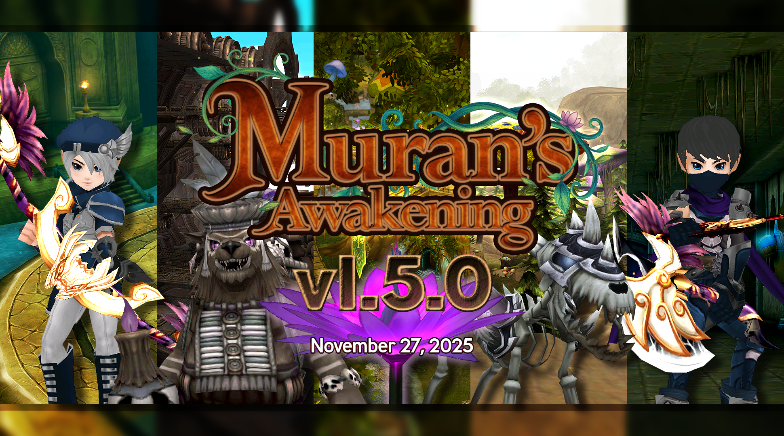

2026

* `2025-01-26 06:23 UTC`:[📢 Flyff Universe Official Translation Repository – Info & Call for Contributions](https://universe.flyff.com/news/translationreposiktroy2026 "📢 Flyff Universe Official Translation Repository – Info & Call for Contributions")

   > [Flyff-Universe-Translations](https://github.com/Gala-Lab/Flyff-Universe-Translations "Flyff-Universe-Translations")

#### 💸 top up event

details

* `2022-05-17 ~ 2022-05-31 07:00 UTC`:[Server Group Purchase](https://universe.flyff.com/news/grouppurchase "Server Group Purchase")

* `2022-05-18 ~ 2022-06-28 14:00 UTC`:First Top-Up Event (2x).

* `2022-05-31 ~ 2022-06-02`:[Early Access Customer Appreciation Event](https://m.facebook.com/uflyff/photos/a.113466831296755/132532422723529/ "Early Access Customer Appreciation Event")

   * You will receive `30%` more fCoins from topping up! The bonus can only be claimed once per Top-up option.

   * `30%` Top-up Bonus Event does Not apply with "First Top up(2x)".

* `2022-07-05 ~ 2022-07-12`:[fCoins Spending Event](https://universe.flyff.com/news/fcoinsspending05072022 "fCoins Spending Event")

* `2022-07-31 00:00 UTC ~ 2022-08-02 23:59 UTC`:[Top-Up 30% Discount Event](https://universe.flyff.com/news/topup30aug "Top-Up 30% Discount Event")

* `2022-09-30 00:00 UTC ~ 2022-10-02 23:59 UTC`:[Top-Up Event (Sept 30 - Oct 2)](https://universe.flyff.com/news/topupevent220930 "Top-Up Event (Sept 30 - Oct 2)")

* `2022-11-11 00:00 (server time) ~ 2022-11-13 23:59 (server time)`:[Purchasing Event](https://universe.flyff.com/news/purchaseevent221110 "Purchasing Event")

* **2 for 1** `2022-11-24 ~ 2022-11-27 23:59 UTC`:[Black Friday Special Sales](https://universe.flyff.com/news/blackfridaysales "Black Friday Special Sales")

* `2022-12-27 ~ 2022-01-12 23:59 UTC`:[Lucky Roulette Event](https://universe.flyff.com/news/luckyroulette "Lucky Roulette Event")

* **2 for 1** `2023-03-02 07:00 UTC ~ 2023-03-08 07:00 UTC`:Special `1+1` Category, `20%` discount.

   > [🔔item-shop-news @gm_shadow [GM] Shadow (discord flyff universe)](https://discord.com/channels/778915844070834186/1034809950356111390/1080759284163412059 "🔔item-shop-news @gm_shadow @[GM] Shadow (discord flyff universe)")

* `2023-03-13 ~ 2023-04-02 23:59 UTC`:[Special Stripe Payment Event](https://universe.flyff.com/news/stripepayment "Special Stripe Payment Event")

* `2023-05-18 07:00 UTC ~ 2023-05-25 06:59 UTC`:Special Item Shop Discount `20%` discount.

   > [🔔item-shop-news @gm_shadow [GM] Shadow (discord flyff universe)](https://discord.com/channels/778915844070834186/1034809950356111390/1108664998328287325 "🔔item-shop-news @gm_shadow [GM] Shadow(discord flyff universe)")

* **2 for 1** `2023-11-24 00:00 UTC ~ 2023-11-27 23:59 UTC`:Black Friday Special Sales `1+1` (No `20%` discount).

   > [🔔item-shop-news @wemadeconnect @[GM] Pang (discord flyff universe)](https://discord.com/channels/778915844070834186/1034809950356111390/1177389181723496498 "🔔item-shop-news @wemadeconnect @[GM] Pang (discord flyff universe)")

* **2 for 1** `2024-11-29 00:00 UTC ~ 2024-11-30 23:59 UTC`:Black Friday Special Sales `1+1` (`20%` discount).

   > [🔔item-shop-news @wemadeconnect @[GM] Pang (discord flyff universe)](https://discord.com/channels/778915844070834186/1034809950356111390/1311623005864202250 "🔔item-shop-news @wemadeconnect @[GM] Pang (discord flyff universe)")

* **2 for 1** `2025-11-28 00:00 UTC ~ 2025-11-30 23:59 UTC`:Black Friday Special Sales `1+1` (`20%` discount).

   > [November 27 Item Shop Update](https://universe.flyff.com/news/nov27itemshopupdate "November 27 Item Shop Update")

</td></tr></table>

### 📅 all server contents time

<table><tr><td>

details

> source:[Minor Fixes after 11/21 Maintenance](https://universe.flyff.com/news/minorfixesnov21 "Minor Fixes after 11/21 Maintenance")

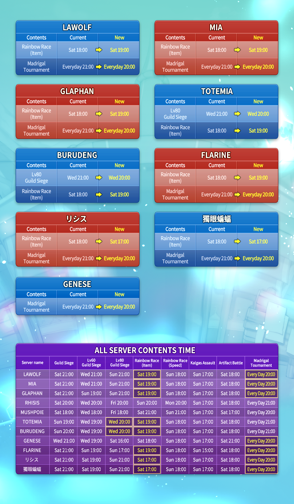

</td></tr></table>

### 🕙 time

<table><tr><td>

details

> source:[@yorrow @[Totemia] Pantalaimon (discord flyff universe)](https://discord.com/channels/778915844070834186/1000058902576119878/1025687121161375794 "@yorrow @[Totemia] Pantalaimon (discord flyff universe)")

* `1` second of real time = `100` seconds in game.

   > 現實世界 `1` 秒鐘 = 遊戲世界 `100` 秒。

* A whole day is `14` minutes and `24` seconds (`14:24`).

   > 遊戲中一天是現實世界 `14` 分 `24` 秒（`14:24`)。

* Night is `6` minutes and `36` seconds(`6:36`), from `19:00` to `06:00`.

   > 夜晚為現實世界 `6` 分 `36` 秒（`6:36`），從遊戲世界 `19:00` 到 `06:00`。

* Daytime is `7` minutes and `48` seconds(`7:48`), from `06:00` to `19:00`.

   > 白晝為現實世界 `7` 分 `48` 秒（`7:48`），從遊戲世界 `06:00` 到 `19:00`。

</td></tr></table>

### 🗺️ map

<table><tr><td>

details

#### madrigal minimum level limit

* Some continents now require a minimum player level: Level `20` for Garden of Rhisis and Darkon 3, Level `80` for Azria and Level `100` for Coral Island. Note that the level requirement does not apply to safe areas like Azria Village, Coral Village, The Wilds entrance, etc. Players not meeting level requirements will be automatically teleported to Flaris.

* Reduced the requirement to teleport to Sunny Pang using Town Blinkwing or Blinkwing of Madrigal from Level `120` to Level `110`.

> source:[Game Version 1.3.11 Patch Notes](https://universe.flyff.com/news/patchnotes1311 "Game Version 1.3.11 Patch Notes")

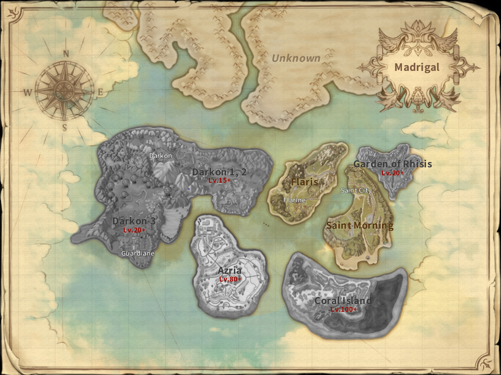

#### wdmadrigal

#### coral island monster

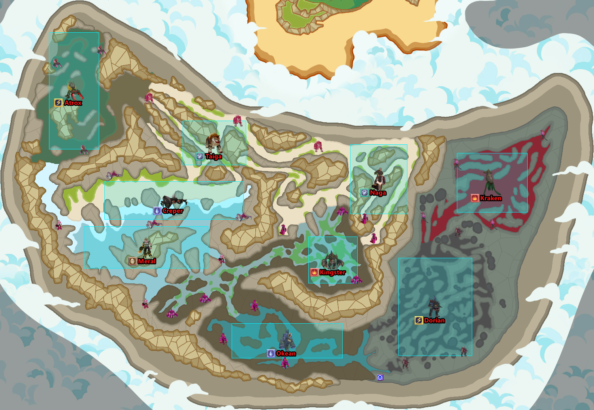

#### herneos monster

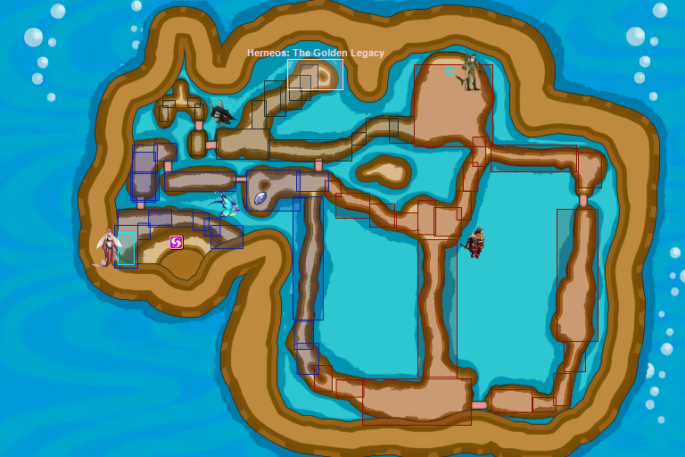

#### kaillun monster

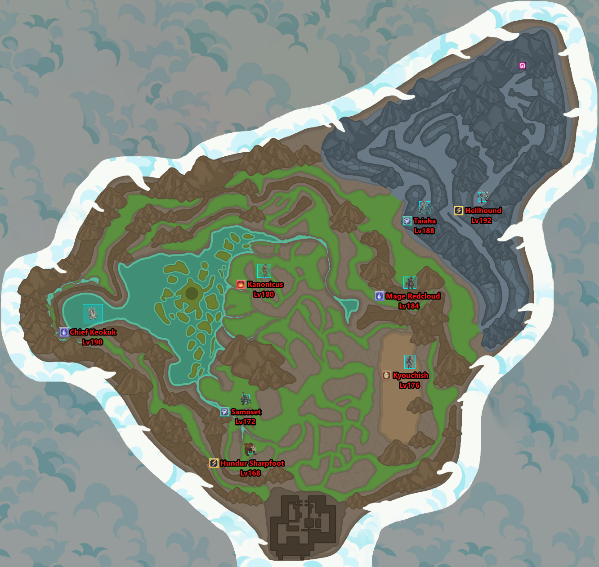

</td></tr></table>

### 🖱️ pixel perfect cursor precision

<table><tr><td>

details

> source:[Game Version 1.2.12 Minor Patch Notes](https://universe.flyff.com/news/patchnotes1212minor "Game Version 1.2.12 Minor Patch Notes")

* Pixel perfect Cursor Selection allowing for precise pixel-level selection and ensuring accurate selection at the boundaries and corners of UI elements, for players who want to target objects more precisely.

</td></tr></table>

### ❤️ provisional damage hp

<table><tr><td>

details

* Provisional Damage Hp Gauge effect option to the Options window (Disabled by default).

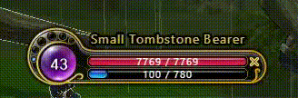

</td></tr></table>

### 🎨 theme

<table><tr><td>

details

**For more information please refer to [Gothante](https://gothante.wiki/?search=how+to+change+theme%3F).**

</td></tr></table>

### 💬 chatting filter

<table><tr><td>

details

**For more information please refer to [Gothante](https://gothante.wiki/?search=chat).**

> source:[Game Version 1.3.3 Patch Notes](https://universe.flyff.com/news/patchnotes133 "Game Version 1.3.3 Patch Notes")

* Added Chat color customization options in Chat option window.

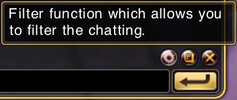

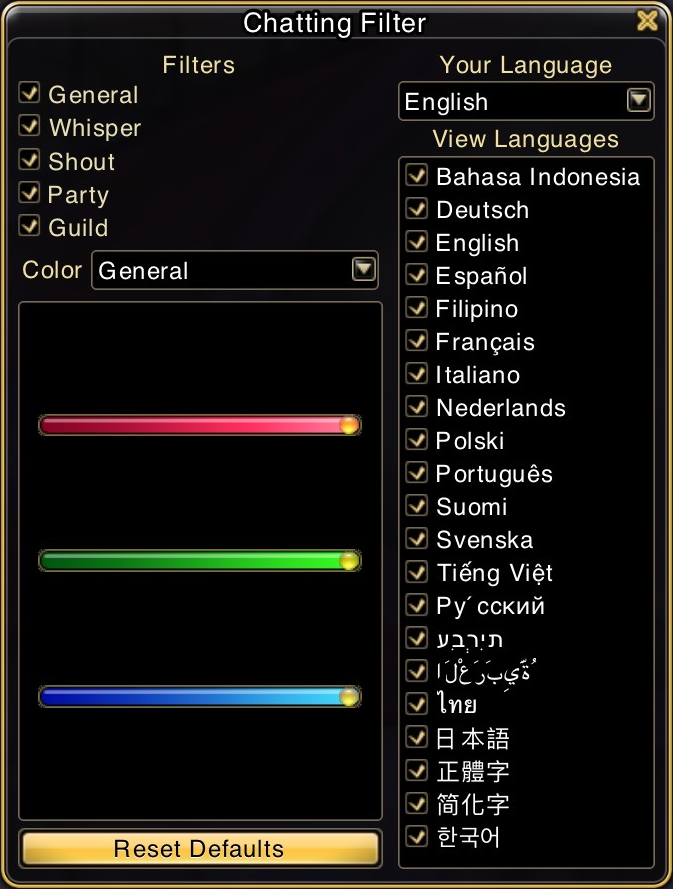

</td></tr></table>

### 👩🏻‍💻 commands

<table><tr><td>

details

**For more information please refer to [Gothante](https://gothante.wiki/?search=commands).**

> source:[Game Version 1.3.2 Patch Notes](https://universe.flyff.com/news/patchnotes132 "Game Version 1.3.2 Patch Notes")

* Added a chat command `/lockedslots` to display all missing quests and achievements unlocking inventory slots.

> source:[Game Version 1.4.3 Patch Notes (March 6)](https://universe.flyff.com/news/patchnotemarch6 "Game Version 1.4.3 Patch Notes (March 6)")

* You can now spectate players inside Guild Siege maps using `/spectate <name>`, with some restrictions. Spectating a player will allow your camera to follow them.

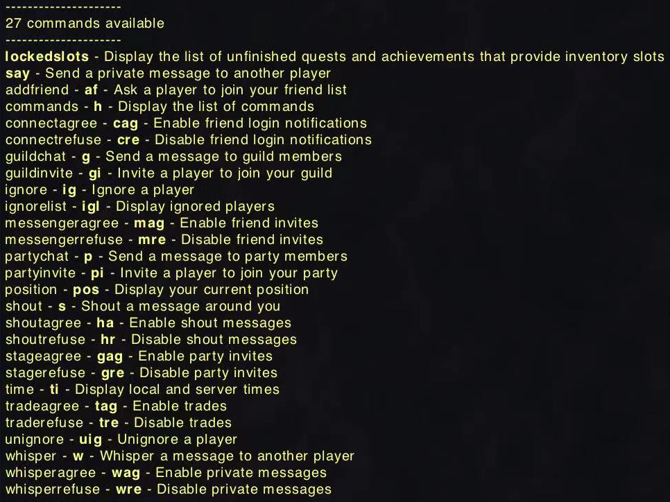

</td></tr></table>

### 💫 transmute

<table><tr><td>

details

**For more information please refer to [Gothante](https://gothante.wiki/?search=how+do+i+transmute+an+equipment%3F).**

</td></tr></table>

### 🏰 guild level

<table><tr><td>

details

**For more information please refer to [Gothante](https://gothante.wiki/?search=guild+level).**

> source:[@bluechromed @[Dev] Blukie (discord flyff universe)](https://discord.com/channels/778915844070834186/1000058902576119878/1173045738230521926 "@bluechromed @[Dev] Blukie (discord flyff universe)")

> source:[@kroontje @[Mod] Kroontje (discord flyff universe)](https://discord.com/channels/778915844070834186/1076577555546656850/1201432655619702885 "@kroontje @[Mod] Kroontje (discord flyff universe)")

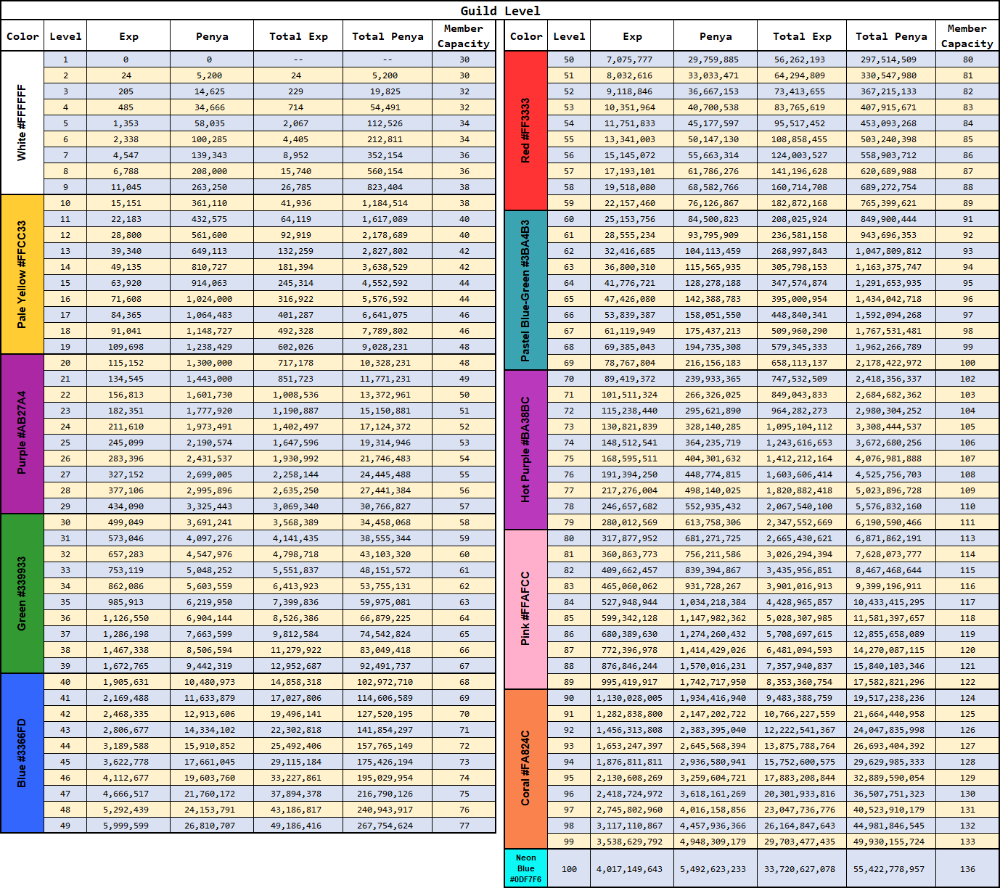

> source:[@cysotiso @cysotiso (discord flyff universe)](https://discord.com/channels/778915844070834186/1000058902576119878/1342035456627310613 "@cysotiso @cysotiso (discord flyff universe)")

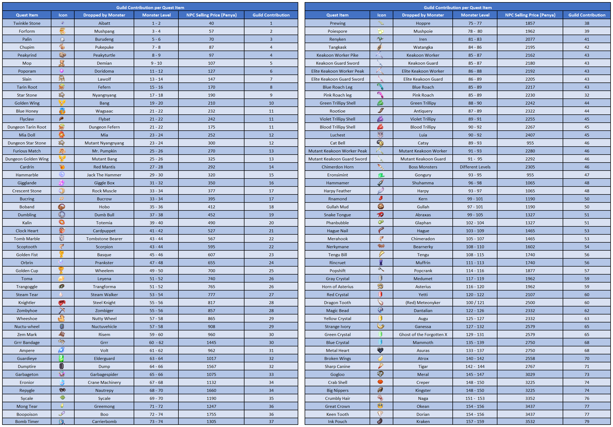

</td></tr></table>

### 👩🏻‍❤️‍👨🏻 couple

<table><tr><td>

details

> source:[Battle for Madrigal Expansion (Flyff Universe Version 1.4.0)](https://universe.flyff.com/news/battleformadrigal1400 "Battle for Madrigal Expansion (Flyff Universe Version 1.4.0)")

#### couple levels

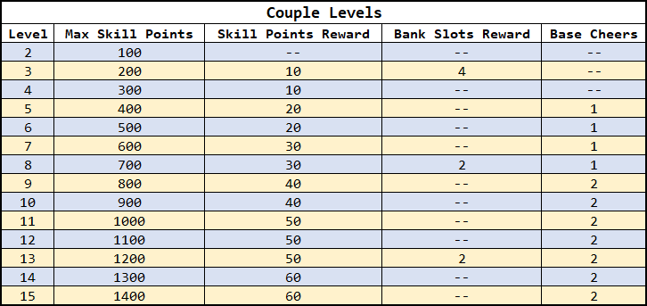

#### couple skills

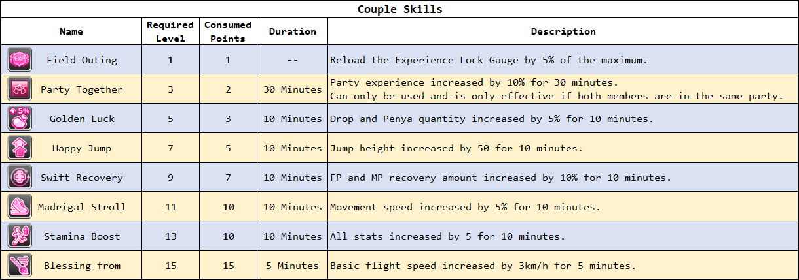

#### couple ring

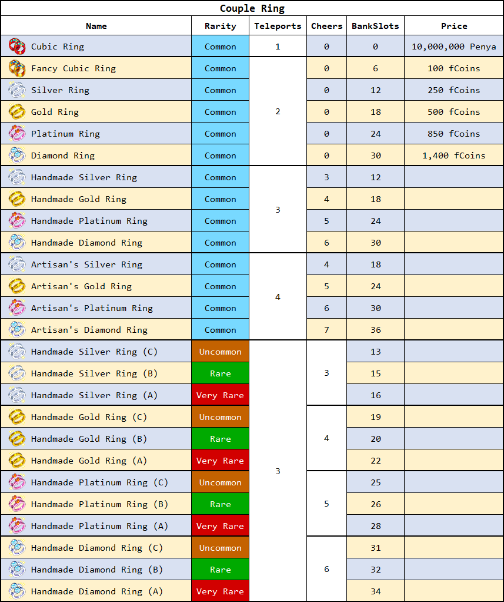

#### couple daily quests

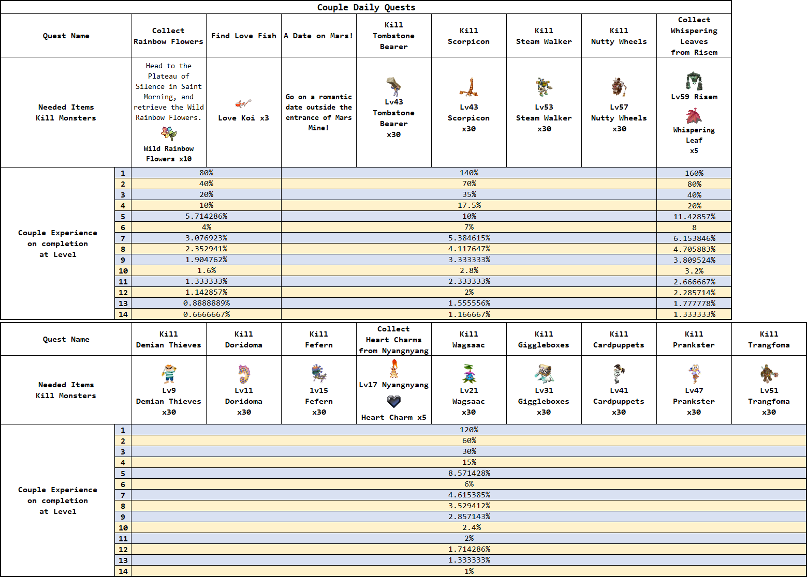

#### couple anniversary rewards

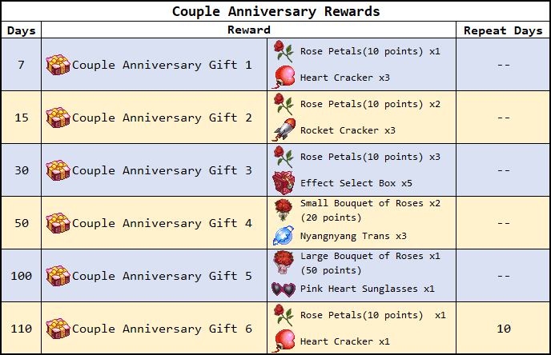

</td></tr></table>

### 🤝 party

<table><tr><td>

details

> source:[Game Version 1.0.3 Patch Notes](https://universe.flyff.com/news/patchnotes103 "Game Version 1.0.3 Patch Notes")

> source:[Game Version 1.0.4 Patch Notes](https://universe.flyff.com/news/patchnotes104 "Game Version 1.0.4 Patch Notes")

#### party window

* Exp Bonus: The additional experience gained by the party members in the surroundings.
  > 經驗獎勵：劇團成員在周遭環境中獲得的額外經驗。

* Min Level: The minimum level required to get experience and to contribute to the party Exp Bonus.
  > 最低等級：獲得經驗並為劇團經驗獎勵做出貢獻所需的最低等級。

  * This corresponds to the level of the highest level player in the party and in the surroundings, minus `19 / 9 (master or hero quest)`.
    > 劇團中和周圍環境中最高等級玩家的等級(減去 `19 / 9 (master or hero quest)` 級)。

  * The text is red if the player does not meet the condition.
    > 如果玩家不符合條件，則文字為紅色。

#### exp share

* The "**Level**" and "**Contribution**" experience sharing modes now provide different amount of **Exp Bonus**, and the way the experience is shared is different as well.
  > 「等級」和「貢獻」經驗分享模式現在提供不同的經驗加成，並且經驗分享的方式也有所不同。

  * With "**Level**" the experience is distributed to the Party members according to their levels.
    > 「等級」的經驗將根據成員的等級進行分配。

  * With "**Contribution**" the experience is given according to the participation to kill the monster (their contribution to the combat). Contribution includes attacking, healing and tanking.
    > 「貢獻」的經驗根據擊殺怪物的參與度(對戰鬥的貢獻)進行分配。貢獻包括攻擊、治療和坦克。

* No matter the sharing mode, the bonus part of the experience is always distributed to all party members around and according to their levels.
  > 無論何種分享模式，經驗的加成部分總是會根據等級分配給周圍的所有成員。

* There is no more specific bonus to complete the party with `8` members, apart from the base bonus depending on the number of members around.
  > 除了取決於周圍成員數量的基本獎勵之外，組滿 `8` 名成員的劇團沒有更具體的獎勵。

#### contribution

* Contribution Exp is now shared equally across party members who participated to the fight. [Game Version 1.0.3 Patch Notes](https://universe.flyff.com/news/patchnotes103 "Game Version 1.0.3 Patch Notes")
  > 貢獻經驗現在由參與戰鬥的成員平均分配。

* Holycross and other debuffs are now counted as party Contribution. [Game Version 1.0.3 Patch Notes](https://universe.flyff.com/news/patchnotes103 "Game Version 1.0.3 Patch Notes")
  > 神圣惩戒和和其他減益效果現在算是劇團貢獻。

* Adjusted the Party Contribution formula so the Support does not steal experience from the Attacker. [Game Version 1.0.4 Patch Notes](https://universe.flyff.com/news/patchnotes104 "Game Version 1.0.4 Patch Notes")
  > 調整了隊伍貢獻公式，使支持者不會從攻擊者那裡竊取經驗。

* Attacking, Tanking and Healing are now all counted as a contribution. Previously only attackers got the huge part of the contribution experience.
  > 攻擊、坦克和治療現在都算是貢獻。以前只有攻擊者才能獲得大部分貢獻經驗。

  * Now `3` players with the same level, `1` attacker, `1` tanker (can attack too), `1` healer (can attack or tank too) should get roughly the same amount of experience.
    > 現在 `3` 名相同等級的玩家，`1` 名攻擊者，`1` 名坦克手（也可以攻擊），`1` 名治療者（也可以攻擊或坦克）應該獲得大致相同的經驗量。

* **Contribution experience is based on the highest level contributor, so if the highest contributor has an exp penalty against the monster you’re fighting, everyone in the area receives the same penalty.**
  >  **貢獻經驗取決於最高等級的貢獻者，因此如果最高貢獻者對你正在戰鬥的怪物有經驗懲罰，則該區域中的每個人都會受到相同的懲罰。**

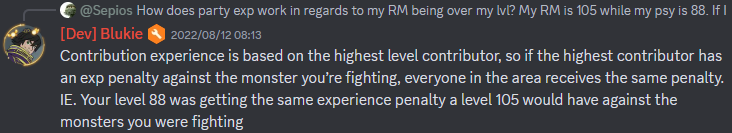

> source:[@bluechromed @[Dev] Blukie (discord flyff universe)](https://discord.com/channels/778915844070834186/1000058902576119878/1007441765206343680 "@bluechromed @[Dev] Blukie (discord flyff universe)")

#### exp bonus

* To grant the additional party experience bonus, players must be within `19 / 9 (master or hero quest)` levels.
  > 要獲得額外的劇團經驗獎勵，玩家等級必須在 `19 / 9 (master or hero quest)` 級以內。。

* **At least 2 members are needed to activate the experience bonus.**
  > **至少需要 `2` 名成員才能啟動經驗獎勵**。

* The Exp Bonus for a non-advanced Party (below level `10`) is the following:

  * `4%` per member in the surroundings (minimum `19 / 9 (master or hero quest)` levels below) + `13.5%` per active member contributing in the combat.
    > 周圍每位成員(相差 `19 / 9 (master or hero quest)` 級以內)提供 `4%` + 每個在戰鬥中做出貢獻的活躍成員提供 `13.5%`。

* The Exp Bonus for an advanced Party is the following:

  * With **Level** Exp Share: `7%` per member in the surroundings (minimum `19 / 9 (master or hero quest)` levels below) + `13%` per active member contributing in the combat.
    > 等級經驗分配：周圍每位成員(相差 `19 / 9 (master or hero quest)` 級以內)提供 `7%` + 每個在戰鬥中做出貢獻的活躍成員提供 `13%`。

  * With **Contribution** Exp Share: `7%` per member in the surroundings (minimum `19 / 9 (master or hero quest)` levels below) + `25%` per active member contributing in the combat.
    > 貢獻經驗分配：周圍每位成員(相差 `19 / 9 (master or hero quest)` 級以內)提供 `7%` + 每個在戰鬥中做出貢獻的活躍成員提供 `25%`。

#### party exp

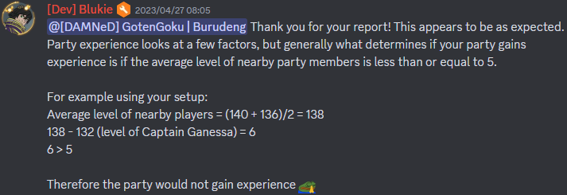

> source:[@bluechromed @[Dev] Blukie (discord flyff universe)](https://discord.com/channels/778915844070834186/1097267183945515100/1100935602746171522 "@bluechromed @[Dev] Blukie (discord flyff universe)")

* If the average level of the surrounding members compared to the monster's level is less than or equal to `5`, the party will gain experience.
  > 若周圍成員的平均等級與怪物等級相比小於或等於 `5`，劇團將獲得經驗。

#### party skill

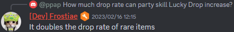

> source:[@frostiae @[Dev] Frostiae (discord flyff universe)](https://discord.com/channels/778915844070834186/1000058902576119878/1075631574864896010 "@frostiae @[Dev] Frostiae (discord flyff universe)")

* Lucky Drop: Doubles the drop rate of rare items (red items on the ground).

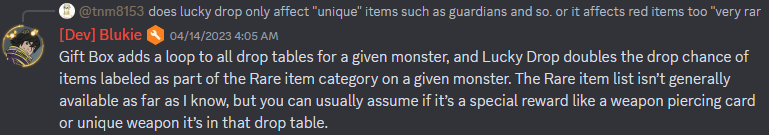

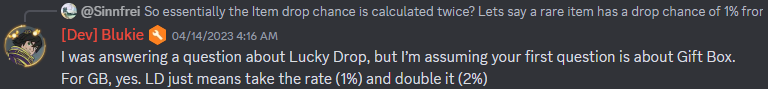

> source:[@bluechromed @[Dev] Blukie (discord flyff universe)](https://discord.com/channels/778915844070834186/1000058902576119878/1096164375313797150 "@bluechromed @[Dev] Blukie (discord flyff universe)")

* Gift Box: Adds a loop for all drop tables for a given monster (will run all drop tables 1 more time).

</td></tr></table>

### 🎯 1v1 bonus

<table><tr><td>

details

> source:[Game Version 1.1.3 Patch Notes](https://universe.flyff.com/news/patchnotes113 "Game Version 1.1.3 Patch Notes")

> source:[📣patch-notes @gm_shadow @[GM] Shadow (discord flyff universe)](https://discord.com/channels/778915844070834186/959370780666396703/1030383740632965120 "📣patch-notes @gm_shadow @[GM] Shadow (discord flyff universe)")

> source:[@bluechromed @[Dev] Blukie (discord flyff universe)](https://discord.com/channels/778915844070834186/1000058902576119878/1177176494221566062 "@bluechromed @[Dev] Blukie (discord flyff universe)")

> source:[getSingleTargetFactor() Flyffulator/src/flyff/flyffexperiencecalculator.js](https://github.com/Frostiae/Flyffulator/blob/main/src/flyff/flyffexperiencecalculator.js#L98 "getSingleTargetFactor() Flyffulator/src/flyff/flyffexperiencecalculator.js")

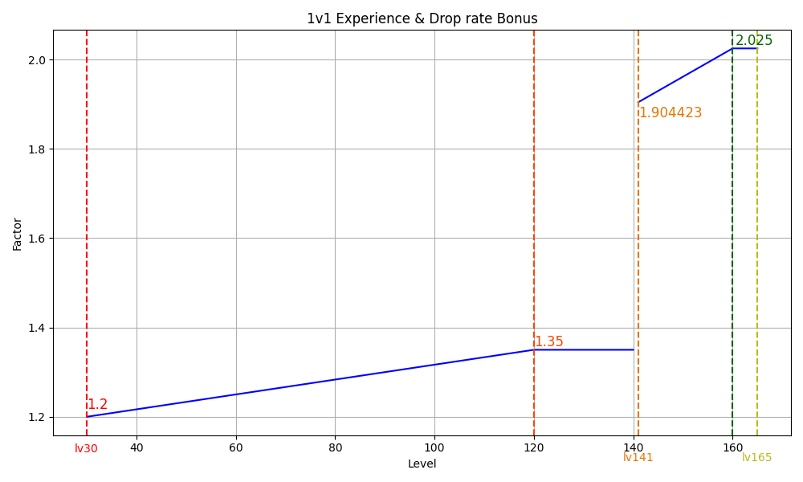

* New mechanism to the game: low, regular and captain monsters level `30+` killed by at least `80%` of damage inflicted from single target attacks and skills will have an increased experience and drop rate.

   > monster's rank: small, normal, captain.

   > 遊戲新機制：`30` 級以上的低階怪物、普通怪物、隊長怪物被單一目標攻擊和技能造成的傷害至少 `80%` 擊殺後，經驗值和掉落率都會增加。

* The experience and drop rate increase is currently `20%` for monsters level `30` and increases gradually to reach `35%` for monsters level `120 ~ 140`.

   > 目前 `30` 級怪物的經驗和掉落率增加為 `20%`，並逐漸增加，對於怪物等級 `120 ~ 140` 達到 `35%`。

> source:[Game Version 1.3.1 Patch Notes](https://universe.flyff.com/news/patchnotes131 "Game Version 1.3.1 Patch Notes")

> source:[📣patch-notes @wemadeconnect @[GM] Pang (discord flyff universe)](https://discord.com/channels/778915844070834186/959370780666396703/1177171087008727120 "📣patch-notes @wemadeconnect @[GM] Pang (discord flyff universe)")

* Increased the 1v1 Exp and Drop bonus of new levels. It was `35%` before and is now ranging from `90.4423%` at `141` to `102.5%` at `160`. (At levels `161` and higher, remains `102.5%`.)

   > 增加了新等級的 `1v1` 經驗值和掉落獎勵。之前是 `35%`，現在從等級 `141` 時的 `90.4423%` 到 `160` 時的 `102.5%`。(在 `161` 以上，仍為 `102.5%`。)

> source:[@navi2765 @Navi (discord flyff universe)](https://discord.com/channels/778915844070834186/1000058902576119878/1177233268349870182 "@navi2765 @Navi (discord flyff universe)")

* 1v1 Exp and Drop bonus are based on monster level. Meaning that you can take advantage of this exp increase as soon as you are strong enough to fight monsters level 141 and above.

   > `1v1` 經驗值和掉落獎勵基於怪物等級。這意味著，只要您足夠強大，可以對抗 `141` 級及以上的怪物，您就可以利用此經驗值增加。

</td></tr></table>

### 🥇 level gap

<table><tr><td>

details

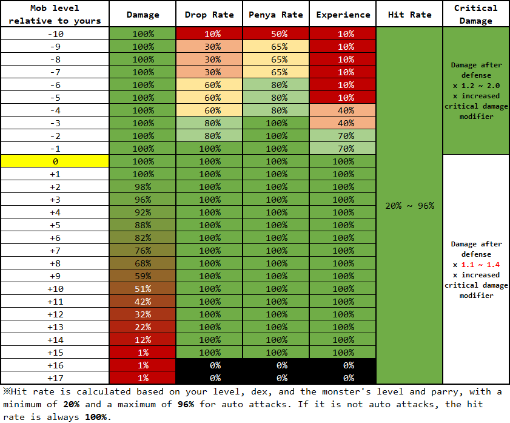

> source:[Flyffulator/src/flyff/flyffdamagecalculator.js](https://github.com/Frostiae/Flyffulator/blob/main/src/flyff/flyffdamagecalculator.js#L379 "Flyffulator/src/flyff/flyffdamagecalculator.js")

> source:[Flyffulator/src/assets/LevelDifferencePenalties.json](https://github.com/Frostiae/Flyffulator/blob/main/src/assets/LevelDifferencePenalties.json "Flyffulator/src/assets/LevelDifferencePenalties.json")

> source:[@navi2765 @Navi (discord flyff universe)](https://discord.com/channels/778915844070834186/1333187382941585468/1333187382941585468 "@navi2765 @Navi (discord flyff universe)")

</td></tr></table>

### 🎁 drop rate

<table><tr><td>

details

**For more information please refer to [Gothante](https://gothante.wiki/?search=drop+rate).**

> source:[Developers Q&A December 2022 - January 2023](https://universe.flyff.com/news/qna-01-2023 "Developers Q&A December 2022 - January 2023")

> source:[Flyff Universe Developer Q&A December ‘22 - January ‘23 Questions](https://wcdn-universe.flyff.com/site/qna_01_2023.pdf "Flyff Universe Developer Q&A December ‘22 - January ‘23 Questions")

#### Level-based Drop Rate Penalties

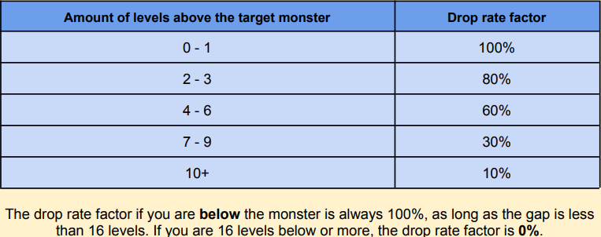

* When you fight monsters much lower than your level you have a reduced drop rate, and when de-leveling the game treats your character as your **highest level** from a drop penalty perspective.
   > 當你與比你等級低得多的怪物戰鬥時，你的掉落率會降低，並且當降低等級時，從掉落懲罰的角度來看，遊戲會以角色的最高等級計算。

  If you're considering intentionally reducing your level to farm more efficiently, please remember that these mechanisms will affect your drop rates.

   > source:[@bluechromed @[Dev] Blukie (discord flyff universe)](https://discord.com/channels/778915844070834186/1000058902576119878/1124117122432380958 "@bluechromed @[Dev] Blukie (discord flyff universe)")

* Drop rate is based on the character with the **highest level** who is **participating**.
   > 掉落率是基於參與貢獻的最高等級(包含降級)角色。

  As an example, if a 126 and 140 kill an Ancient Mammoth (level 139), the highest level player who contributed is taken into account. That means the experience would be reduced by 20% for both players, and both players would have a full 100% drop rate.

   > source:[@bluechromed @[Dev] Blukie (discord flyff universe)](https://discord.com/channels/778915844070834186/1000058902576119878/1113470252257382550 "@bluechromed @[Dev] Blukie (discord flyff universe)")

  *Healing and Resurrection are not considered participation, but Tanking, Holycross, and any attack that causes damage are considered participation.*

  *The penalties still apply if the monster’s HP has not fully recovered, regardless of whether the highest-level character has disconnected, switched to another channel or world, or died.*

  *High level players will not negatively affect the drop rate of monsters for lower level players by receiving damage from special attacks of giants or violet monsters.* You don’t affect the drop rate if the AoE damage you receive comes from a monster that you can’t attack back (not the same party etc.)

  > source:[Minor Fixes after 11/21 Maintenance](https://universe.flyff.com/news/minorfixesnov21 "Minor Fixes after 11/21 Maintenance")

* Player level does not affect the drop rate of **monster cosmetics**; players may farm cosmetics effectively at any level.
   > 玩家等級不會影響怪物幻化外觀的掉落率，玩家在任何等級都可以有效刷出幻化外觀。

   > source:[@bluechromed @[Dev] Blukie (discord flyff universe)](https://discord.com/channels/778915844070834186/1000058902576119878/1092833498034880552 "@bluechromed @[Dev] Blukie (discord flyff universe)")

#### Optional Master/Hero Quests

* If any of the participants has an active Optional Master/Hero Quest, the drop rate is divided by 2 (**50% drop rate penalty**).

#### Character Buffs That Increase Drop Rate

* Regarding Party Skills(Lucky Drop and Gift Box), Housing Buffs, Adventurer's Fortune Flask, and other character buffs that increase drop rates:

  When a monster dies, the drop rate is affected by the buffs of the character who dealt the **most total damage**, and the drops will belong to that character, ignoring players who are disconnected, have switched to another channel or world, or are dead.
  > 當怪物死亡時，掉落率會受到造成 **最大總傷害** 角色的 Buffs 影響，且掉落的物品將屬於該角色，並忽略斷線、切換到其他頻道、世界或已死亡的玩家。

  *The **last hit** is only considered for monster kill count like quests, battle pass, achievement etc.*

  If there are two characters with the same total damage, the character who started attacking the monster last will affect it (this is not about the last hit but rather the order of the first hit).

  If a character dies and then resurrects, the total damage dealt by the character does **not** include the damage done before death.

#### Drops Mechanics

* Drops are all done in a separate drop groups, so big loot tables don't affect the ability for certain things to drop (like cards, sunstones, unique weapons, etc.)
   > 掉落都是在單獨的掉落組合中分別完成的，因此大的戰利品表不會影響掉落某些東西的能力（例如卡牌，日光石，獨特的武器等）

   > source:[@bluechromed @[Dev] Blukie (discord flyff universe)](https://discord.com/channels/778915844070834186/1172687169337430116/1172969789002616993 "@bluechromed @[Dev] Blukie (discord flyff universe)")

* There are different drop groups on each monster so when killed the monster will drop a set amount of items from each group based on the drop chance.
   > 每個怪物都有不同的掉落組合(組別、分區)，因此當怪物被殺死時，會根據掉落機率從每個組合(組別、分區)中掉落一定數量的物品。

   > source:[@bluechromed @[Dev] Blukie (discord flyff universe)](https://discord.com/channels/778915844070834186/1076577555546656850/1171954949765222470 "@bluechromed @[Dev] Blukie (discord flyff universe)")

* For instance if you kill a violet in Darkon 3, it will check the scrolls group 5 times and give you either a spro low, a spro, an apro, or a gpro, with probability affected by drop skills, level, etc.
   > 例如：如果你在 達肯3 中殺死紫羅蘭，它會檢查捲軸組 5 次，並給你一個 `spro low`、一個 `spro`、一個 `apro` 或一個 `gpro`，機率受掉落技能、等級等影響。

   > source:[@bluechromed @[Dev] Blukie (discord flyff universe)](https://discord.com/channels/778915844070834186/1076577555546656850/1171955221300252783 "@bluechromed @[Dev] Blukie (discord flyff universe)")

*  When a monster dies, it will always check the drop table in order, starting with the items that have the **lowest chances first**, which means that the rarest items are rolled first.

#### 1v1 Disadvantage Towards AoE

* We received many feedbacks regarding the disadvantage of players using a 1vs1 playstyle. It takes them more time to level up and loot items due to the ability of AoE players to kill more monsters at a time.

  Thus we introduced a new mechanism to the game: low, regular and captain monsters level 30+ killed by **at least 80% of damage inflicted from single target attacks and skills** will have an increased experience and drop rate.

* The 1v1 experience and drop rate increase is currently **20%** for monsters at level 30 and gradually rises to **35%** at level 140, with rates ranging from **90%** at level 141 to **102%** at level 160.

* **The 1v1 experience and drop rate increases are based on monster level**, which means that you can take advantage of these increases as soon as you are strong enough to fight monsters at level 141 and above.

#### Dungeon

* When a single player enters general instance dungeons (Big Muscle, Krrr, Mushmoot, Iblis Leanes, Clockworks War, Meteonyker, Red Meteonyker), there will be a drop penalty of -68% to -90% (applicable when there is only 1 player).

* The monsters in these **6 new dungeons** (Leren Chasm, Rhisis Catacombs, Envy Depths, Guardian Sanctuary, Storm Peak, The Wilds) have no level. They are balanced according to the required entry level, but they do not interact the same way as other monsters in terms of level difference penalties.

  The monsters do not have any damage reduction based on level difference, so their damage is not affected by your level at all. They also have no drop penalties based on level difference, so it doesn’t matter what level you are - if you can enter the dungeon, you have the full drop rate potential.

* Some dungeon curses grant extra drop rate for all monsters inside the dungeon, ranging from as low as 1% to as high as 10%.

* If you find and kill the **Golden Aibatt** in dungeons, the last super monster will feel generous and will have an increased drop and EXP bonus of 10%.

</td></tr></table>

### 📦 item rarity

<table><tr><td>

details

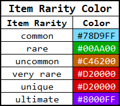

</td></tr></table>

### 💳 extended battle pass

<table><tr><td>

details

**For more information please refer to [Gothante](https://gothante.wiki/?search=extended+pass+system).**

> source:[Battle Pass System](https://universe.flyff.com/news/battlepass "Battle Pass System")

> source:[v1.2.0 Reborn is coming on March 13!](https://universe.flyff.com/news/reborn120 "v1.2.0 Reborn is coming on March 13!")

> source:[Reborn Expansion Flyff Universe Version 1.2.0](https://wcdn-universe.flyff.com/site/patch1_2_0.pdf "Reborn Expansion Flyff Universe Version 1.2.0")

> source:[Updates to Battle for Madrigal Expansion (Flyff Universe Version 1.4.1)](https://universe.flyff.com/news/ver141 "Updates to Battle for Madrigal Expansion (Flyff Universe Version 1.4.1)")

Dear players,

After the maintenance on November 3, 2022, a new system will be in place for all players: the Battle Pass system.

With the Battle Pass system, you can complete various missions to earn points to level up your Battle Pass Grade.

Each time you level up, you will be able to get different types of rewards.

In order to level up, you need to gather `100` points through different missions.

Missions are divided into daily, weekly, and season.

You can obtain up to `1,000` points per week and the points are only valid for the season that the Battle Pass is open.

This Extended is also valid for that specific season when it is purchased.

* This purchase gives you many advantages during the Battle Pass season:

   1. More Battle Pass rewards (including an Exclusive Costume)

   2. Common Bank

   3. 2 days Vendor Shops

   4. Unlimited Acceleration Fuel

   5. Unlimited Exp Lock

   6. Dungeons Map and Navigator

   7. Faster Safe Upgrades:The loading phase if it success or failed is faster (animation).

   8. 1 More Free Dungeon Entrance

   9. Second stat page:There is a `15` minute cool down between each swap.

      * Each stat page has its own `STR`, `DEX`, `INT`, `STA`, and remaining stat points.

      * Using a `Re-Stat` will only apply to the currently selected stat page, not both stat pages.

   10. 5 Daily Search Shop Teleports

   * and more to come over the game updates!

</td></tr></table>

### ⚖️ trade

<table><tr><td>

details

**For more information please refer to [Gothante](https://gothante.wiki/?search=what+is+trading%3F).**

</td></tr></table>

### 🛒 search shop

<table><tr><td>

details

**For more information please refer to [Gothante](https://gothante.wiki/?search=search+shop).**

> source:[Updates to Battle for Madrigal Expansion (Flyff Universe Version 1.4.1)](https://universe.flyff.com/news/ver141 "Updates to Battle for Madrigal Expansion (Flyff Universe Version 1.4.1)")

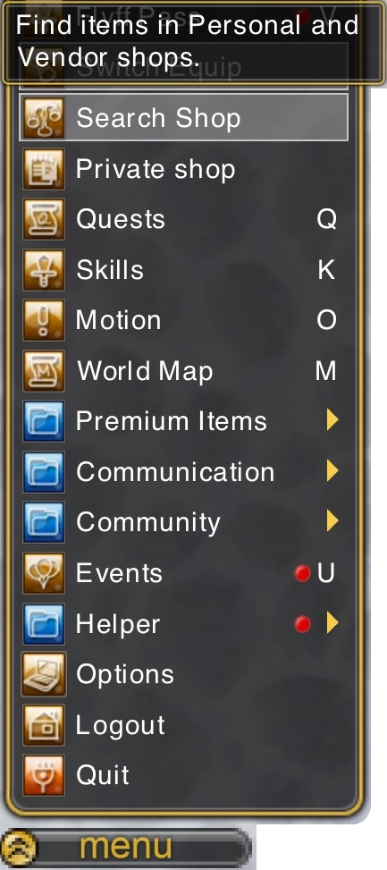

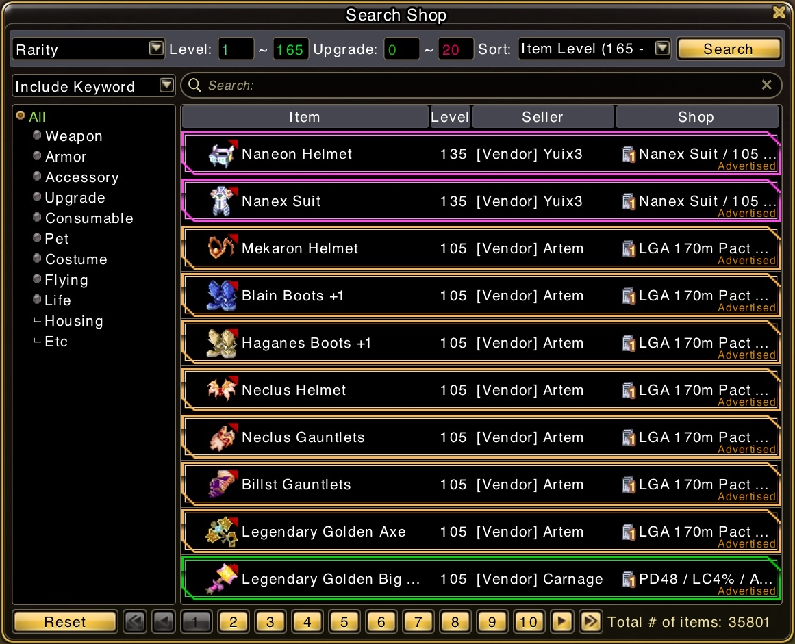

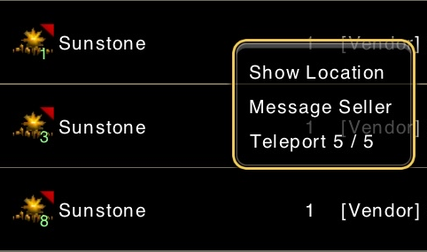

</td></tr></table>

### 👕 fitting room

<table><tr><td>

details

**For more information please refer to [Gothante](https://gothante.wiki/?search=fitting+room).**

> source:[Game Version 1.2.7 Patch Notes](https://universe.flyff.com/news/patchnotes127 "Game Version 1.2.7 Patch Notes")

* A new window has been added that players may access through the start menu → Helper → Fitting Room. This window allows players to preview items on their character, see item stats, and play around with animations.

* Added a Reset Equipment button to the Fitting Room. **[Minor Fixes after 3/14 Maintenance](https://universe.flyff.com/news/minorfixesmarch14 "Minor Fixes after 3/14 Maintenance")**

* Added a Equip (L) button to the Fitting Room for Blade weapons. **[Minor Fixes after 3/14 Maintenance](https://universe.flyff.com/news/minorfixesmarch14 "Minor Fixes after 3/14 Maintenance")**

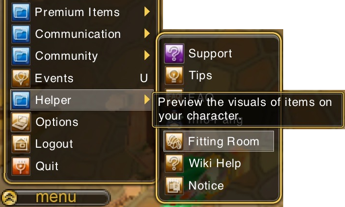

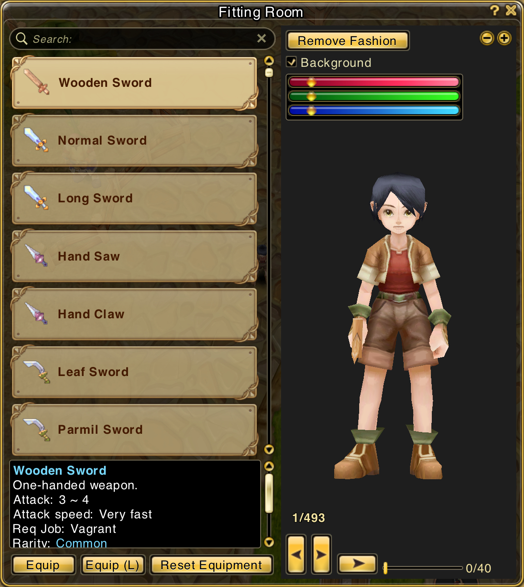

</td></tr></table>

### 👗 costume collection

<table><tr><td>

details

**For more information please refer to [Gothante](https://gothante.wiki/?search=costume+collection).**

#### 👗 costume collection details

**For more information please refer to [Costume Collection](./Costume%20Collection.md "Formulas.md").**

</td></tr></table>

### ⏳ monster focus timer

<table><tr><td>

details

> source:[Game Version 1.0.6 Patch Notes](https://universe.flyff.com/news/patchnotes106 "Game Version 1.0.6 Patch Notes")

* Monster focus timer (the time they chase you without landing a hit) is now based on the number of monsters focusing the same player:

   * 3 minutes for < 4 monsters
   * 80 seconds for >= 4 and < 7 monsters
   * 50 seconds for >= 8 and < 13 monsters
   * 28 seconds for >= 14 monsters

</td></tr></table>

### 🐑 herd damage reduction

<table><tr><td>

details

**For more information please refer to [Gothante](https://gothante.wiki/?search=herd+damage+reduction).**

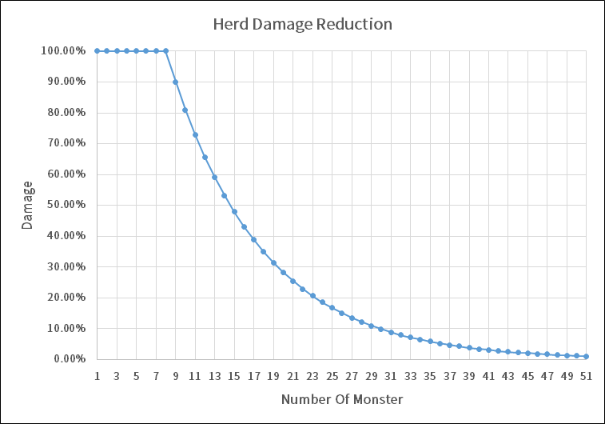

When the number of monsters attacked by the same spell (n) is greater than 8, the n-th monster will take

$$
\text{Damage}(n) =
\begin{cases}
1, & n \leq 8 \\
0.9^{n-8}, & n > 8
\end{cases}
$$

* For example:
  * Monsters 1st to 8th will receive 100% damage.
  * Monsters 9th will receive 90% damage.
  * Monsters 10th will receive 81% damage.
  * Monsters 11th will receive 72.9% damage.
  * Monsters 12th will receive 65.61% damage.
  * Monsters 13th will receive 59.05% damage.
  * Monsters 14th will receive 53.14% damage.
  * Monsters 15th will receive 47.83% damage.
  * Monsters 16th will receive 43.05% damage.
  * Monsters 17th will receive 38.74% damage.
  * Monsters 18th will receive 34.87% damage.
  * Monsters 19th will receive 31.38% damage.
  * Monsters 20th will receive 28.24% damage.

</td></tr></table>

### 🧠 skill point

<table><tr><td>

details

> source:[@bluechromed @[Dev] Blukie (discord flyff universe)](https://discord.com/channels/778915844070834186/867043266162458654/1179796650504503366 "@bluechromed @[Dev] Blukie (discord flyff universe)")

> source:[@cysotiso @cysotiso (discord flyff universe)](https://discord.com/channels/778915844070834186/1076577555546656850/1198561141207597127 "@cysotiso @cysotiso (discord flyff universe)")

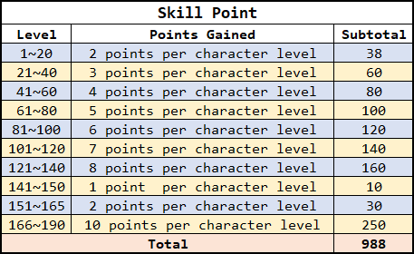

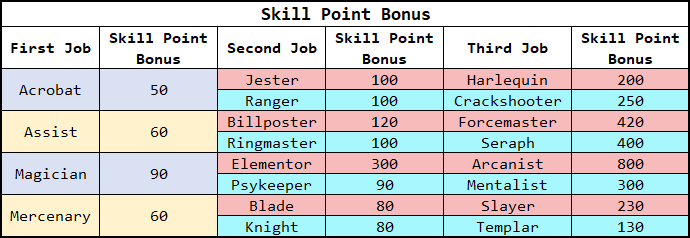

</td></tr></table>

### 💪 buff scale

<table><tr><td>

details

> source:[@steinschleuder @[Justice] Steinschleuder (discord flyff universe)](https://discord.com/channels/778915844070834186/999269990098284554/1145962826742116352 "@cysotiso @[Zanarkand] Cysotiso (discord flyff universe)")

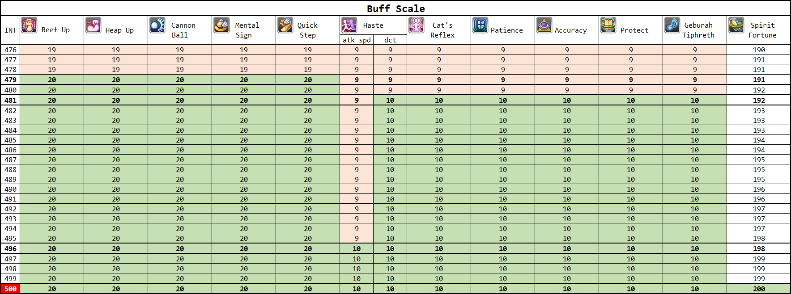

</td></tr></table>

### 💯 level reach rewards

<table><tr><td>

details

<table><tr>
<td>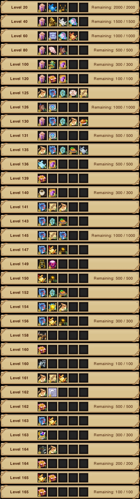</td>
<td>

- level 20 (**Quantity Limit: 2000**):
   * [Essentials Box II](https://flyffipedia.com/items/details/2942) x1
   * [Scroll of Sprint](https://flyffipedia.com/items/details/7364) x3
   * [Fire Effect (7 days)](https://flyffipedia.com/items/details/2803) x1

+ level 40 (**Quantity Limit: 1500**):
   * [Essentials Box III](https://flyffipedia.com/items/details/851) x1
   * [Extra Bag (15 days)](https://flyffipedia.com/items/details/624) x1
   * [Scroll of Holy](https://flyffipedia.com/items/details/3456) x2
   * [Blinkwing of Madrigal](https://flyffipedia.com/items/details/7684) x2

- level 60 (**Quantity Limit: 1000**):
   * [Essentials Box IV](https://flyffipedia.com/items/details/5441) x1
   * [Common Bank 15](https://flyffipedia.com/items/details/8007) x1
   * [Blinkwing of Madrigal](https://flyffipedia.com/items/details/7684) x2
   * [Scroll of Blessing](https://flyffipedia.com/items/details/7594) x2

+ level 80 (**Quantity Limit: 500**):
   * [Essentials Box V](https://flyffipedia.com/items/details/4859) x1
   * [Riding Cloud (Light pink) 30 Days](https://flyffipedia.com/items/details/435) x1
   * [Scroll of SProtect](https://flyffipedia.com/items/details/2527) x3

- level 100 (**Quantity Limit: 300**):
   * [Essentials Box V](https://flyffipedia.com/items/details/4859) x1
   * [Baby Robot 30 Days](https://flyffipedia.com/items/details/1612) x1
   * [Scroll of Weapon Bonus](https://flyffipedia.com/items/details/6201) x1

+ level 120 (**Quantity Limit: 100**):
   * [Essentials Box VI](https://flyffipedia.com/items/details/8744) x1
   * [Spy Set (M)](https://flyffipedia.com/items/details/9920) / [Spy Set (F)](https://flyffipedia.com/items/details/5838) x1
   * [Scroll of Weapon Bonus](https://flyffipedia.com/items/details/6201) x3

- level 125:
   * [Scroll of Amplification ES](https://flyffipedia.com/items/details/6106) x5
   * [Vital Drink X or Refresher Hold](https://flyffipedia.com/items/details/3237) x5
   * [Upcut Stone](https://flyffipedia.com/items/details/8691) x5
   * [Def-Upcut Stone](https://flyffipedia.com/items/details/2551) x5
   * [Activition](https://flyffipedia.com/items/details/7833) x5

+ level 126 (**Quantity Limit: 1000**):
   * [Scroll of SProtect](https://flyffipedia.com/items/details/2527) x15
   * [Pet Transmute](https://flyffipedia.com/items/details/8898) x3

- level 130:
   * [Clockworks +1 Ring Box](https://flyffipedia.com/items/details/7288) x1
   * [Vital Drink X or Refresher Hold](https://flyffipedia.com/items/details/3237) x5
   * [Upcut Stone](https://flyffipedia.com/items/details/8691) x5
   * [Scroll of Amplification ES](https://flyffipedia.com/items/details/6106) x5
   * [Bull Hamstern](https://flyffipedia.com/items/details/3393) x5

+ level 131 (**Quantity Limit: 500**):
   * [Clockworks +2 Ring Box](https://flyffipedia.com/items/details/5349) x1
   * [Pet Transmute](https://flyffipedia.com/items/details/8898) x4

- level 135:
   * [Scroll of Amplification ES](https://flyffipedia.com/items/details/6106) x5
   * [Vital Drink X or Refresher Hold](https://flyffipedia.com/items/details/3237) x5
   * [Upcut Stone](https://flyffipedia.com/items/details/8691) x5
   * [Grilled Eel](https://flyffipedia.com/items/details/6049) x5
   * [Scroll of Resurrection](https://flyffipedia.com/items/details/6525) x5

+ level 136 (**Quantity Limit: 500**):
   * [Scroll of AProtect](https://flyffipedia.com/items/details/1683) x15
   * [Scroll of Weapon Bonus](https://flyffipedia.com/items/details/6201) x2

- level 139:
   * [Yetti Set (M)](https://flyffipedia.com/items/details/937) / [Yetti Set (M)](https://flyffipedia.com/items/details/3549) x1

+ level 140 (**Quantity Limit: 300**):
   * [Baby Yetti](https://flyffipedia.com/items/details/3683) x1
   * [Scroll of Weapon Bonus](https://flyffipedia.com/items/details/6201) x10

</td><td>

- level 141:
   * [Smelting Scroll Box](https://flyffipedia.com/items/details/15944) x2
   * [Activition](https://flyffipedia.com/items/details/7833) x5
   * [Scroll of Amplification ES](https://flyffipedia.com/items/details/6106) x5

+ level 143:
   * [Smelting Scroll Box](https://flyffipedia.com/items/details/15944) x3
   * [Upcut Stone](https://flyffipedia.com/items/details/8691) x5
   * [Grilled Eel](https://flyffipedia.com/items/details/6049) x5

- level 145 (**Quantity Limit: 1000**):
   * [Vital Drink X or Refresher Hold](https://flyffipedia.com/items/details/3237) x10
   * [Activition](https://flyffipedia.com/items/details/7833) x10
   * [Smelting Scroll Box](https://flyffipedia.com/items/details/15944) x10

+ level 147:
   * [Smelting Scroll Box](https://flyffipedia.com/items/details/15944) x3
   * [Scroll of Xprotect](https://flyffipedia.com/items/details/14737) x5
   * [Sunstone](https://flyffipedia.com/items/details/15403) x5

- level 149:
   * [Cloak of Coral](https://flyffipedia.com/items/details/19985) x1
   * [Ultimate Orb](https://flyffipedia.com/items/details/15012) x1

+ level 150 (**Quantity Limit: 500**):
   * [Scroll of Xprotect](https://flyffipedia.com/items/details/14737) x10
   * [Sunstone](https://flyffipedia.com/items/details/15403) x10

- level 152:
   * [Smelting Scroll Box](https://flyffipedia.com/items/details/15944) x5
   * [Upcut Stone](https://flyffipedia.com/items/details/8691) x10
   * [Grilled Eel](https://flyffipedia.com/items/details/6049) x10

+ level 154:
   * [Smelting Scroll Box](https://flyffipedia.com/items/details/15944) x5
   * [Shining Oricalkum](https://flyffipedia.com/items/details/12908) x1
   * [Scroll of Amplification ES](https://flyffipedia.com/items/details/6106) x10

- level 156 (**Quantity Limit: 300**):
   * [Smelting Scroll Box](https://flyffipedia.com/items/details/15944) x5
   * [Scroll of Xprotect](https://flyffipedia.com/items/details/14737) x15
   * [Sunstone](https://flyffipedia.com/items/details/15403) x10

+ level 158:
   * [Baby Wheelem (30 Days)](https://flyffipedia.com/items/details/19969) x1

- level 160:
   * [Light Prince/Princess Set](https://flyffipedia.com/items/details/14548) x1

+ level 160 (**Quantity Limit: 100**):
   * [Meteo Bike (Silver)](https://flyffipedia.com/items/details/13605) x1

</td><td>

- level 161:
   * [Scroll of Amplification ES](https://flyffipedia.com/items/details/6106) x4
   * [Activition](https://flyffipedia.com/items/details/7833) x5
   * [Scroll of Xprotect](https://flyffipedia.com/items/details/14737) x4

+ level 162:
   * [Scroll of Amplification ES](https://flyffipedia.com/items/details/6106) x8
   * [Flip Jump 2 Motion](https://flyffipedia.com/items/details/22206) x1

- level 162 (**Quantity Limit: 500**):
   * [5th grade Jewel Selection Box](https://flyffipedia.com/items/details/23000) x3

+ level 163:
   * [Vital Drink X or Refresher Hold](https://flyffipedia.com/items/details/3237) x4
   * [Scroll of Xprotect](https://flyffipedia.com/items/details/14737) x4

- level 163 (**Quantity Limit: 300**):
   * [Ultimate Jewel Box](https://flyffipedia.com/items/details/17866) x10

+ level 164:
   * [Baby Carrierbomb](https://flyffipedia.com/items/details/18276) (30 Days) x1
   * [Scroll of Amplification ES](https://flyffipedia.com/items/details/6106) x12

- level 164 (**Quantity Limit: 200**):
   * [Tier A Piercing Card Lucky Box](https://flyffipedia.com/items/details/20148) x1

+ level 165:
   * [Scroll of Xprotect](https://flyffipedia.com/items/details/14737) x10
   * [Nightmare Set](https://flyffipedia.com/items/details/24944) x1

- level 165 (**Quantity Limit: 100**):
   * [Archangel White Weapon Set](https://flyffipedia.com/items/details/27322) x1

</td>

<td>

- level 169:
   * [Scroll of Amplification ES](https://flyffipedia.com/items/details/6106) x2
   * [Shining Oricalkum](https://flyffipedia.com/items/details/12908) x2
   * [Ultimate Orb](https://flyffipedia.com/items/details/15012) x2

+ level 172:
   * [Scroll of Amplification ES](https://flyffipedia.com/items/details/6106) x2
   * [Scroll of Ultimate Power](https://flyffipedia.com/items/details/12252) x2
   * [Scroll of Ultimate Bonus](https://flyffipedia.com/items/details/12944) x2

- level 175 :
   * [Scroll of Amplification ES](https://flyffipedia.com/items/details/6106) x2
   * [Scroll of Reduction B](https://flyffipedia.com/items/details/3149) x5

+ level 175 (**Quantity Limit: 500**):
   * [Baby Pang 30 Day](https://flyffipedia.com/) x1

- level 178:
   * [Scroll of Amplification ES](https://flyffipedia.com/items/details/6106) x4
   * [Scroll of PickUp Boost (7 days)](https://flyffipedia.com/items/details/12988) x1
   * [Scroll of Pickup Range (7 days)](https://flyffipedia.com/items/details/27781) x1

+ level 181:
   * [Scroll of Amplification ES](https://flyffipedia.com/items/details/6106) x4
   * [Scroll of Weapon Bonus (3rd Jobs)](https://flyffipedia.com/) x10
   * [Smelting Scroll Box](https://flyffipedia.com/items/details/15944) x10

- level 184:
   * [Scroll of Amplification ES](https://flyffipedia.com/items/details/6106) x4
   * [Nitro Booster (15 Days)](https://flyffipedia.com/items/details/10962) x1

+ level 184 (**Quantity Limit: 300**):
   * [Muran Guardian Lion](https://flyffipedia.com/) x1

- level 187:
   * [Scroll of Amplification ES](https://flyffipedia.com/items/details/6106) x6
   * [Extra Bag (15 days)](https://flyffipedia.com/items/details/624) x1
   * [Bank Extra Bag (15 Days)](https://flyffipedia.com/items/details/15883) x1

+ level 190:
   * [Scroll of Xprotect](https://flyffipedia.com/items/details/14737) x5
   * [Sunstone](https://flyffipedia.com/items/details/15403) x2
   * [Scroll of Ultimate Bonus II](https://flyffipedia.com/) x1

- level 190 (**Quantity Limit: 100**):
   * [Muran Weapon Set](https://flyffipedia.com/) x1

</td></tr></table>

</td></tr></table>

### 👑 master&hero quests

<table><tr><td>

details

**For more information please refer to [Gothante](https://gothante.wiki/?search=optional+master%2Fhero+quests).**

> source:[v1.2.0 Reborn is coming on March 13!](https://universe.flyff.com/news/reborn120 "v1.2.0 Reborn is coming on March 13!")

> source:[Reborn Expansion Flyff Universe Version 1.2.0](https://wcdn-universe.flyff.com/site/patch1_2_0.pdf "Reborn Expansion Flyff Universe Version 1.2.0")

> source:[New Horizon Expansion (Flyff Universe Version 1.3.0)](https://universe.flyff.com/news/newhorizonv1301 "New Horizon Expansion (Flyff Universe Version 1.3.0)")

> source:[Updates to Battle for Madrigal Expansion (Flyff Universe Version 1.4.1)](https://universe.flyff.com/news/ver141 "Updates to Battle for Madrigal Expansion (Flyff Universe Version 1.4.1)")

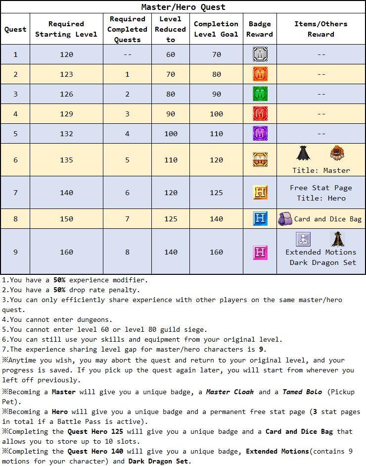

* Once you complete all of the Optional Master quest, you can try the new New Optional Hero quest at  [Master Quests] Leila. This quest will ask you to level up from `120` to `125` and gather `100` Symbols of Shade.

* While on a master and hero quest, there are some changes to your character:

   * You have a 50% experience modifier.

      > 從怪物身上獲取的經驗減半 (`-50%`)。

   * You have a 50% drop rate penalty.

      > 掉落率減半 (`-50%`)。

   * You can only efficiently share experience with other players on the same master quest.

      > 只能與同一主線任務的其他玩家分享經驗。

   * You cannot enter dungeons.

      > 不能進入副本(地下城)。

   * You cannot enter level 60 or level 80 guild siege.

     > 不能進入 `60`、`80` 級公會戰。

   * You can still use your skills and equipment from your original level.

      > 可以使用原本等級的裝備和技能。

   * **The experience sharing level gap for master characters is 9.**

      > 在大師任務中，經驗分享等級差距為 `9` 級。

#### master cloak

> source:[@gm_shadow [GM] Shadow (discord flyff universe)](https://discord.com/channels/778915844070834186/778927702874652682/1095975334270226492 "@gm_shadow [GM] Shadow (discord flyff universe)")

You will be able to get the Cloak that can be seen on the left of the image attached after completing the quest.

Those who have completed the Optional Master Quest during the event period will get a special version of the Cloak seen on the right.

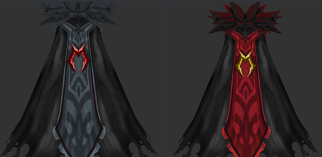

#### hero reward

* Becoming a **Hero 120 - 125** will give you a unique badge and a permanent free stat page (`3` stat pages in total if a Battle Pass is active).

* Completing the **Quest Hero 125 - 140** will give you a unique badge and a Card and Dice Bag that allows you to store up to 10 slots.

* Completing the **Quest Hero 140 - 160** will give you a unique badge, Extended Motions (contains 9 motions for your character) and Dark Dragon Set.

</td></tr></table>

## 🧪 formula

[🔝 Back to top](#universe-document)

  
📁 formula details

**For more information please refer to [Formulas](./Formulas.md "Formulas.md").**

## 🚀 upgrade

[🔝 Back to top](#universe-document)

  
📁 upgrade details

**For more information please refer to [Gothante](https://gothante.wiki/?search=upgrade).**

> source:[@bluechromed @[Dev] Blukie (discord flyff universe)](https://discord.com/channels/778915844070834186/778936929902395392/975078940425207928 "@bluechromed @[Dev] Blukie (discord flyff universe)")

> source:[v1.2.0 Reborn is coming on March 13!](https://universe.flyff.com/news/reborn120 "v1.2.0 Reborn is coming on March 13!")

> source:[Reborn Expansion Flyff Universe Version 1.2.0](https://wcdn-universe.flyff.com/site/patch1_2_0.pdf "Reborn Expansion Flyff Universe Version 1.2.0")

> source:[New Horizon Expansion (Flyff Universe Version 1.3.0)](https://universe.flyff.com/news/newhorizonv1301 "New Horizon Expansion (Flyff Universe Version 1.3.0)")

> source:[Battle for Madrigal Expansion (Flyff Universe Version 1.4.0)](https://universe.flyff.com/news/battleformadrigal1400 "Battle for Madrigal Expansion (Flyff Universe Version 1.4.0)")

### 🎲 power dice

<table><tr><td>

details

**For more information please refer to [Gothante](https://gothante.wiki/?search=what+power+dice+and+upgrading+materials+do+i+need+for+which+upgrade).**

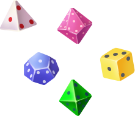

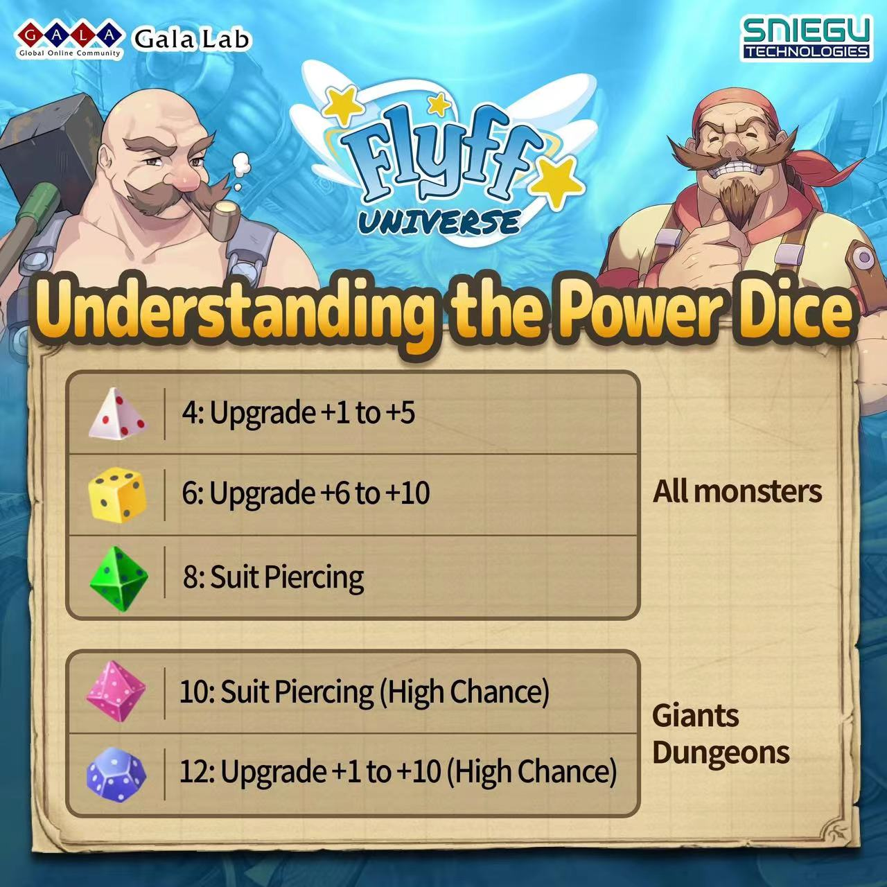

</td></tr></table>

### 🧤 catcher

<table><tr><td>

details

**For more information please refer to [Gothante](https://gothante.wiki/?search=the+catchers).**

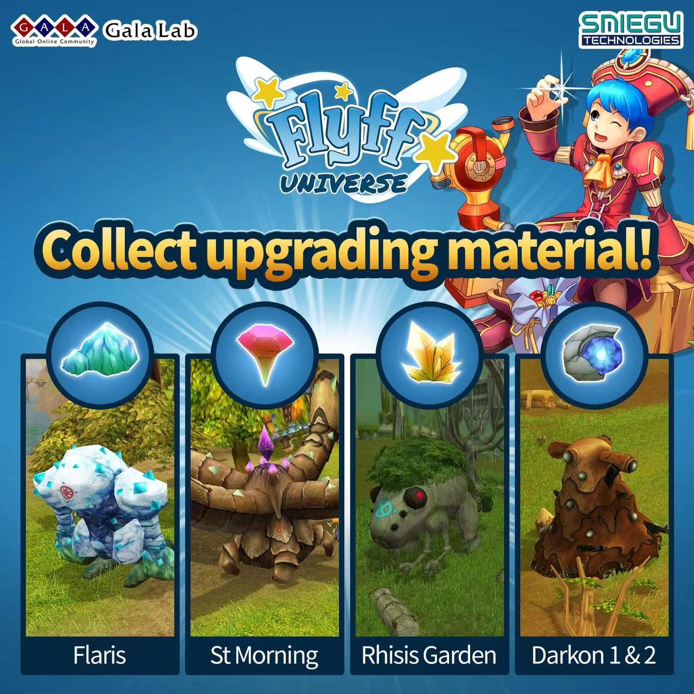

* All catcher spawn:`Darkon 3`, `Azria`.

* No catcher spawn:`Coral Island`

* Collecting materials will be directly taken from your inventory, and don’t have to be placed in the upgrading window.

</td></tr></table>

### 🥺 pity system

<table><tr><td>

details

> source:[@Insanive @Insanive (discord flyff universe)](https://discord.com/channels/778915844070834186/1000058902576119878/1150940230736674857 "@Insanive @Insanive (discord flyff universe)")

* In reality, the upgrade rates are theoretically the same, but your chances of being very unlucky and failing way past the theoretical average number of attempts is much lower now.

   > 理論上的升級率是相同的，但是你非常不幸並且失敗超過理論平均嘗試次數的機會，現在要低得多。

* The upgrade rate is still mathematically the same.

   > 升級率在數學上仍然是相同的。

* It is based on a simple `MarkovChain`, dramatically lowering the standard deviation.

   > 它基於簡單的馬可夫鏈，大大降低了標準差。

   * With this system the standard deviation for a success is `+/- 17` upgrade attempts, instead of `+/- 49` upgrade attempts with the old system.

   > 對於憐憫系統，成功的標準差是 `+/- 17` 次升級嘗試次數，而不是舊系統的 `+/- 49` 次升級嘗試次數。

</td></tr></table>

### 🏹 weapon&armor upgrade

<table><tr><td>

details

**The average number of attempts just shows whether you were lucky or not.**

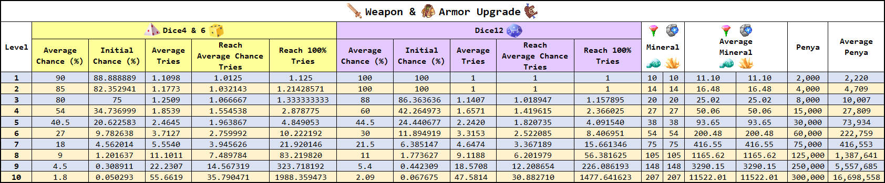

#### event

> source[@piccolo0002 @[GM] Piccolo (discord flyff universe)](https://discord.com/channels/778915844070834186/778927702874652682/1076113591536717834 "@piccolo0002 @[GM] Piccolo (discord flyff universe)")

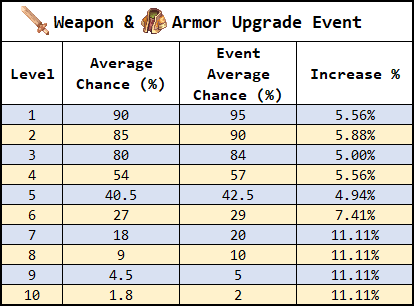

* **Enhanced Upgrade (Gear)** event is for upgrade with **Scroll of SProtect**, including weapons, armor and element upgrade (not Ultimates, Piercing, Jewelry, Cards).

#### upgrade level bonus

details

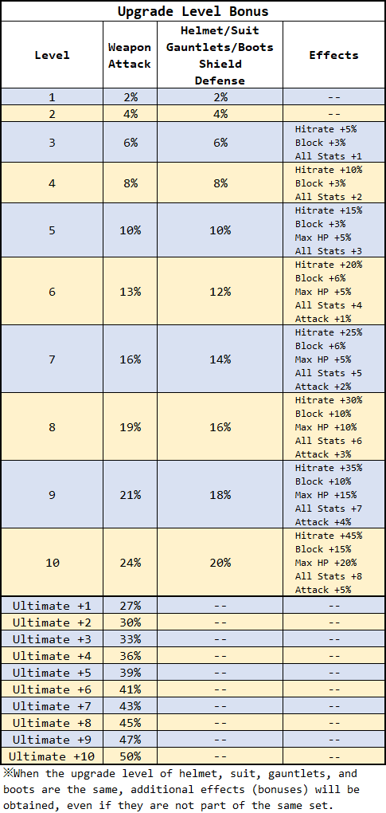

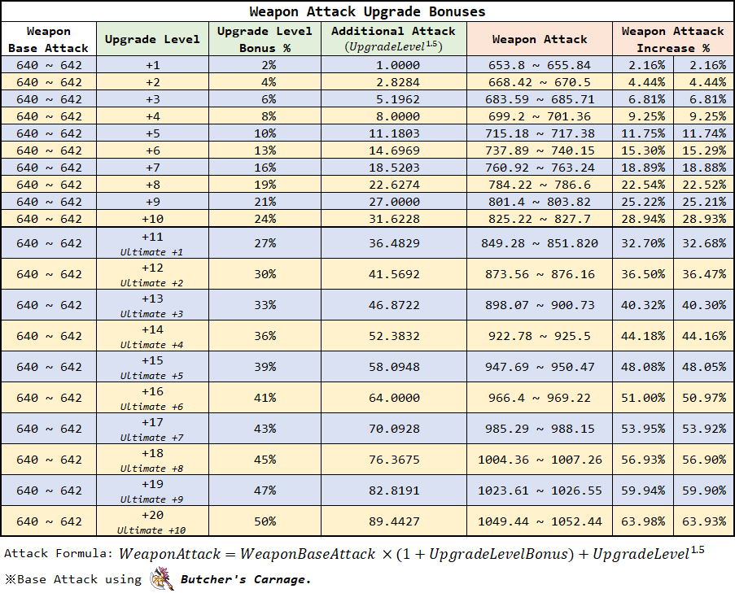

> source:[@frostiae @[Dev] Frostiae (discord flyff universe)](https://discord.com/channels/778915844070834186/867043266162458654/1218321541029167194 "@frostiae @[Dev] Frostiae (discord flyff universe)")

</td></tr></table>

### 🆄🅻🆃🅸🅼🅰🆃🅴 ultimate

<table><tr><td>

details

#### ultimate weapon

details

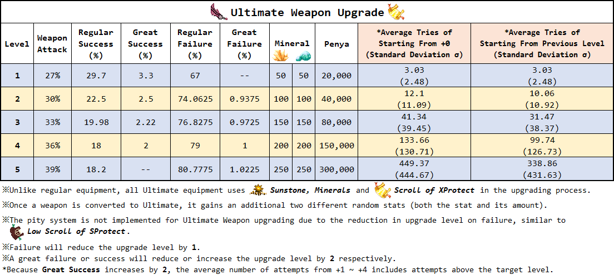

#### lv150 weapon

details

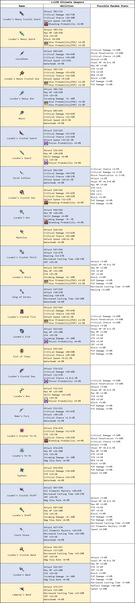

#### lv175 weapon

details

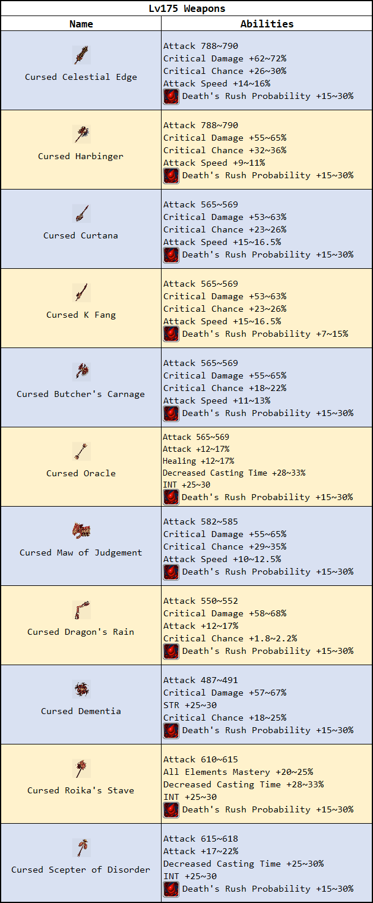

#### lv180 weapon & shield

details

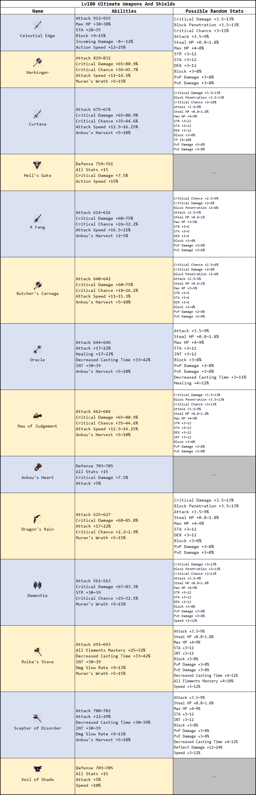

#### reroll weapons

details

**For more information please refer to [Gothante](https://gothante.wiki/?search=how+to+reroll).**

#### ultimate jewelry

details

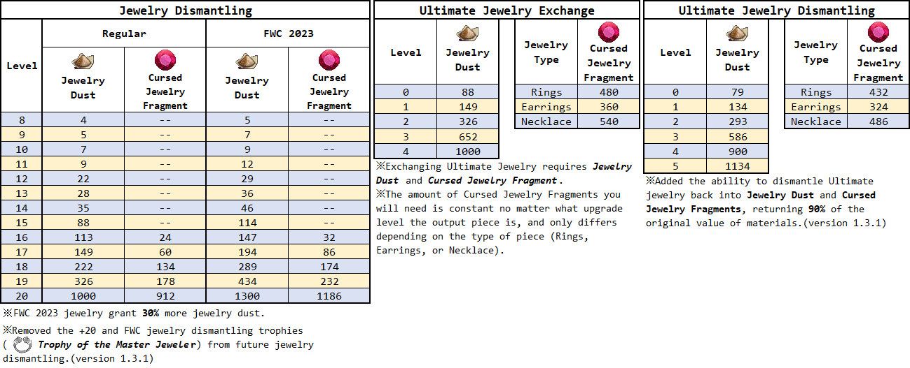

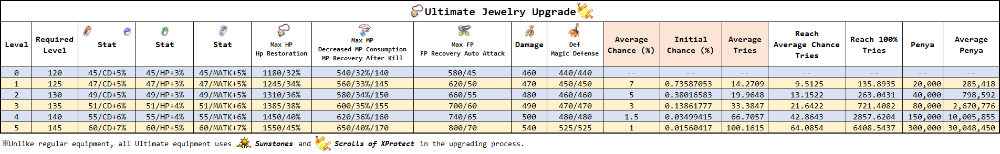

* Ultimate Jewelry provides the following set effects:

  *  Champion's Set :
    * (4/5) Set Effect : Critical Chance +10%
    * (5/5) Set Effect : Attack +5%, Block Penetration +10%

  *  Marksman's Set :
    * (4/5) Set Effect : HP Recovery After Kill +750
    * (5/5) Set Effect : Attack +5%, Block Penetration +10%

  *  Defender's Set :
    * (4/5) Set Effect : Block +10%
    * (5/5) Set Effect : Magic Defense +5%, Critical Resist +10%

  *  Adept's Set :
    * (4/5) Set Effect : MP Recovery After Kill +500
    * (5/5) Set Effect : Magic Attack +5%, Decreased Casting Time +10%

</td></tr></table>

### 🦾 new horizon equipment sets

<table><tr><td>

details

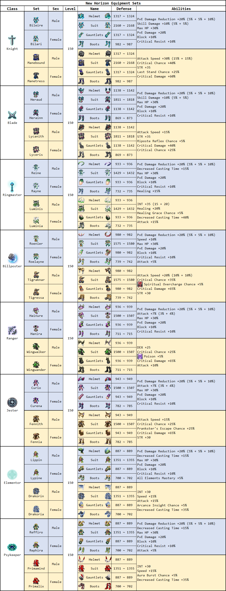

</td></tr></table>

### 🦾 muran's awakening equipment sets

<table><tr><td>

details

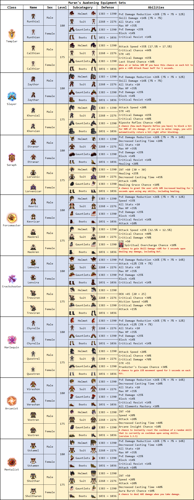

</td></tr></table>

### 💎 ultimate jewels

<table><tr><td>

details

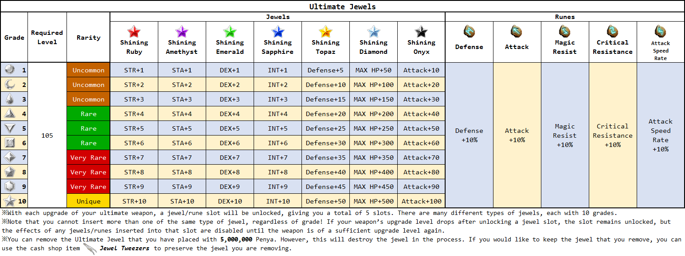

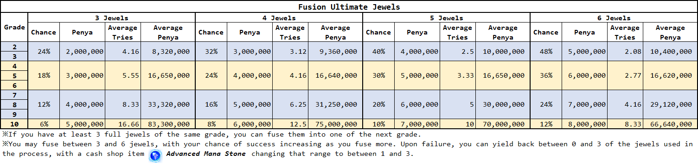

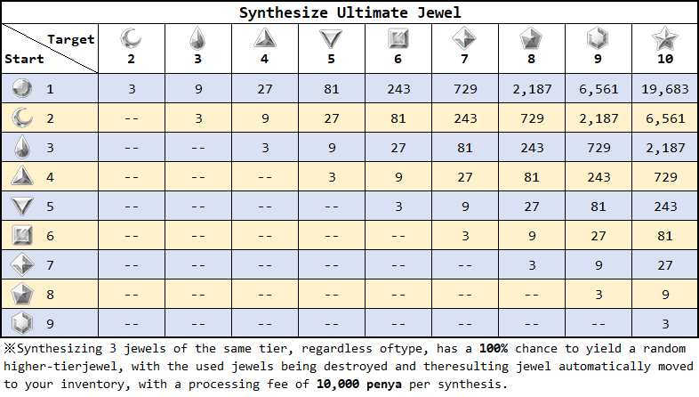

</td></tr></table>

### 💍 jewelry upgrade

<table><tr><td>

details

**The average number of attempts just shows whether you were lucky or not.**

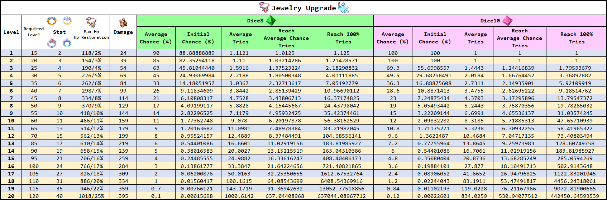

</td></tr></table>

### 🔥 element upgrade

<table><tr><td>

details

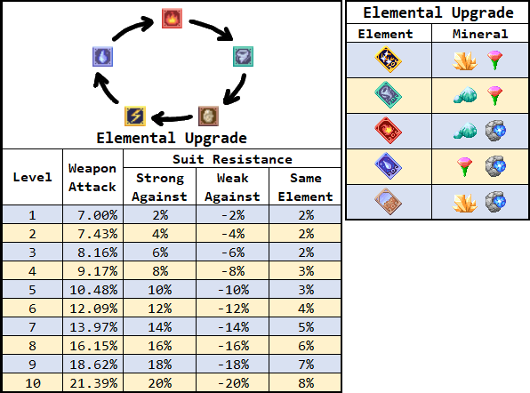

* Monsters have a +30% resistance to 1 element (taking less damage) and a -30% resistance for the opposite element (taking more damage).

* Having the advantageous element (e.g. +1 fire) on your weapon increases your damage by 30% due to the monster's negative resistance.

* Upgrading weapon with an element also increases attack by a % on top of the resistance bonus.

* Always use a weapon with at least a +1 elemental advantage against the monster for a 7% attack bonus boost and 30% damage increase.

**For more information please refer to [Formulas/damage/dps/auto attack/DamagePropertyFactor](./Formulas.md "Formulas.md").**

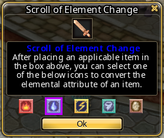

</td></tr></table>

### ✨ glow&swinging

<table><tr><td>

details

#### weapon glow

**For more information please refer to [Gothante](https://gothante.wiki/?search=weapon+glow).**

#### armor glow

**For more information please refer to [Gothante](https://gothante.wiki/?search=armor+set+glow).**

#### swinging

**For more information please refer to [Gothante](https://gothante.wiki/?search=weapon+swinging).**

</td></tr></table>

### ✂️ piercing

<table><tr><td>

details

**The average number of attempts just shows whether you were lucky or not.**

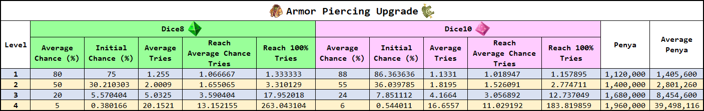

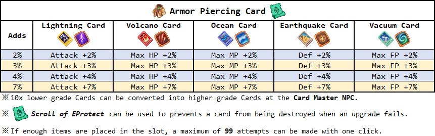

***

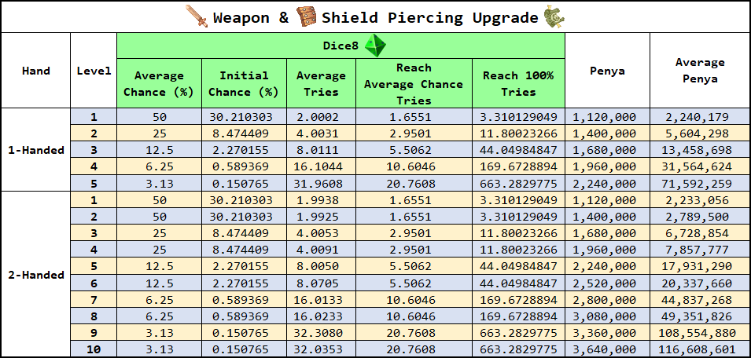

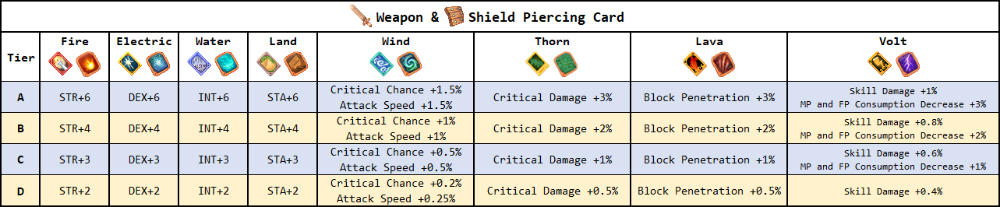

#### event

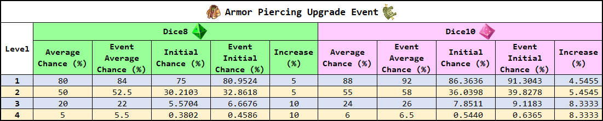

* **Enhanced Armor Piercing** event is for upgrade with **Scroll of GProtect**, only including armor piercing(not weapon and shield piercing).

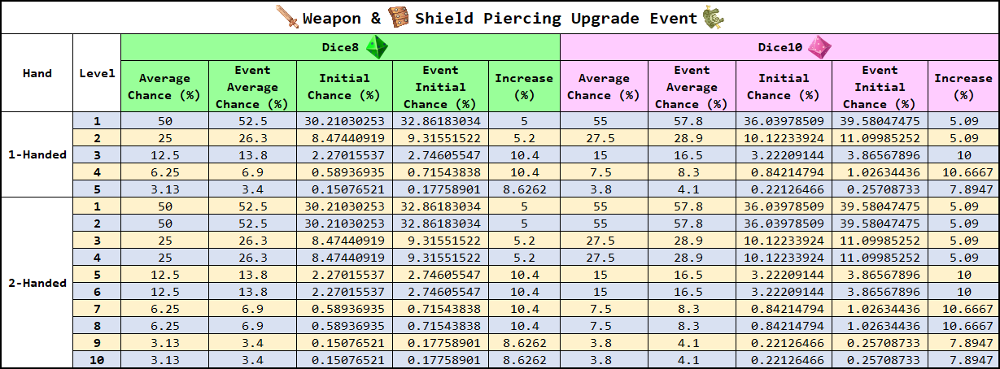

* **Enhanced Weapon Piercing** event is for upgrade with **Scroll of GProtect**, only including weapon and shield piercing(not armor piercing).

</td></tr></table>

### 🛠️ craft

<table><tr><td>

details

**For more information please refer to [Gothante](https://gothante.wiki/?search=crafting).**

> source:[@frostiae @[Dev] Frostiae (discord flyff universe)](https://discord.com/channels/778915844070834186/1000058902576119878/1172180003119697970 "@frostiae @[Dev] Frostiae (discord flyff universe)")

> source:[@cloudishere1 @クラウドニャン (discord flyff universe)](https://discord.com/channels/778915844070834186/1000058902576119878/1018066487291944962 "@cloudishere1 @クラウドニャン (discord flyff universe)")

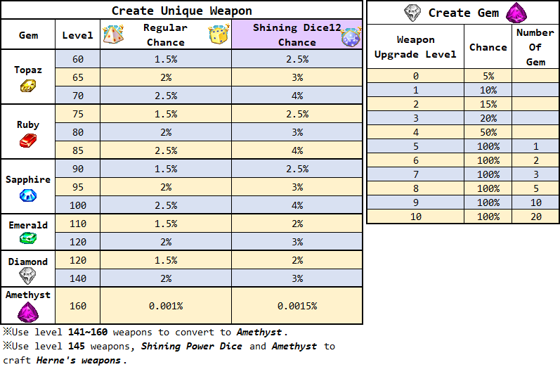

</td></tr></table>

### 🙌 blessing

<table><tr><td>

details

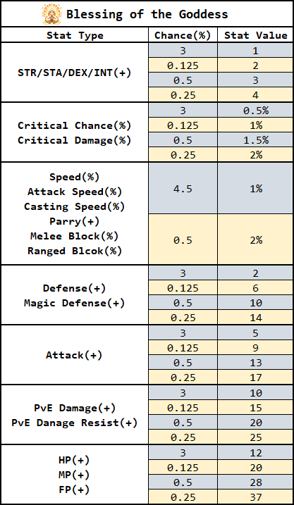
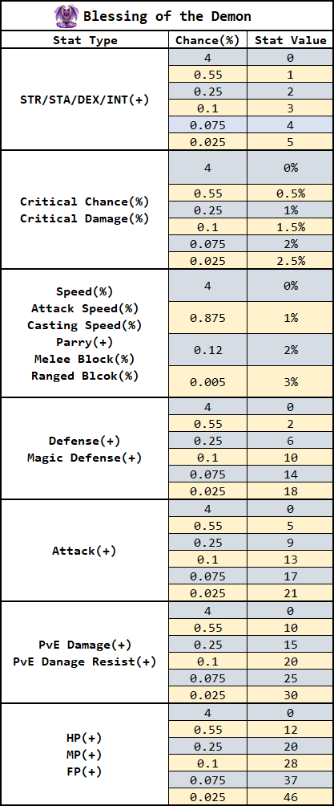

</td></tr></table>

### 📜 stat scroll

<table><tr><td>

details

**For more information please refer to [Gothante](https://gothante.wiki/?search=random+stats+%28stats+bonus%29).**

* Add a random `STR`/`STA`/`DEX`/`INT` stat to your weapon or armor.

* The stat can be anywhere from `+1` to `+4`.

* This replaces any existing stat on the weapon or armor.

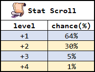

</td></tr></table>

### 📜 awake

<table><tr><td>

details

**For more information please refer to [Flyffipedia](https://flyffipedia.com/skillawakes).**

</td></tr></table>

## 🐶 pet

[🔝 Back to top](#universe-document)

  
📁 pet details

**For more information please refer to [Gothante](https://gothante.wiki/?search=raised+pet).**

> source:[Summer 2022 expansion on August 22!](https://universe.flyff.com/news/summerupdate "Summer 2022 expansion on August 22!")

> source:[Summer 2022 Expansion Flyff Universe Version 1.1.0](https://wcdn-universe.flyff.com/site/patch1_1_0.pdf "Summer 2022 Expansion Flyff Universe Version 1.1.0")

> source:[Battle for Madrigal Expansion (Flyff Universe Version 1.4.0)](https://universe.flyff.com/news/battleformadrigal1400 "Battle for Madrigal Expansion (Flyff Universe Version 1.4.0)")

### 🦮 raised pet

<table><tr><td>

details

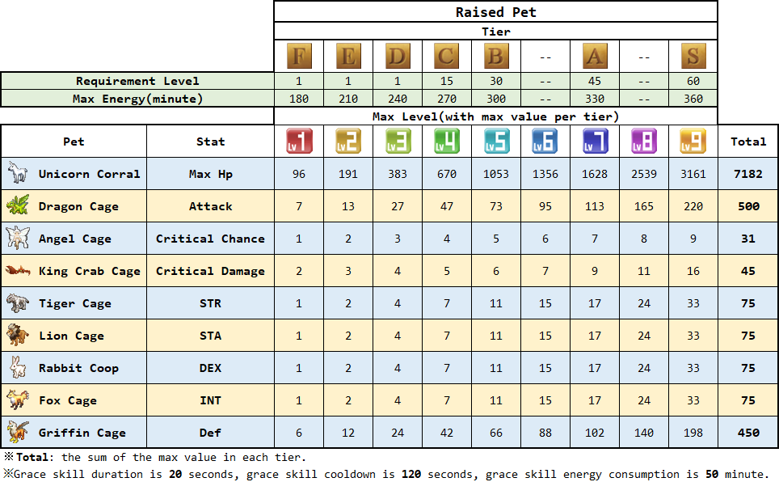

</td></tr></table>

### 🕊️ grace effect

<table><tr><td>

details

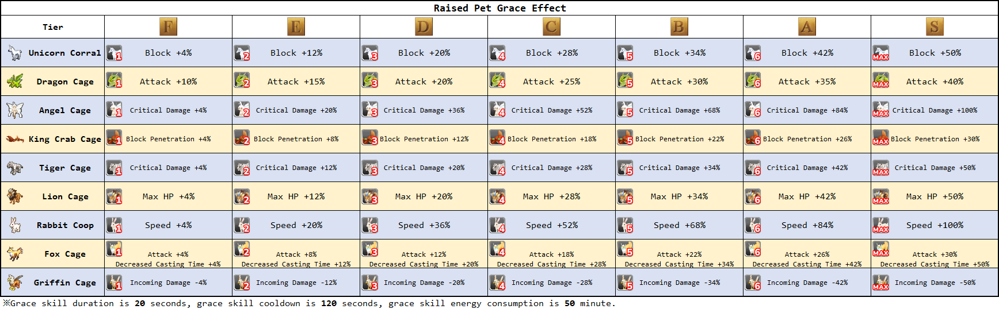

</td></tr></table>

### 🍭 pet candy recipes

<table><tr><td>

details

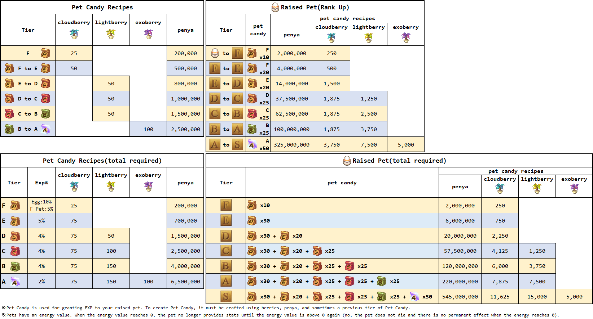

</td></tr></table>

### 🐾 pet defect recycling

<table><tr><td>

details

> source:[Developers Q&A October-November 2022](https://universe.flyff.com/news/qna-11-2022 "Developers Q&A October-November 2022")

> source:[Flyff Universe Developer Q&A October - November 2022 Questions](https://wcdn-universe.flyff.com/site/qna_11_2022.pdf "Flyff Universe Developer Q&A October - November 2022 Questions")

> source:[Game Version 1.2.5 Patch Notes](https://universe.flyff.com/news/patchnotes125 "Game Version 1.2.5 Patch Notes")

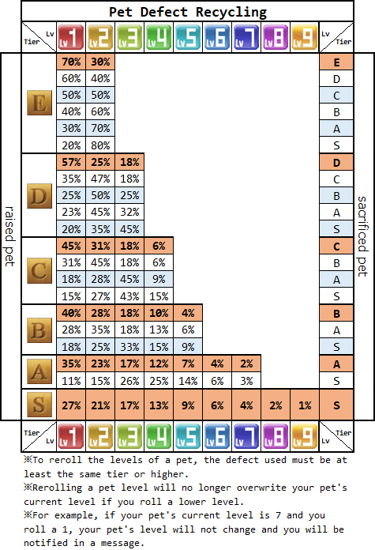

* If you success(green text): Your pet has got a new, higher level!

* If you failure(red text): You rolled the same or a lower level, so nothing changed.

</td></tr></table>

### 🐾 pet rerolling

<table><tr><td>

details

> source:[Updates to Battle for Madrigal Expansion (Flyff Universe Version 1.4.1)](https://universe.flyff.com/news/ver141 "Updates to Battle for Madrigal Expansion (Flyff Universe Version 1.4.1)")

* By using the [Pet Reroll Scroll](https://flyffipedia.com/items/details/21526 "Pet Reroll Scroll"), you can place a raised pet into the pet slot to choose a tier for rerolling, without the need for a sacrificial pet. This feature does not affect regular rerolling with a sacrificial pet at the Pet Tamer.

* Note that once you select a tier to reroll, that is the only tier you will be able to reroll using this feature going forward on this pet. The probabilities for rerolling will be the same as if you were sacrificing a pet of the same tier.

* The number of scrolls required to reroll a tier depends on the tier you select.

* When you press the Reroll button, it will display (N is the new level after rerolling): The selected tier has been rerolled to **N**.

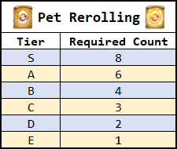

</td></tr></table>

### 🌿 berry map

<table><tr><td>

details

> source:[@cysotiso @[Zanarkand] Cysotiso (discord flyff universe)](https://discord.com/channels/778915844070834186/1000058902576119878/1374779011661693099 "@cysotiso @[Zanarkand] Cysotiso (discord flyff universe)")

</td></tr></table>

### 💫 pet transmutation

<table><tr><td>

details

**For more information please refer to [Gothante](https://gothante.wiki/?search=pet+transmutation).**

1. [Crystal Iphrine Shell](https://flyffipedia.com/items/details/9040 "Crystal Iphrine Shell")
   * `2022-08-22 ~ 2022-09-21`

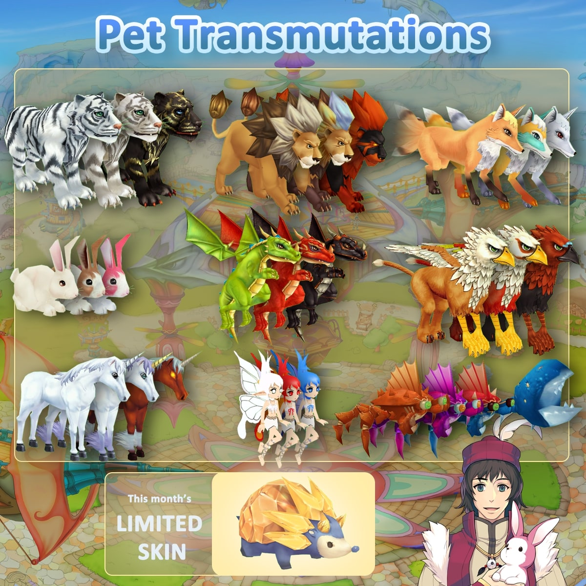

2. [Primgon](https://flyffipedia.com/items/details/1127 "Primgon Cage")
   * `2022-09-22 ~ 2022-11-24`

3. [Nine Tails](https://flyffipedia.com/items/details/14640 "Nine Tails Cage")
   * `2022-11-25 ~ 2023-02-01`

4. [Tonge](https://flyffipedia.com/items/details/11407 "Tonge Cage")
   * `2023-02-02 ~ 2023-04-12`

5. [Hantiger](https://flyffipedia.com/items/details/15854 "Hantiger Cage")
   * `2023-04-13 ~ 2023-06-07`

6. [Skating Cat](https://flyffipedia.com/items/details/17941 "Skating Cat Cage")
   * `2023-06-08 ~ 2023-07-19`

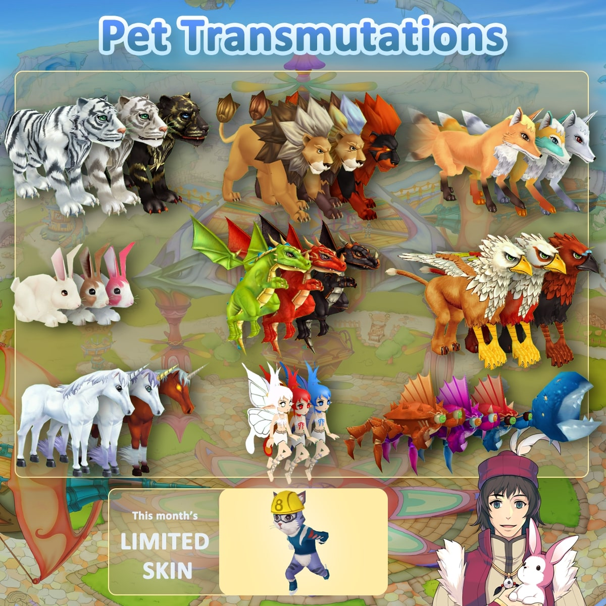

7. [Draco](https://flyffipedia.com/items/details/2923 "Draco Cage")
   * `2023-07-20 ~ 2024-05-08`
   * `2025-06-12 ~`

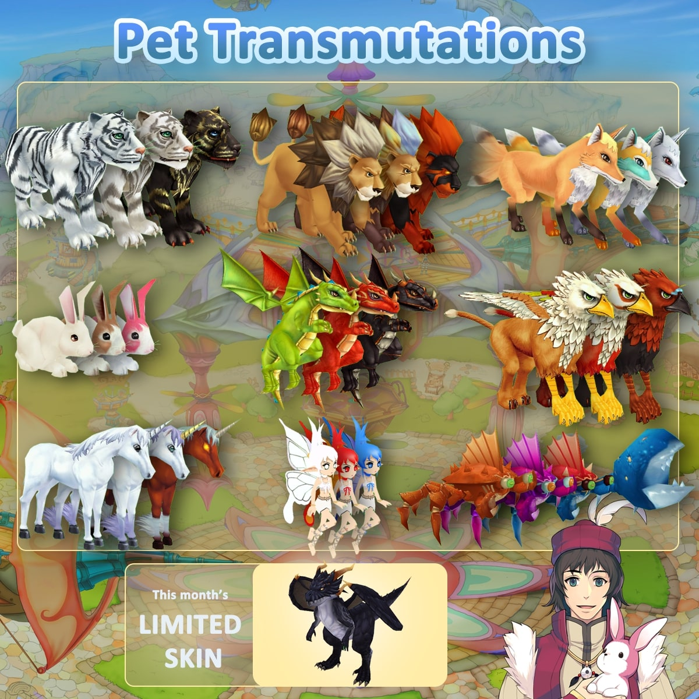

8. [Fox Spirit](https://flyffipedia.com/items/details/11025 "Fox Spirit Cage")
   * `2024-05-09 ~ 2024-11-20`

9. [White Lion](https://flyffipedia.com/items/details/10710 "White Lion Cage")
   * `2024-11-21 ~ 2025-05-14`

10. [Steambot](https://flyffipedia.com/items/details/15601 "Steambot Cage")
   * `2025-05-15 ~ 2025-06-11`

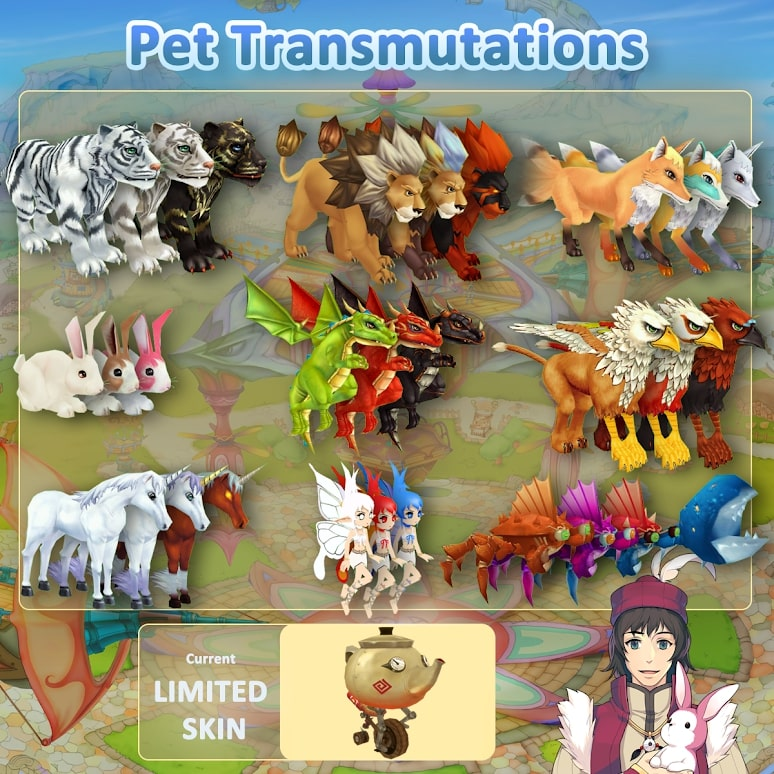

</td></tr></table>

## 🐉 dungeons

[🔝 Back to top](#universe-document)

  
📁 dungeons details

**For more information please refer to [Gothante](https://gothante.wiki/?search=dungeons).**

> source:[v1.2.0 Reborn is coming on March 13!](https://universe.flyff.com/news/reborn120 "v1.2.0 Reborn is coming on March 13!")

> source:[Reborn Expansion Flyff Universe Version 1.2.0](https://wcdn-universe.flyff.com/site/patch1_2_0.pdf "Reborn Expansion Flyff Universe Version 1.2.0")

> source:[New Horizon Expansion (Flyff Universe Version 1.3.0)](https://universe.flyff.com/news/newhorizonv1301 "New Horizon Expansion (Flyff Universe Version 1.3.0)")

> source:[Battle for Madrigal Expansion (Flyff Universe Version 1.4.0)](https://universe.flyff.com/news/battleformadrigal1400 "Battle for Madrigal Expansion (Flyff Universe Version 1.4.0)")

> source:[Updates to Battle for Madrigal Expansion (Flyff Universe Version 1.4.1)](https://universe.flyff.com/news/ver141 "Updates to Battle for Madrigal Expansion (Flyff Universe Version 1.4.1)")

### 📌 dungeons location

<table><tr><td>

details

| Continent | Dungeons | Instance Dungeons |
|:---:|:---:|:---:|
| Flaris | Mars Dungeon | Leren Chasm |
| Saint Morning | Iblis Temple | -- |
| Garden of Rhisis | -- | Rhisis Catacombs |
| Darken1&2 | Dekane Mine | Envy Depths |
| Darkon3 | Volkane | Guardiane Sanctuary |
| Azria | -- | Storm Peak |
| Coral Island | Herneos | The Wilds |
| Kaillun | -- | Ankou's Asylum |

</td></tr></table>

### 🚩 dungeons difficulties

<table><tr><td>

details

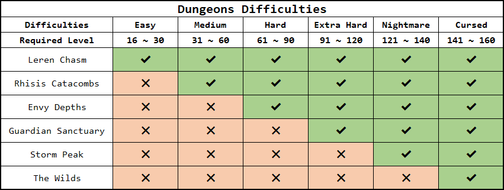

</td></tr></table>

### 📚 story dungeons

<table><tr><td>

details

> source:[Game Version 1.2.7 Patch Notes](https://universe.flyff.com/news/patchnotes127 "Game Version 1.2.7 Patch Notes")

* Story Dungeons allow players to experience a dungeon and its mechanics, while making it easier to complete the story quests associated with a dungeon alone or in a smaller group.

   * Story mode dungeons do not drop items.
   * Story mode dungeons may not have curses applied.
   * Story mode dungeons do not have Pet Cages or chests.
   * Story mode dungeons grant less experience than other dungeon difficulties (90% less).
   * Common buffs are not removed when entering a Story mode dungeon.
   * Final bosses in Story mode dungeons do not grant Soul Fragments.
   * Story mode dungeons do not grant credit towards achievements, but do count towards the daily Clear Dungeon(s) battle pass mission.

</td></tr></table>

### 📍 dungeon checkpoints

<table><tr><td>

details

> source:[Game Version 1.2.7 Patch Notes](https://universe.flyff.com/news/patchnotes127 "Game Version 1.2.7 Patch Notes")

* Dungeons now have checkpoints that appear after players have cleared certain objectives. These checkpoints can be used to teleport back to the entrance and vice versa. Each dungeon has 2 checkpoints, except for Storm Peak which has 4.

</td></tr></table>

### ⏳ cooldown

<table><tr><td>

details

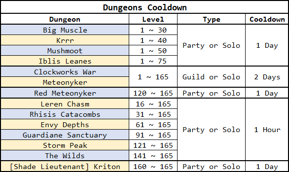

</td></tr></table>

### 🥅 pet cages

<table><tr><td>

details

> source:[@bluechromed @[Dev] Blukie (discord flyff universe)](https://discord.com/channels/778915844070834186/1000058902576119878/1172264259665809510 "@bluechromed @[Dev] Blukie (discord flyff universe)")

> source:[Updates to Battle for Madrigal Expansion (Flyff Universe Version 1.4.1)](https://universe.flyff.com/news/ver141 "Updates to Battle for Madrigal Expansion (Flyff Universe Version 1.4.1)")

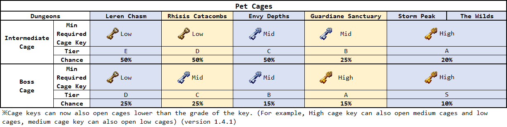

</td></tr></table>

### 💥 dungeons curses

<table><tr><td>

details

#### the wilds & ankou's asylum

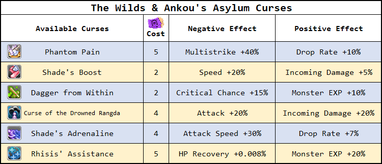

</td></tr></table>

### 💎 dungeons drops

<table><tr><td>

details

> source:[Game Version 1.2.2 Patch Notes](https://universe.flyff.com/news/patchnotes122 "Game Version 1.2.2 Patch Notes")

> source:[Game Version 1.2.3 Patch Notes](https://universe.flyff.com/news/patchnotes123 "Game Version 1.2.3 Patch Notes")

> source:[Game Version 1.2.4 Patch Notes](https://universe.flyff.com/news/patchnotes124 "Game Version 1.2.4 Patch Notes")

* Added new repeatable quests that reward weapon piercing card select boxes for a certain number of final dungeon boss kills. **[version 1.2.2](https://universe.flyff.com/news/patchnotes122 "Game Version 1.2.3 Patch Notes")**
   > 新增了可重複完成的任務，完成擊殺一定數量的地下城最終 boss 後，會獲得武器穿洞卡片選擇盒。

   > [Weapon Piercing Box Quests](https://flyffipedia.com/quests?repeatable=True&sort=minLevel-2&search=Weapon+Piercing+Box "Weapon Piercing Box Quests")

* Added treasure chests to all instanced dungeons, which can contain Essential boxes, Element Attack boxes, Pill boxes, and Rainbow Cotton candies. **[version 1.2.3](https://universe.flyff.com/news/patchnotes123 "Game Version 1.2.3 Patch Notes")**
   > 為所有實例地下城(副本)添加了寶箱，其中可以包含必需品盒、元素攻擊盒、藥丸盒和彩虹棉花糖。

* Golden Aibatts are now permanent, with a lower chance to spawn than during their event. **[version 1.2.4](https://universe.flyff.com/news/patchnotes124 "Game Version 1.2.4 Patch Notes")**
   > 金色蝙蝠現在是永久性的，生成的幾率比活動期間要低。

   * If you kill [Golden Aibatt](https://flyffipedia.com/monsters/details/2630) in dungeons, last super monster will [Feeling Generous](https://flyffipedia.com/skills/details/110).

   
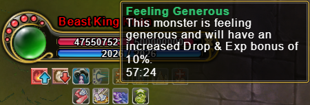

   * The buff that increases the drop rate is applied to all drops.

   * It always roll lower chances items first, which means since the **rarest** items are rolled first and they have a slightly higher drop chance.
      > source:[@nanoaa @[Dev] NaNo (discord flyff universe)](https://discord.com/channels/778915844070834186/1221684853901365288/1227538842744000592 "@nanoaa @[Dev] NaNo (discord flyff universe)")

   
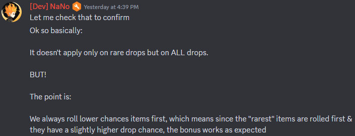

* Player level does not affect the drop rate of monster cosmetics, players may farm cosmetics effectively at any level.
   > 玩家等級不會影響怪物幻化外觀的掉落率，玩家在任何等級都可以有效刷出幻化外觀。

* Instanced dungeon (specifically Reborn dungeons) monsters do not have a drop penalty based on level due to the scaled nature of the monsters.
   > 由於怪物的縮放性質，實例地下城（特別是重生地下城）怪物沒有基於等級的掉落懲罰。

   * For instance, a level `126` and `140` would have the same drop rate when defeating monsters in Storm Peak.

      > 例如，`126` 級和 `140` 級在風暴峰擊敗怪物時掉落率相同。

   > source:[@bluechromed @[Dev] Blukie (discord flyff universe)](https://discord.com/channels/778915844070834186/1000058902576119878/1113468851213058170 "@bluechromed @[Dev] Blukie (discord flyff universe)")

   > source:[@bluechromed @[Dev] Blukie (discord flyff universe)](https://discord.com/channels/778915844070834186/1000058902576119878/1113470252257382550 "@bluechromed @[Dev] Blukie (discord flyff universe)")

* Under the hood dungeon monsters have a level as seen in the API, but all penalties are removed from dungeon monsters. So there should be no effect to drops, etc. based on level.
   > 真正的原因是地下城怪物有一個等級，如 API 中所示，但所有懲罰都從地下城怪物中刪除，所以基於等級的掉落率應該沒有影響。

   > source:[@bluechromed @[Dev] Blukie (discord flyff universe)](https://discord.com/channels/778915844070834186/1152141645257641985/1158031426202124399 "@bluechromed @[Dev] Blukie (discord flyff universe)")

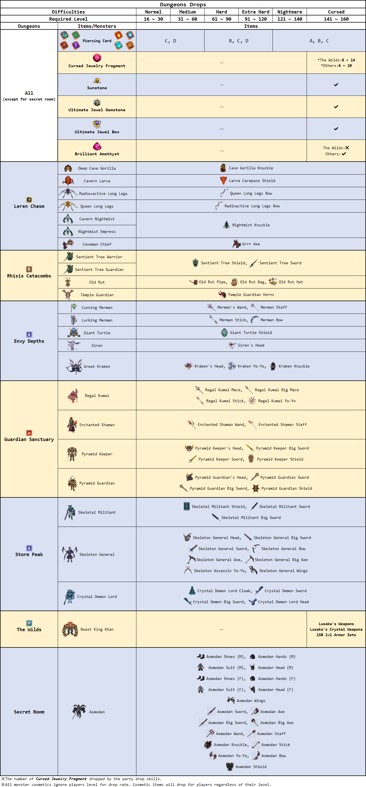

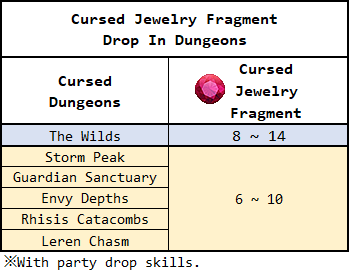

* cursed jewelry fragment drop in dungeons:

   > source:[@bluechromed @[Dev] Blukie (discord flyff universe)](https://discord.com/channels/778915844070834186/1076577555546656850/1172134100539281499 "@bluechromed @[Dev] Blukie (discord flyff universe)")

* Fragments you earn in Cursed dungeons are not soul-linked, they are untradeable however. Everyone in the party can receive them, and if they do the fragments will go directly to their inventory.

   > source:[@bluechromed @[Dev] Blukie (discord flyff universe)](https://discord.com/channels/778915844070834186/1000058902576119878/1172752197742768189 "@bluechromed @[Dev] Blukie (discord flyff universe)")

</td></tr></table>

### ❓ office quest

<table><tr><td>

details

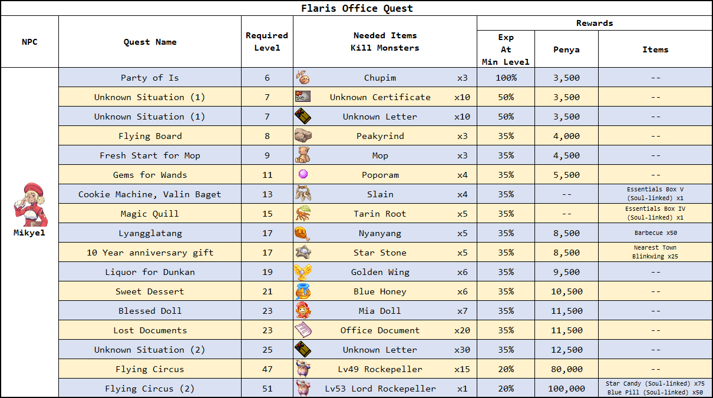

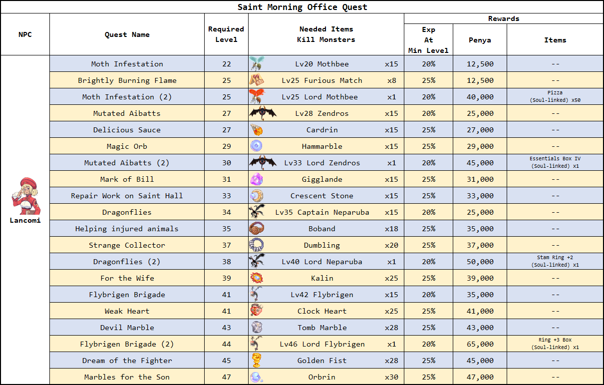

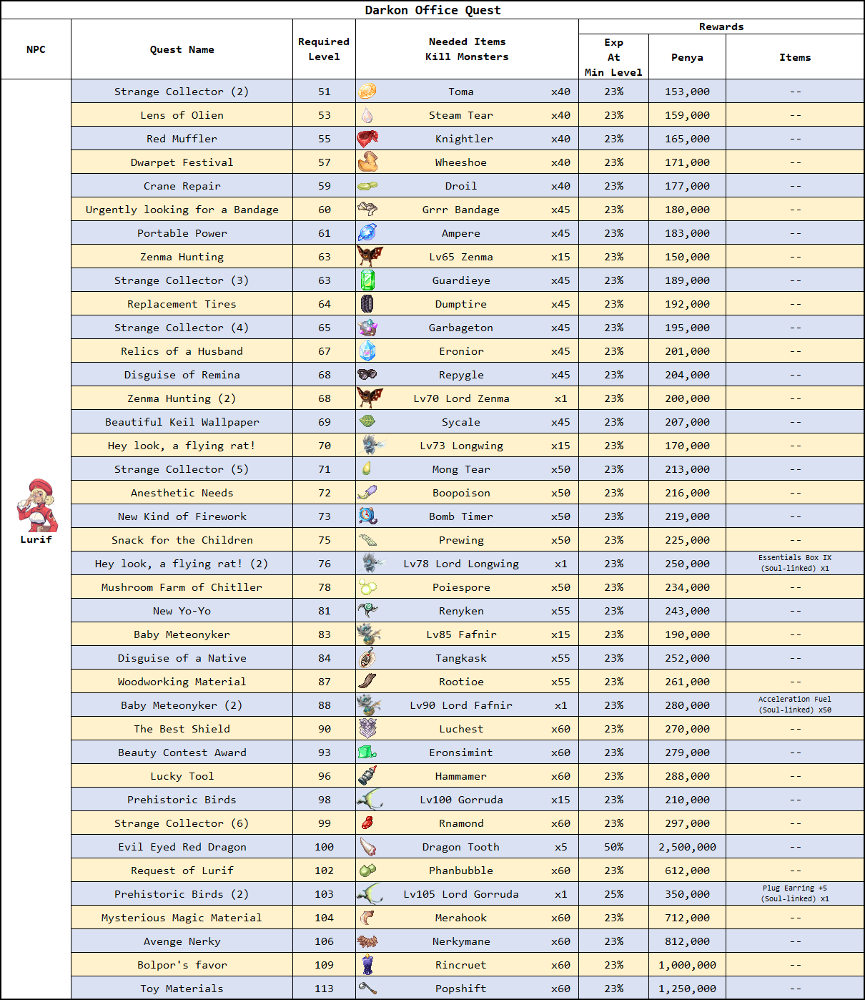

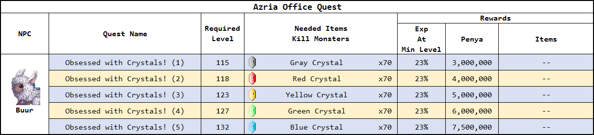

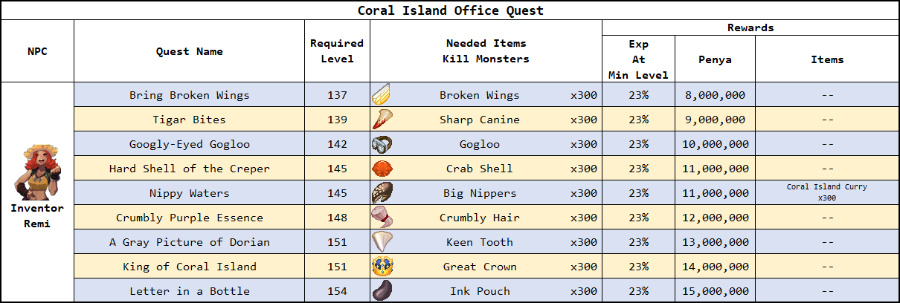

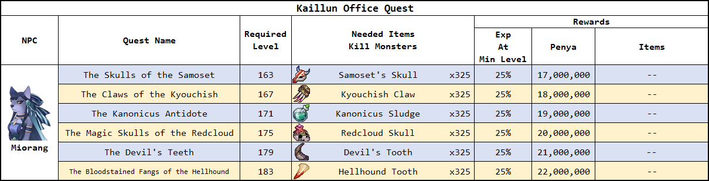

</td></tr></table>

### 🗼 forsaken tower

<table><tr><td>

details

**For more information please refer to [Gothante](https://gothante.wiki/?search=forsaken+tower).**

**Only the experience necessary for a single level up is calculated, without accounting for cumulative experience.**

**The actual number of days required to level up will be fewer than those indicated in the chart.**

> [Forsaken Tower Daily Quests](https://flyffipedia.com/quests/details/16118 "Forsaken Tower Daily Quests")

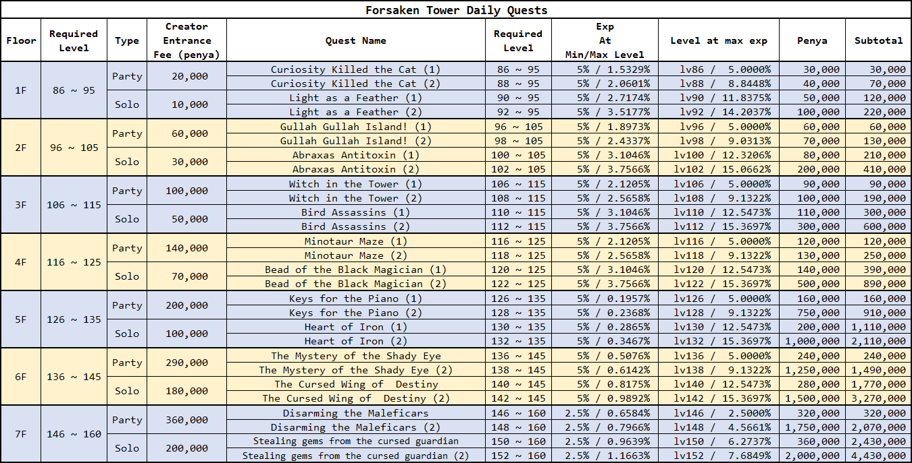

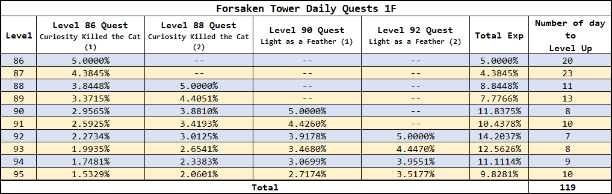

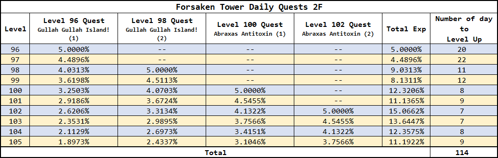

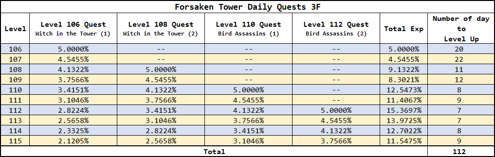

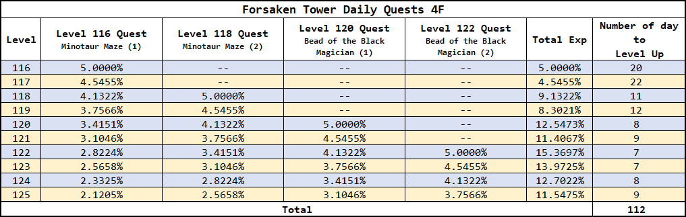

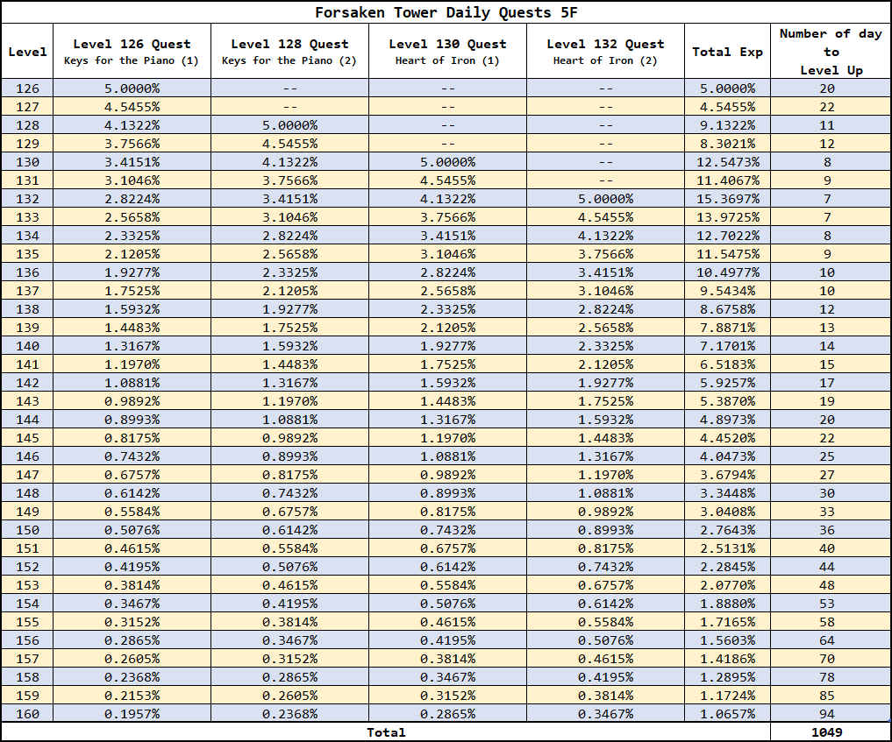

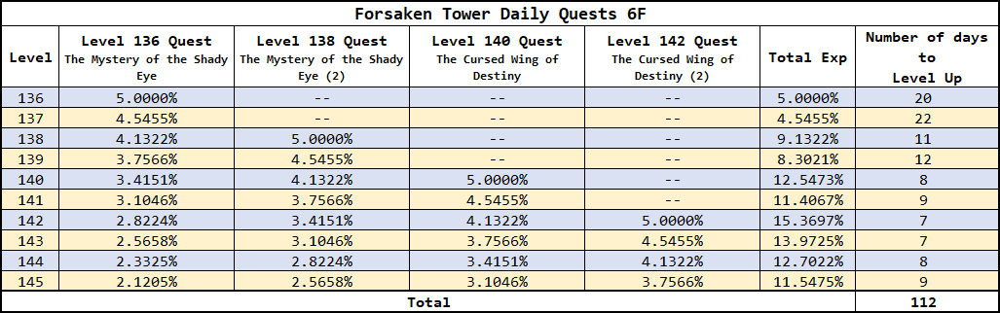

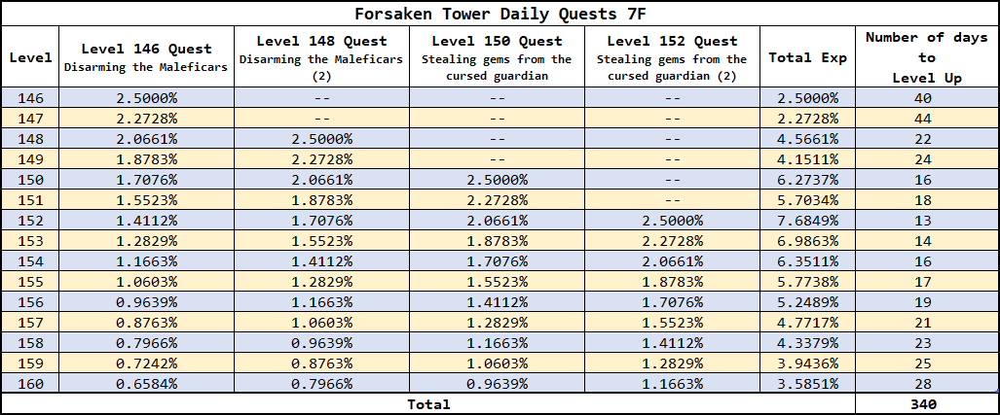

</td></tr></table>

### ❓ daily quests v1.5

<table><tr><td>

details

**Only the experience necessary for a single level up is calculated, without accounting for cumulative experience.**

**The actual number of days required to level up will be fewer than those indicated in the chart.**

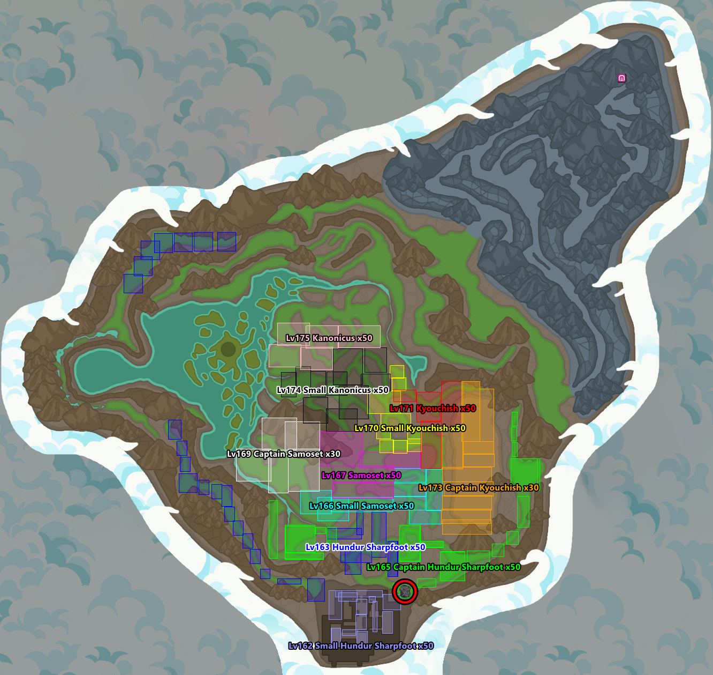

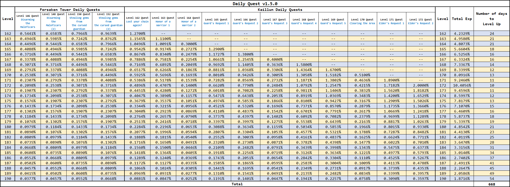

</td></tr></table>

### 🏆 guild siege

<table><tr><td>

details

#### red chip

* [Red Chip Distribution Calculator](https://docs.google.com/spreadsheets/d/1zX1pZ_bB7aPqpZ4rPB9pAFJmAgL4e7y8F6F9qDRc9gw/edit#gid=1531356297)

> source:[@bluechromed @[Dev] Blukie (discord flyff universe)](https://discord.com/channels/778915844070834186/867043266162458654/1109658569466454099 "@bluechromed @[Dev] Blukie (discord flyff universe)")

#### maps

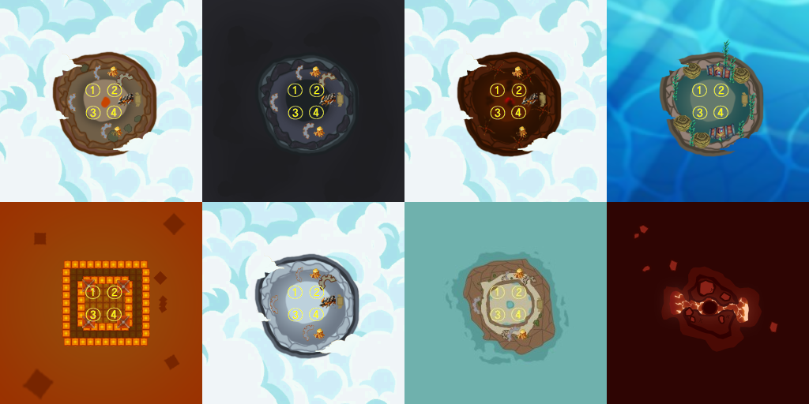

> source:[flyffipedia](https://flyffipedia.com/worlds)

</td></tr></table>

### 🏆 kalgas assault

<table><tr><td>

details

**For more information please refer to [Gothante](https://gothante.wiki/?search=kalgas+assault).**

> source:[New Horizon Expansion (Flyff Universe Version 1.3.6)](https://universe.flyff.com/news/patchnotes136 "Game Version 1.3.6 Patch Notes")

> source:[Updates to Battle for Madrigal Expansion (Flyff Universe Version 1.4.1)](https://universe.flyff.com/news/ver141 "Updates to Battle for Madrigal Expansion (Flyff Universe Version 1.4.1)")

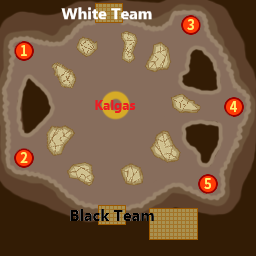

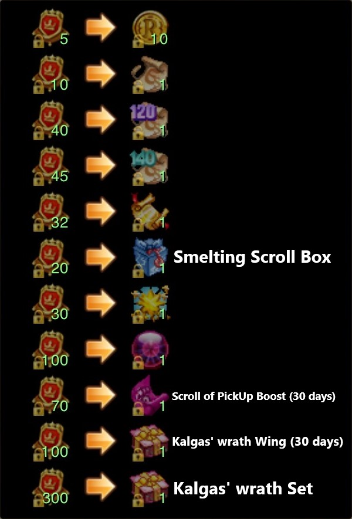

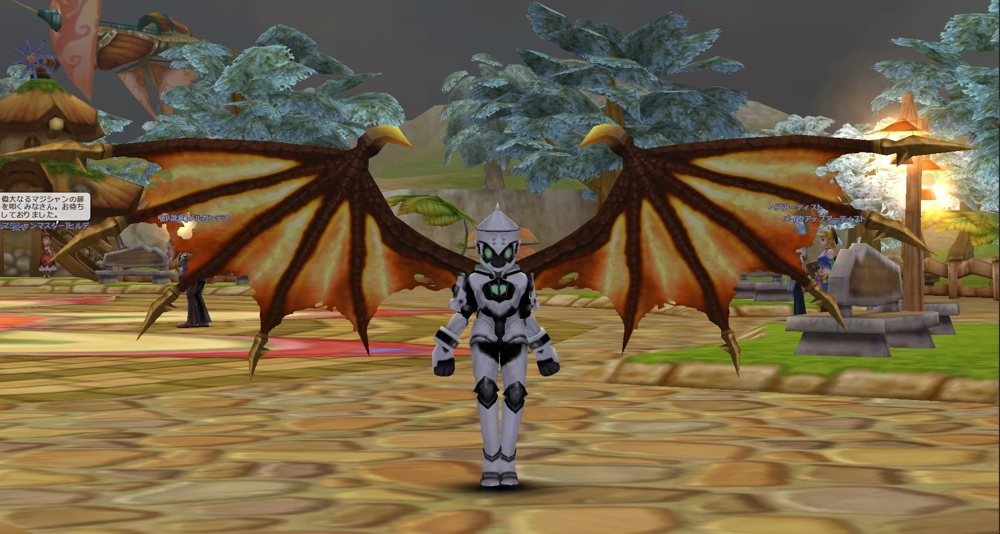

> [Kalgas' wrath Wing](https://flyffipedia.com/items/details/16975 "Kalgas' wrath Wing")

> [Kalgas' wrath Set](https://flyffipedia.com/items/details/19999 "Kalgas' wrath Set")

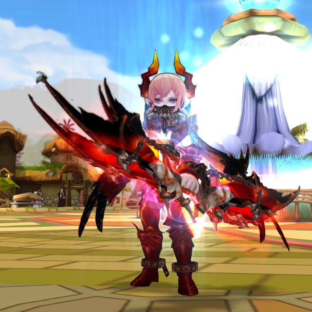

> [Kalgas' Fury Wing (30 days)](https://flyffipedia.com/items/details/20834 "Kalgas' Fury Wing (30 days)")

> [Kalgas' Fury Set](https://flyffipedia.com/items/details/29875 "Kalgas' Fury Set")

> [Kalgas' Fury Weapon Set](https://flyffipedia.com/items/details/24829 "Kalgas' Fury Weapon Set")

</td></tr></table>

## 🏠 housing

[🔝 Back to top](#universe-document)

  
📁 housing details

**For more information please refer to [Gothante](https://gothante.wiki/?search=housing).**

> source:[New Horizon Expansion (Flyff Universe Version 1.3.6)](https://universe.flyff.com/news/patchnotes136 "Game Version 1.3.6 Patch Notes")

> source:[Battle for Madrigal Expansion (Flyff Universe Version 1.4.0)](https://universe.flyff.com/news/battleformadrigal1400 "Battle for Madrigal Expansion (Flyff Universe Version 1.4.0)")

### 📍 template

<table><tr><td>

details

| Template | Size | Price |
|:---:|:---:|:---:|
| Blank World | S | 💲100,000,000 penya |
| Blank World | M | 💲200,000,000 penya |
| Blank World | L | 💲2,250,000,000 penya |
| Blank World | XL | 💲4,000,000,000 penya |
| Beach World | S | 💲400,000,000 penya |
| Darken World Forest World Volcano World Snow World Fall World | S | 💲100,000,000 penya |
| Beach World Darken World Forest World Volcano World Snow World Fall World | M | 💎1600 fCoins |
| Beach World Darken World Forest World Volcano World Snow World Fall World | L | 💎3600 fCoins |
| Beach World Darken World Forest World Volcano World Snow World Fall World | XL | 💎6400 fCoins |

</td></tr></table>

### 🗿 npc

<table><tr><td>

details

#### Personal House NPC

* 💲7,000,000 penya

  * [Personal House NPC] BB Wolf (7 days): Jump Height +30

* 💎70(7 days)/💎140(15 days)

  * [Personal House NPC] Hatter: PvE Damage +3%

  * [Personal House NPC] Alice: PvE Damage Reduction +3%

  * [Personal House NPC] Rulu: Experience Loss Reduction +3% (Decreased from 3% to 2.91%.)

  <!-- * *<ins>Not released yet</ins> [Personal House NPC] Demon: HP Restored on revive +500* -->

  <!-- * *<ins>Not released yet</ins> [Personal House NPC] Gevil: MP Restored on revive +100* -->

  <!-- * *<ins>Not released yet</ins> [Personal House NPC] Sevil: FP restored on revive +50* -->

  * [Personal House NPC] Tino: Added Vendor Shop Day(s) +1.

  <!-- * *<ins>Not released yet</ins> [Personal House NPC] Cachu: Party Exp +10%* -->

  * [Personal House NPC] Casanova: Monster EXP +5%

  * [Personal House NPC] Misun: Item Drop Rate +5%

  * [Personal House NPC] Temas: Speed +5%

  * [Personal House NPC] Chacha: Flying Speed +5%　　

  * [Personal House NPC] Pang: Level2 Buffs limited to characters level 120 and below.

     

     * Haste Lv. 8: Attack Speed+19% (9+10), Casting Speed+13% (4+9)

     * Heap Up Lv. 7: STA+26 (7+19)

     * Quick Step Lv. 8: Speed+27% (8+19)

     * Accuracy Lv. 7: Hit Rate+16% (7+9)

  * [Personal House NPC] Klock: Earn that jewel with 30% chance or removing Ultimate Jewel.

     * Ultimate Jewelry Manufacture, Compose Success Rate Increased.

  * [Personal House NPC] Mac (A Grade): Pet Training (Pet Candy A)

  * [Personal House NPC] Mac (B Grade): Pet Training (Pet Candy B)

  * [Personal House NPC] Mac (C Grade): Pet Training (Pet Candy C)

  * [Personal House NPC] Mac (D Grade): Pet Training (Pet Candy D)

  * [Personal House NPC] Mac (E Grade): Pet Training (Pet Candy E)

  * [Personal House NPC] Mac (F Grade): Pet Training (Pet Candy F)

#### Guild House NPC

* 💲7,000,000 penya

  <!-- * *<ins>Not released yet</ins> [Guild House NPC] Duron: Guild Artifact Max HP +10%* -->

  * [Guild House NPC] Fuba: Guild Artifact HP Recovery +10%　　

  * [Guild House NPC] Dolphie: Guild Artifact DEF +10%

  * [Guild House NPC] Wick: Ally character ATK increase near artifact(10m) +3%

  * [Guild House NPC] Pitch: Ally character Attack Speed increase near artifact(10m) +5%

  * [Guild House NPC] Bako: Ally character HP increase near artifact(10m) +500

  * [Guild House NPC] Wina: Ally character DEF increase near artifact(10m) +3%

  * [Guild House NPC] Catch: Ally character Casting Speed increase near artifact(10m) +5%

* 💎350(7 days)/💎700(15 days)

  * [Guild House NPC] Asa: Allow you to teleport to the place of your choice.

  * [Guild House NPC] Chord: PvP Damage +3%

  * [Guild House NPC] Anura: PvP Damage Reduction +3%

  * [Guild House NPC] Naso: PvP Critical Chance +3%

  * [Guild House NPC] Nuso: PvP Critical Damage +3%

  * [Guild House NPC] Soz: PvP Block Penetration +3%

  * [Guild House NPC] Vikel: PvP Melee/Range Block +3%

  * [Guild House NPC] Quarter: Increased HP +10%

  * ~~[Guild House NPC] Sham: Increased MP +10%~~ **Removed [Minor Fixes after 2024/02/28 Maintenance](https://universe.flyff.com/news/minorfixesfebruary28 "Minor Fixes after 2/28 Maintenance")**

  * [Guild House NPC] Lamew: Increased FP +10%

  * [Guild House NPC] Gira: MP Consumption Decrease +10%

  * [Guild House NPC] Affe: FP Consumption Decrease +10%

  * [Guild House NPC] Cobao: Healing +3%

  * [Guild House NPC] Aibao: Magic Resistance +3%

  * [Guild House NPC] Nanco: Critical Resist +3%

  * [Guild House NPC] Pang: Level4 Buffs limited to characters level 140 and below.

     

     * Haste Lv. 10: Attack Speed+20% (10+10), Casting Speed+13% (4+9)

     * Heap Up Lv. 9: STA+28 (9+19)

     * Quick Step Lv. 10: Speed+29% (10+19)

     * Accuracy Lv. 9: Hit Rate+18% (9+9)

  * [Guild House NPC] Alyn: Weapon/Armor upgrade chance +3%

  * [Guild House NPC] Runni: Piercing upgrade chance +3%

  * [Guild House NPC] Lane: Accessory upgrade chance +3%

</td></tr></table>

